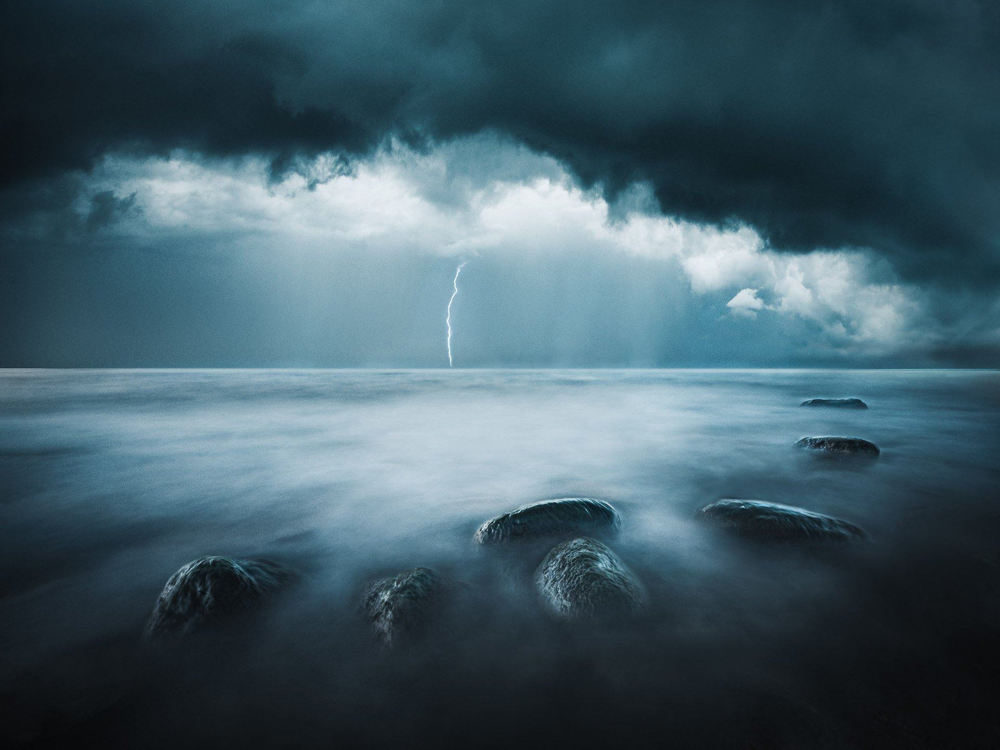
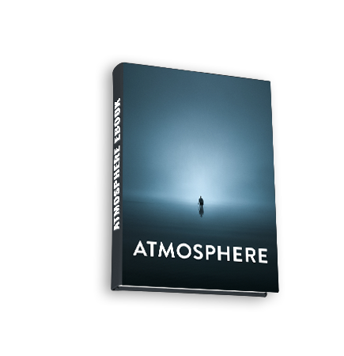
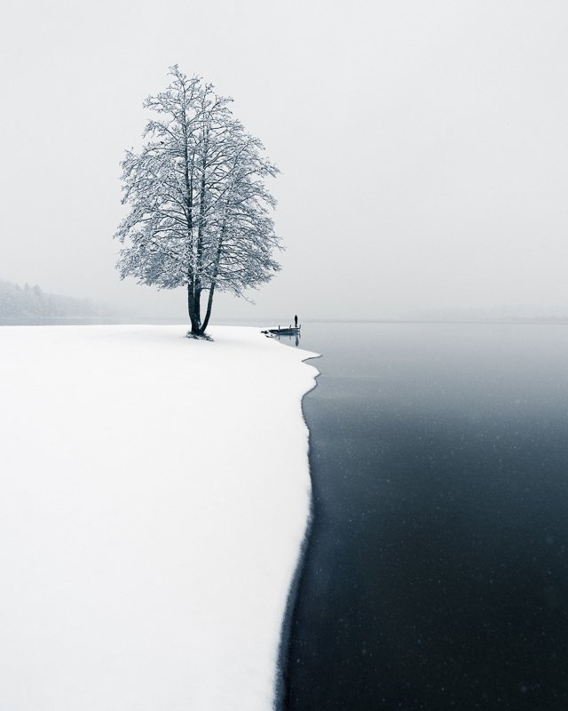
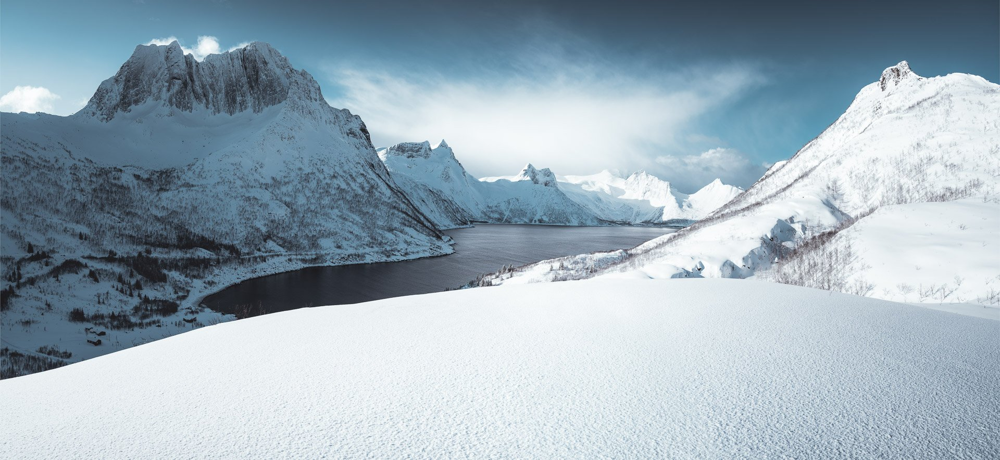
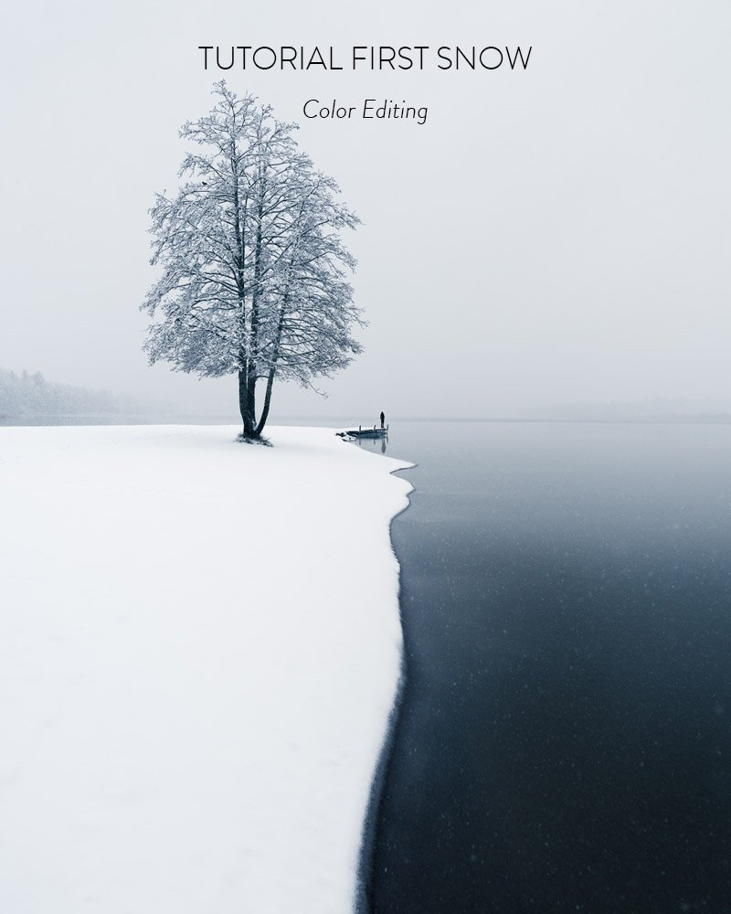
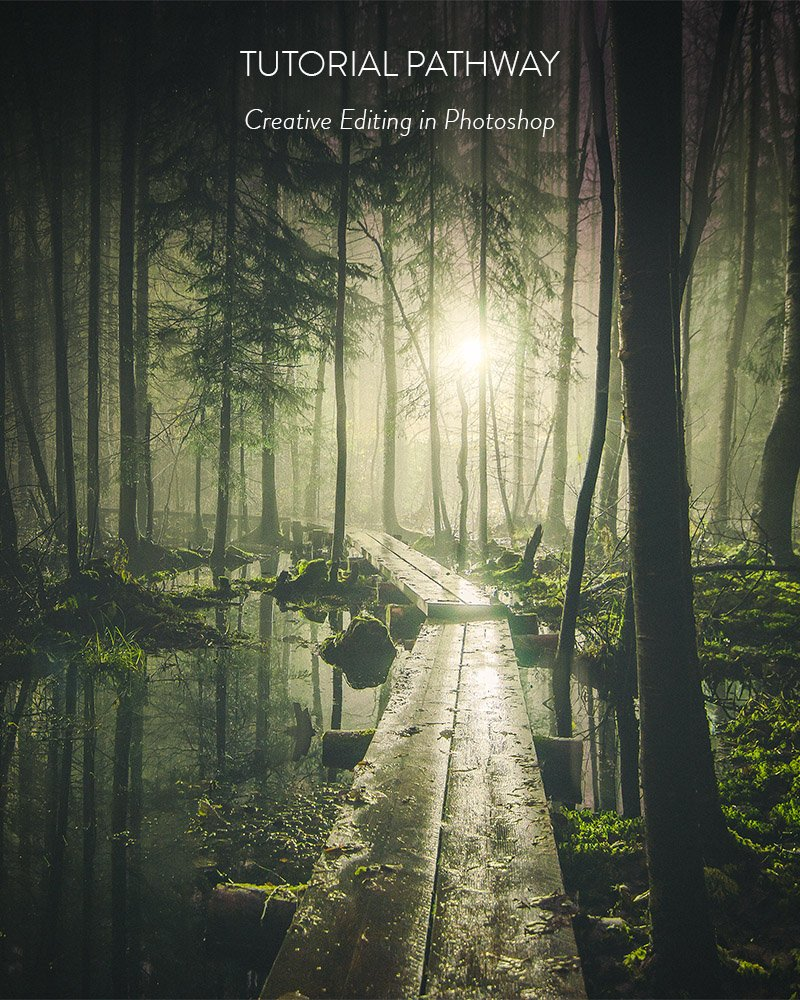
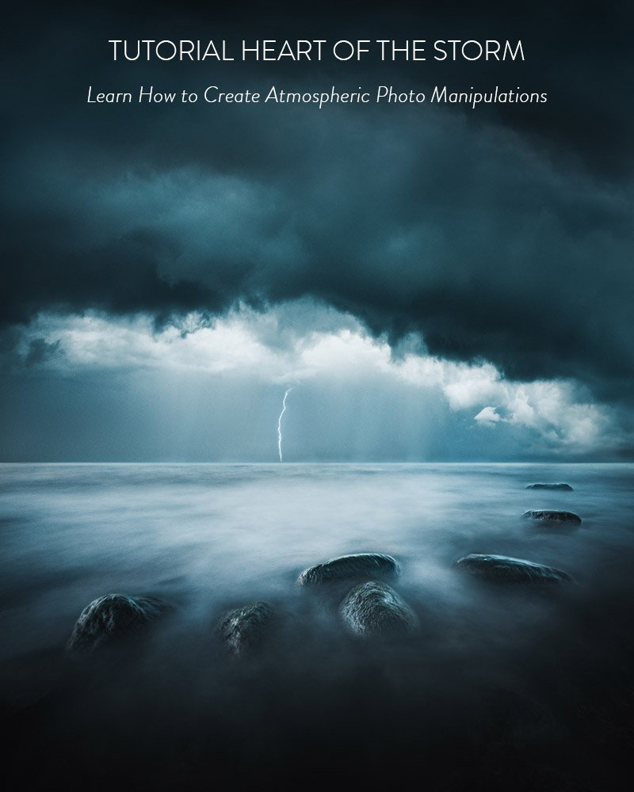
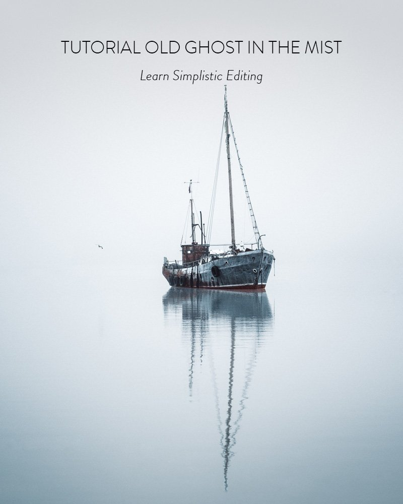
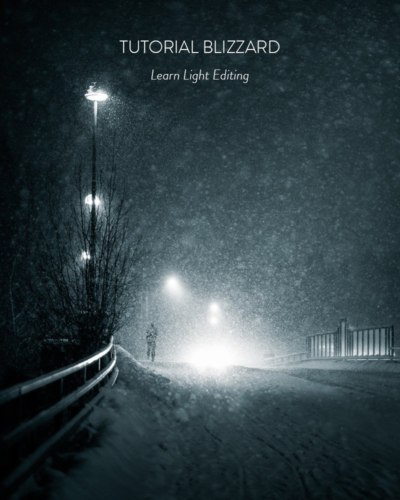

## Atmosphere ebook - Create Mood-filled Photography

Create Mood-Filled Photography  

Seven In-Depth Tutorials
  

Create Photo Ideas
  

Find Your Unique Style
  

Instant Download

### 30€

## 15€

[Buy Now](https://sowl.co/X7fTL)

### Introduction to Atmosphere ebook

Discover the techniques and thought processes to help you create atmospheric photographs that truly stand out. The Atmosphere eBook teaches you how to plan, capture, and edit images that convey deep emotions and unique moods.

*Over a decade of experience distilled into one comprehensive guide – learn from a professional photographer who has mastered the art of evocative photography.*

### What You'll Learn

* How to create mood and atmosphere in your photography
* Using colors to evoke different emotions
* Developing creative ideas for your photography projects
* Planning and scouting new locations for your shoots
* Capturing sceneries, finding interesting subjects, and composing your shots
* Post-processing techniques in Lightroom and Photoshop to create atmospheric photos

  + **In-Depth Editing Tutorials**

    - First Snow ~ Color Editing
    - Old Ghost In The Mist ~ Simplify
    - Blizzard ~ Light Editing
    - Path ~ Use Color to Emphasize Mood
    - Heart of the Storm ~ Create Atmospheric Photo Manipulations
    - Pathway ~ Creative Editing in Photoshop
    - Strange Ways ~ Using Blur to Emphasize Mood
* **Extra Content**

  + How to Find Your Vision & Style in Photography
  + Deconstruct Photographs to Learn Faster

### What people are saying about the ebook

*“I have only gone through the start and I love the book! So much information!”****-* Kerry S.**

*“I got the atmosphere bundle and I’m loving the presets and ebook”****-* Samuel N.**

*“I wanted to see the edits, but there are so much more than the edits, such a great source for inspiration.”*   
**- Tommi R.**

*"Mikko, thank you for another awesome product that inspires me and drives me to be a better photographer and helps me to continue to reach higher and higher. Thank you for sharing your talent and knowledge with us! I love your work!"*  
**– Chris M.**

### Learn how to edit like a pro with the tutorials included in the Ebook!

[View fullsize
](https://images.squarespace-cdn.com/content/v1/63ceaffd33529a45e572bf90/1674547842082-CYYZU01LZL3XMM04VXEE/Color-Edit-tutorial-ebook.jpg)

[View fullsize
](https://images.squarespace-cdn.com/content/v1/63ceaffd33529a45e572bf90/1674547845186-QESRN7O10EJALMKVKPOH/PATHWAY-tutorial-ebook.jpg)

[View fullsize
](https://images.squarespace-cdn.com/content/v1/63ceaffd33529a45e572bf90/1674547847088-E8ZLX0NRYD5M2U3BETWA/Photo-Manipulation-tutorial-ebook.jpg)

[View fullsize
](https://images.squarespace-cdn.com/content/v1/63ceaffd33529a45e572bf90/1674547849501-O49V6HVF5NZAZOWFAIOR/Strange-ways-Tutorial.jpg)

[View fullsize
](https://images.squarespace-cdn.com/content/v1/63ceaffd33529a45e572bf90/1674547851557-NL3TAFYJHUG80HDBJGE0/Tutorial-Path.jpg)

[View fullsize
](https://images.squarespace-cdn.com/content/v1/63ceaffd33529a45e572bf90/1674547853243-9TDBCXO8OL2WKN0S5FX6/OLD-GHOST-TUTORIAL.jpg)

[View fullsize
](https://images.squarespace-cdn.com/content/v1/63ceaffd33529a45e572bf90/1674547855857-WHVOJWUH1J1S09AUOUP8/Tutorial-Blizzard.jpg)

## Atmosphere

### How to Create Mood-Filled Photographs

Create mood-filled photography  

Seven in-depth tutorials
  

Create new ideas
  

Find your vision and style
  

Instant Download

## 15€

[Buy Now](https://sowl.co/X7fTL)