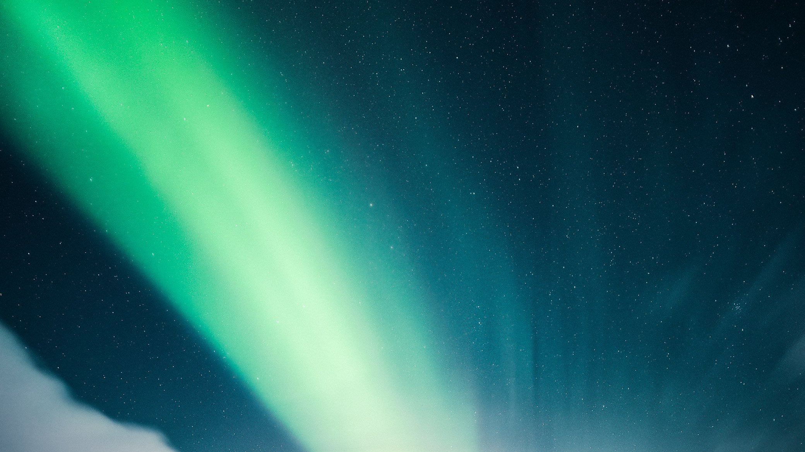
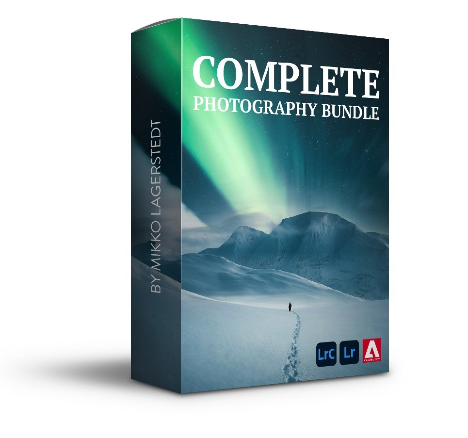
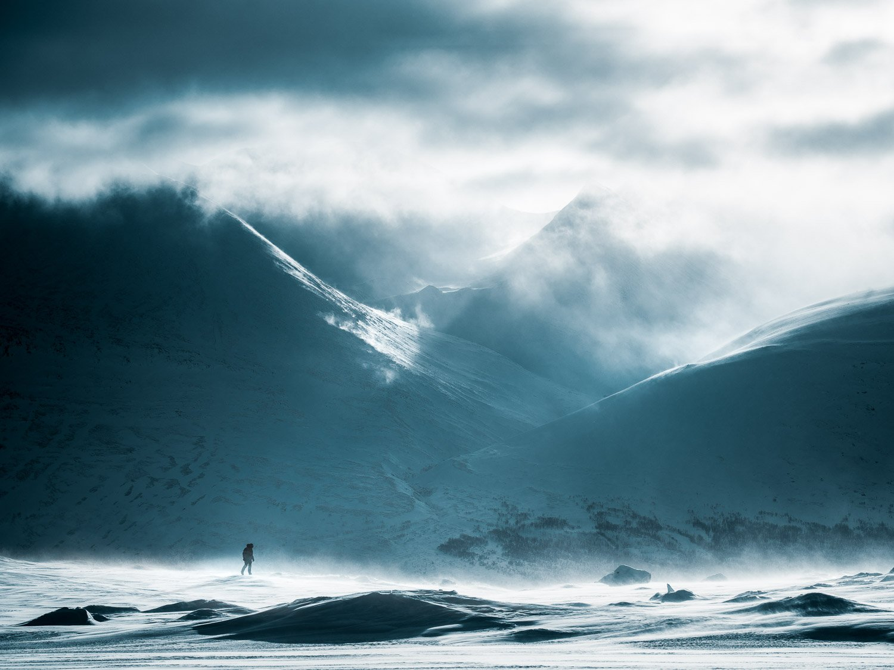
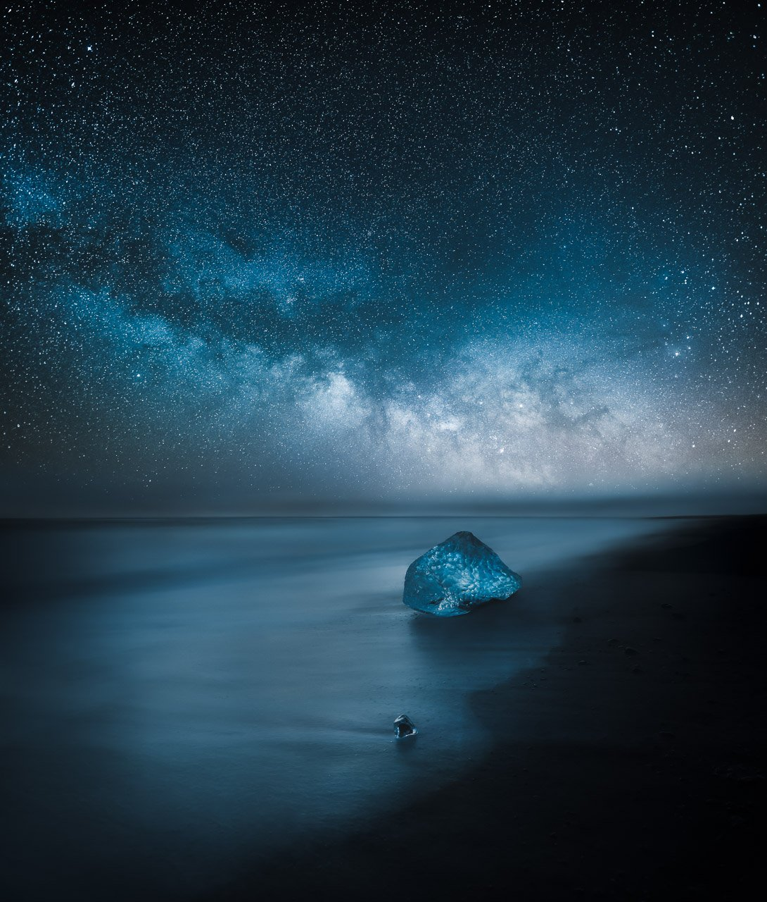
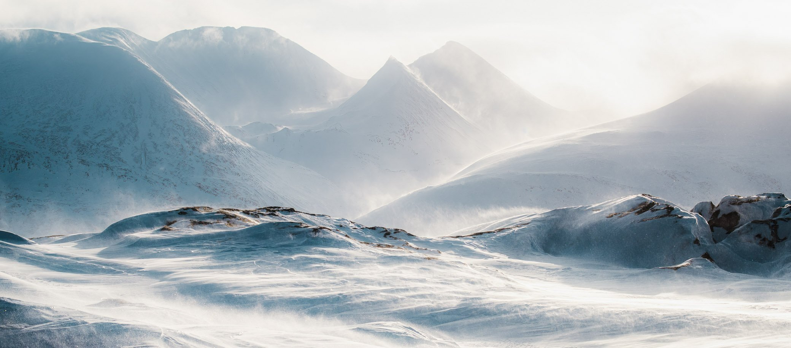
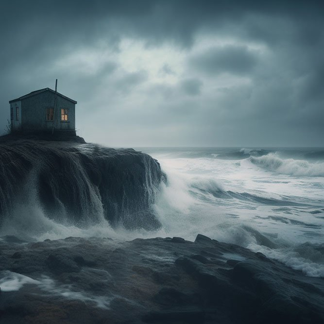
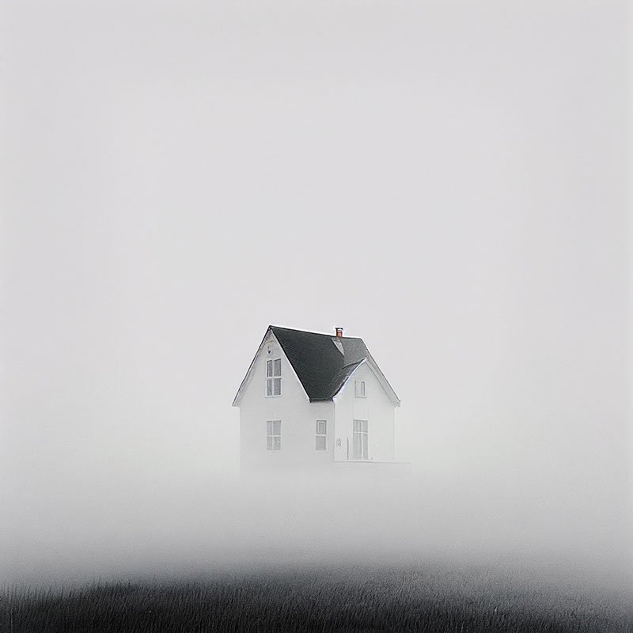
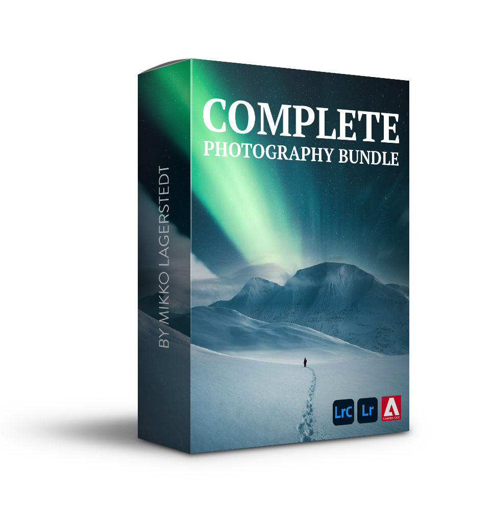

## Complete Landscape Photography Bundle

## Start Creating Breathtaking Landscape Photography!

Learn from Mikko Lagerstedt―with the Complete Photography Bundle, you can achieve breathtaking photographs that will leave people in awe.

Purchasing the bundle now will save you 50%. Don't miss this opportunity to take your photography to the next level.

[Buy Now](/complete-bundle#buy)

## Introduction: Complete Bundle

Invest in your photography journey and take your skills to new heights with the Complete Photography Bundle. Don't miss this opportunity to elevate your photography and stand out from the crowd!

## The Complete Collection Includes

* [EPIC Preset Collection](/epic-presets) – Transform your images to EPIC with this unique 500 preset collection.
* [Atmosphere Photography eBook](/atmosphere-ebook) – Learn How to Create Moody Photography.
* [Composite Photography Video Course](/day-night) – Learn How to Create Composite Landscape Photography.
* [Star Photography Composite eBook](/star-photography-composite) – Create surreal night sky manipulations.
* [Star Photography Masterclass](/star-photography-tutorial) – Learn the Secrets of Stunning Astrophotography.
* [Saga Fine Art Preset Collection](/saga-presets) – Over 180 Lightroom Presets.
* [Phase Preset Collection](/phase-presets) – Over 200 Lightroom and Camera Raw Presets.
* [Fine Art Photoshop Actions](/actions) – Photoshop Action Collection.

Are you tired of your photos blending into the crowd? Stop struggling to learn everything on your own and start creating remarkable images with the Complete Photography Bundle! I provide you with all the techniques, tools, and tips you need to create captivating photos. This comprehensive collection includes all tutorials, courses, eBooks, Lightroom presets, and Photoshop actions in one package.

Testimonials & Reviews

* 

  ## Rowan W.

  I absolutely love everything in the package! The way you have spoken the viewer through your process and your approach to the art in your e-books is clear, slick, and inspiring. You should be proud! The only criticism that I have is that there are no hardback printed copies of your books! They & you deserve this. :)
* 

  ## Sarah G.

  The Complete Photography Bundle has been a game-changer for me! I've learned so much, and my photos have improved tremendously! The ebooks pack a ton of information, and I love to use the Lightroom Presets!
* 

  ## Peter D.

  The Composite Video tutorial makes you not only better in post-production but cuts deep into photography skills itself. I can say that what you have offered to us has much more value than what you charge!
* 

  ## Chris M.

  Mikko, thank you for another awesome product that inspires me and drives me to be a better photographer and helps me to continue to reach higher and higher. Thank you for sharing your talent and knowledge with us! I love your work!

## Complete Landscape Photography Bundle: Save 50%

Elevate your landscape photography today!

EPIC Preset Collection
  

Atmosphere eBook
  

Composite Photography Video Course
  

Star Photography Masterclass
  

Phase Preset Collection
  

Saga Preset Collection
  

Fine Art Action Collection
  

### 340€

-50%

## 170€

[Buy Now](https://transactions.sendowl.com/packages/673238/18184360/purchase)

## Frequently asked questions

* #### Do I get new updates with the Complete Bundle?

  Yes. You will receive all the latest updates and newest versions of the eBooks, Video Courses, and Lightroom & Camera Raw Presets.
* #### What do I need to get started?

  I recommend having the latest Adobe Lightroom CC, Classic, or Camera Raw to get the full benefit of the Presets. If you want to be able to follow along with editing tutorials, you should also consider having Photoshop CC.
* #### How can I access the files?

  You will receive download links to each tutorial, eBook, and Preset Collection, and you can download them to your computer for easy access.
* #### What is the refund policy?

  We want you to be happy with the product; if you are not, please get in touch with us at hello@mikkolagerstedt.com.