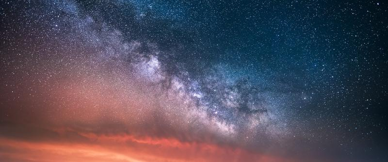

## Composite Landscape Photography Video Course

Learn The Secrets of Stunning Composite Landscape Photography - For Photographers Who Want To Get More Out of Their Photographs!

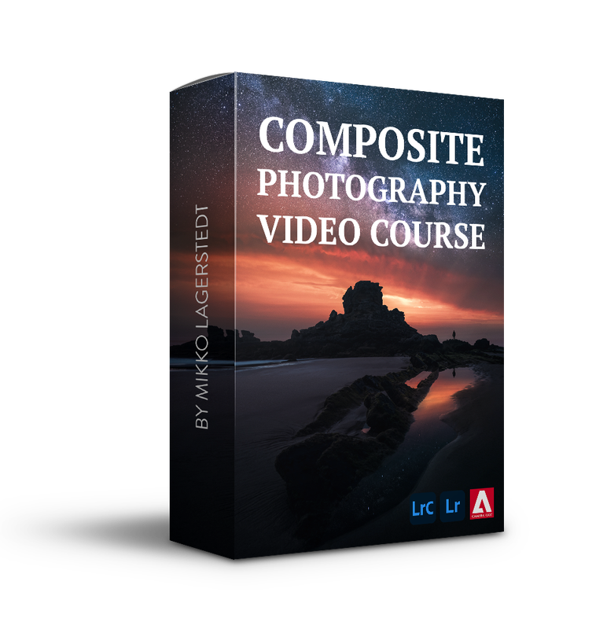

Learn Composite Photography  

14 Video Lessons
  

Includes RAW Images
  

Easy to Follow
  

Over Two Hours of Content
  

Instant Access

### 70€

## 35€

[Buy Now](https://sowl.co/Ez7XK)

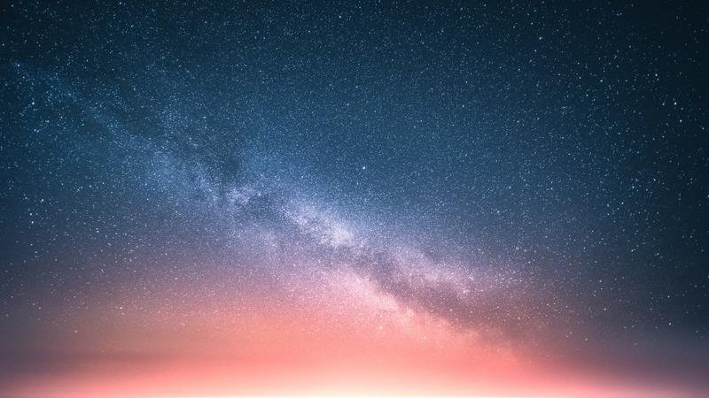

## Introduction: Day to Night - Composite Video Course

Unlock the secrets to breathtaking photomanipulations with the Day to Night composite photography course! Elevate your skills and creativity as you learn to craft stunning images using Photoshop and Lightroom. This course is designed for photographers of all levels, from beginners to advanced professionals.

Discover how to create captivating ideas, plan your adventures, capture the perfect shots, and master editing techniques. With our detailed lessons, you'll be guided through every step of the process to create extraordinary composite landscape photographs.

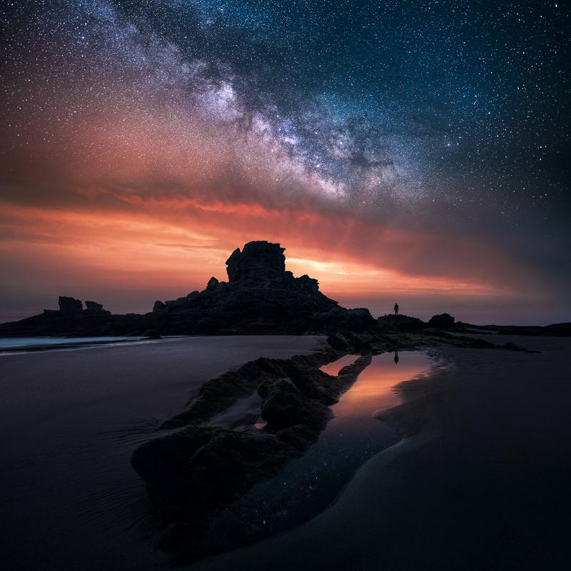

### What is Included in the course?

**1. HOW TO CREATE IDEAS FOR YOUR PHOTOS & KEEP YOURSELF INSPIRED**

**2. HOW TO PLAN YOUR ADVENTURES & WHAT GEAR TO USE**

**3. THE ART OF SEEING & HOW TO FIND YOUR VISION**

**4. HOW TO CAPTURE THE IMAGES & WHAT SETTINGS TO USE**

**5. THE ART OF EDITING (9 DETAILED LESSONS)**

* Learn how to edit the photographs in Lightroom CC
* How to create composite landscape photographs in Photoshop CC

+ How to create realistic views using multiple photographs
+ Learn tricks such as creating light rays & boost Milky Way
+ How to blend images to create balance and smooth transitions

* How to finalize the edit in Lightroom CC

**6. PHOTO CRITIQUE & HOW TO ANALYZE YOUR WORK**

**7. The Phase Preset Collection**

**8. SOURCE FILES TO FOLLOW ALONG THE EDITING PROCESS**

## Learn & Grow:

* Generate unique ideas for your photography
* Master composite landscape photography capture and editing
* Understand composition and storytelling
* Elevate your post-processing skills
* Create mesmerizing photomanipulations
* Analyze your work for continuous improvement

This course goes beyond technical skills, delving into the artistic aspects of photomanipulation, including composition and storytelling. By the end of the course, you'll have the knowledge and skills to create awe-inspiring photomanipulations that will captivate and inspire others.

## Testimonials & Reviews

Peter D.

*"This tutorial makes you not only better in post-production but cuts deep into photography skills itself. I can say that what you have offered to us has much more value than what you charge!"*

Riku N. @rikunorakari

*"This course gave me so much inspiration and ideas for the future. Thank you so much! I recommend this course to anyone interested in fine art landscape photography. The course is easy to follow with clear lessons, and no part is overlooked."*

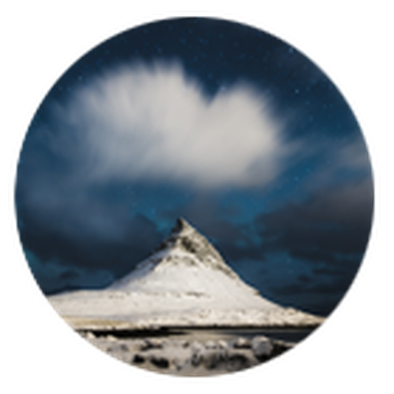

Hendrik M. @hendrik.mandla

*"The tutorial was really good! It definitely changed how I do photography, from planning to editing, even when i’m not doing composites. I just watched it and tried with the sample images. It was great!"*

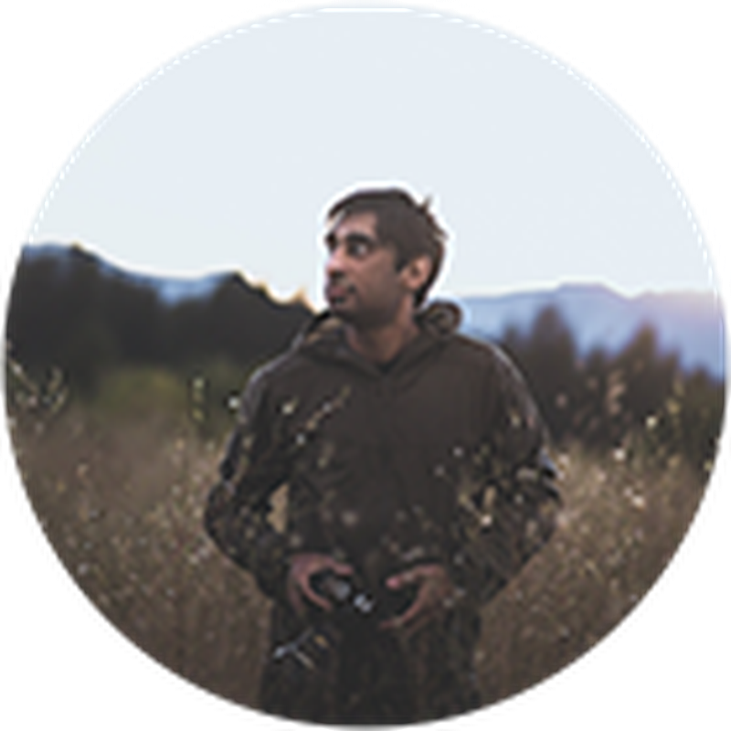

Mandip M. @mandipmann10

*"I can say this is an amazing course, not just for learning about composition and editing but also for getting inspiration to explore and create new ideas!*

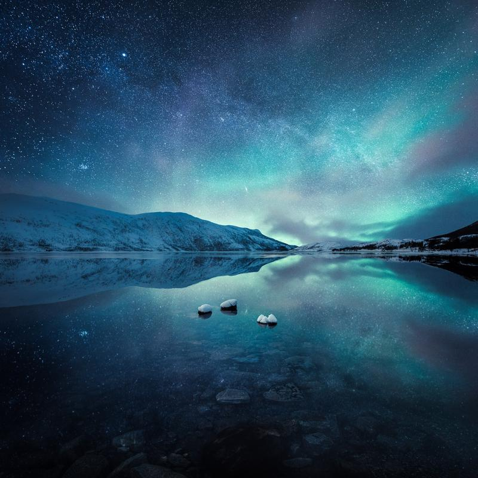

Below are work created using the techniques we go through in the Day to Night video course.

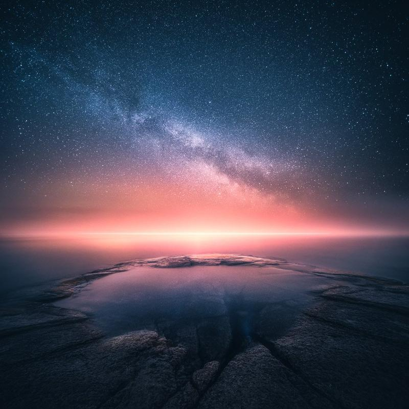

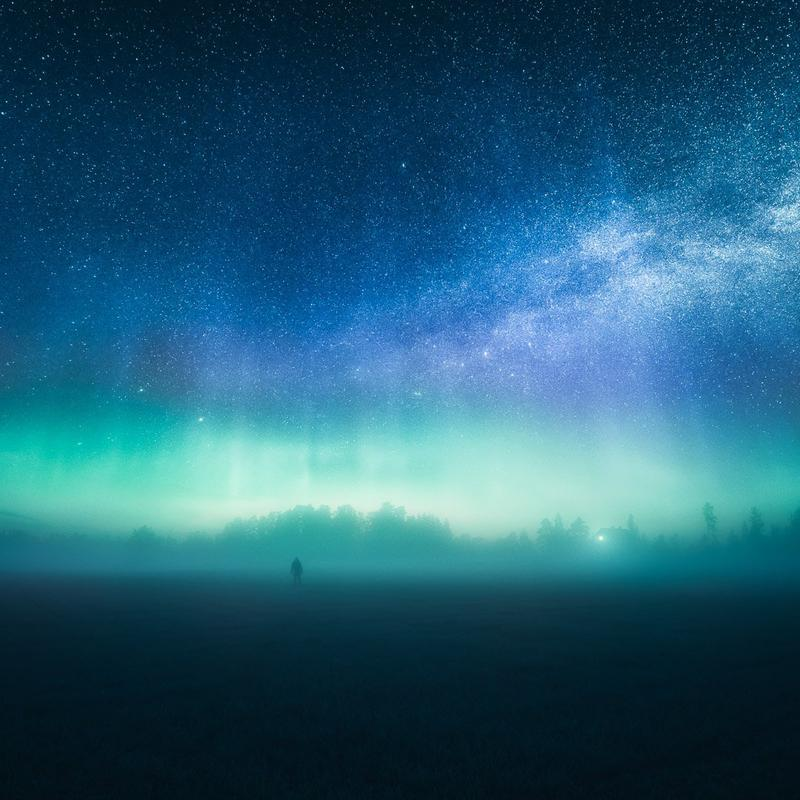

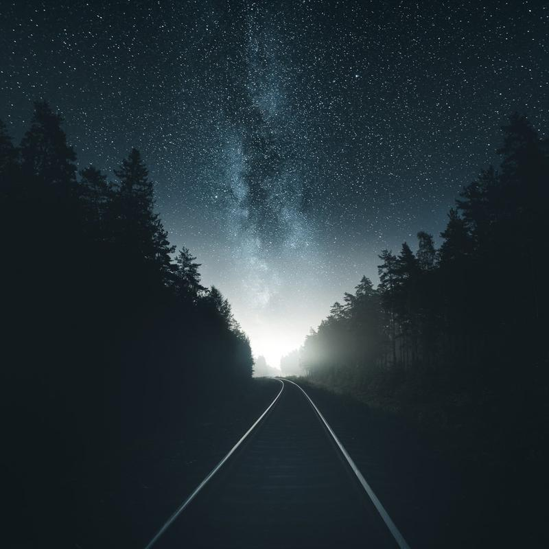

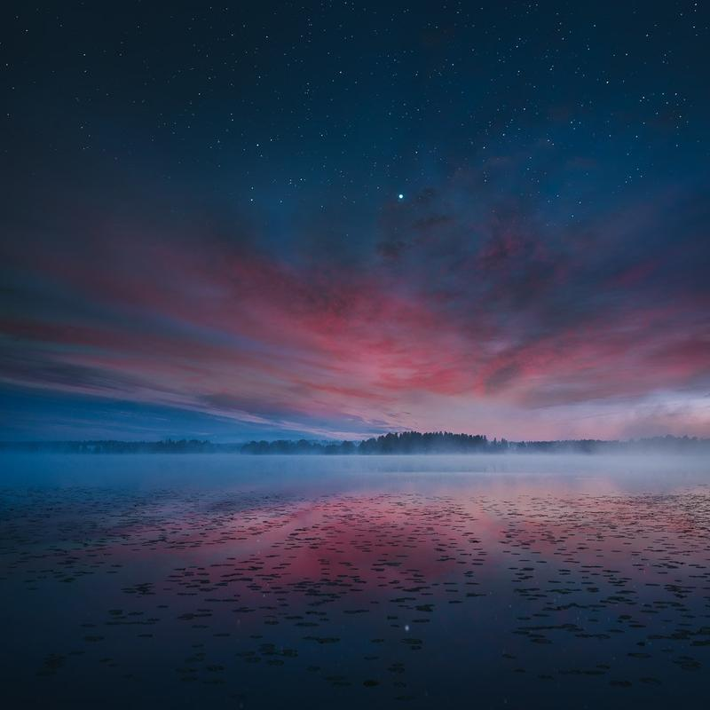

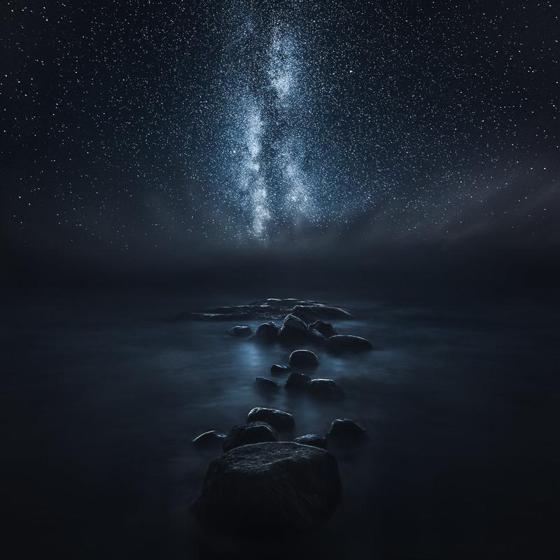

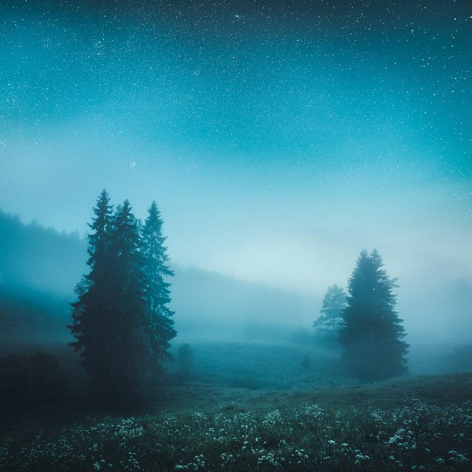

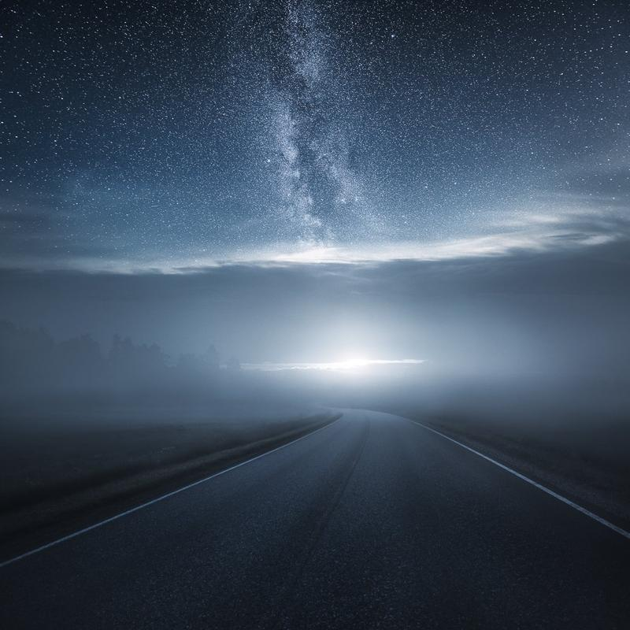

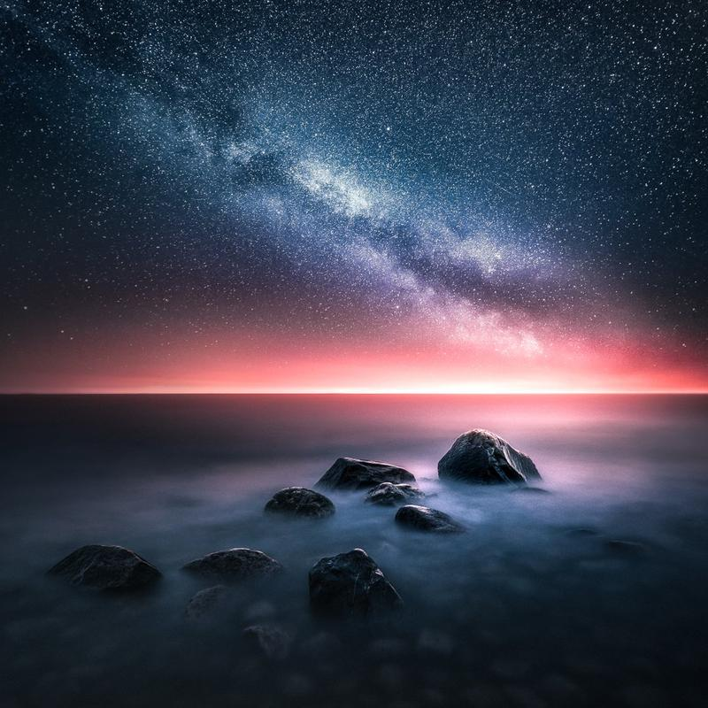

Learn Composite Photography  

14 Video Lessons
  

Includes RAW Images
  

Easy to Follow
  

Over Two Hours of Content
  

Instant Access

### 70€

## 35€

[Buy Now](https://sowl.co/Ez7XK)