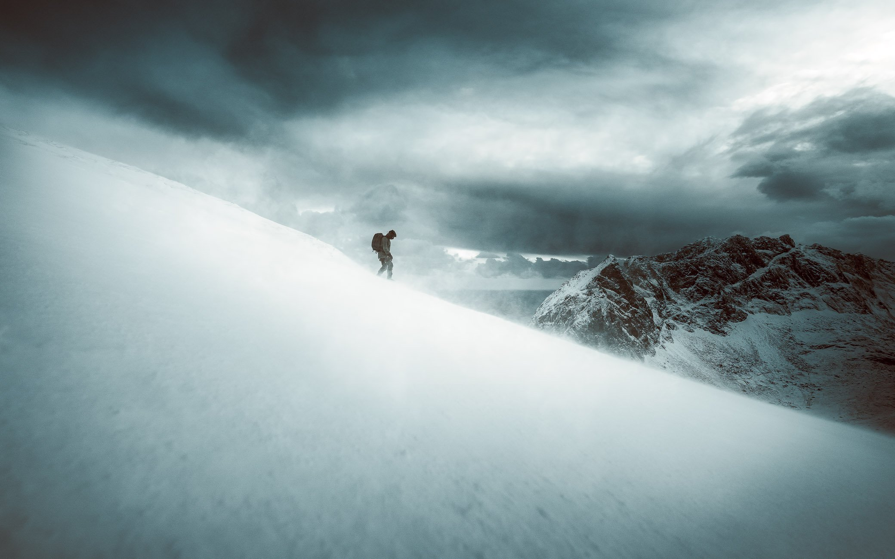

# In The Solitude

Fine art photography collection by Mikko Lagerstedt.

“In The Solitude” photography collection is a reminder of how spending time alone in nature can have a calming and therapeutic effect on your mind. The photographs capture peaceful and untouched landscapes, making you feel right there in the moment. It's about fascination, where nature takes over your mind and lets you relax and connect with everything around you. These pieces are a reminder that taking a break from all the screens and stress of modern life and immersing yourself in nature is a great way to recharge and feel connected to nature. Each photograph has a story. Find them below.

These one-of-a-kind photographs were captured between 2011 and 2023.

[IN THE SOLITUDE](https://foundation.app/collection/in-the-solitude)

## iN tHE sOLITUDE AIRDROPS

Holders of “In The Solitude” 1/1s are eligible to receive the following airdrops by Mikko Lagerstedt.

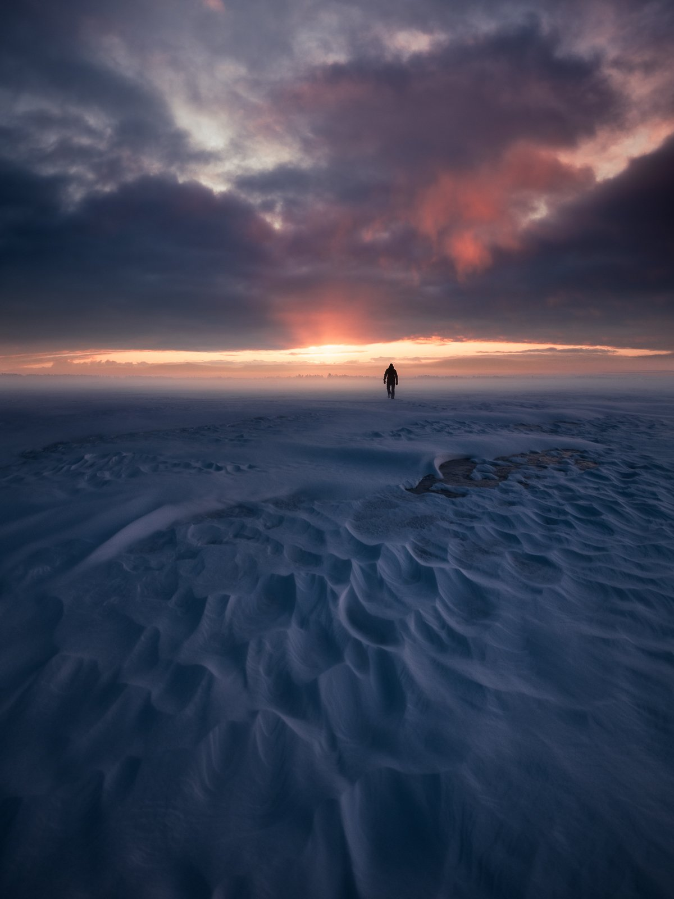

**1st AIRDROP**   
TBA  
Into The Unknown

*EDITION OF 10*

**1/1 Raffle**  
TBA

*EDITION 1 OF 1*

**2nd AIRDROP**  
TBA

*EDITION OF 10*

Descent

[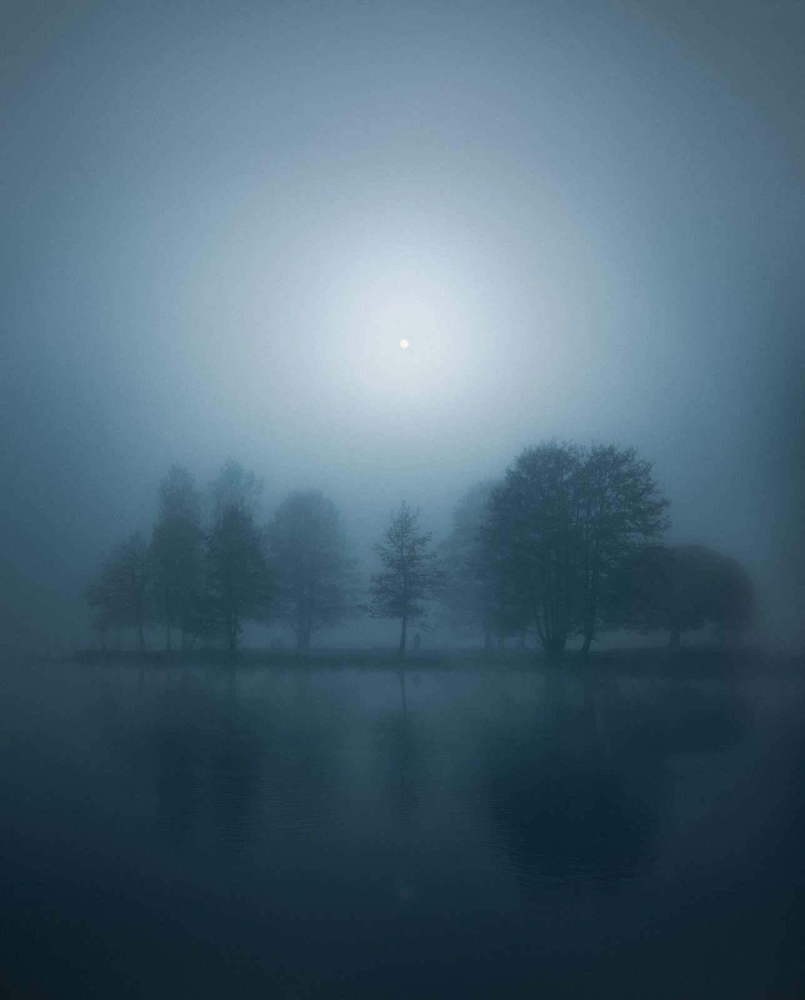](https://foundation.app/@mikkolagerstedt/in-the-solitude/9)

In Silence

[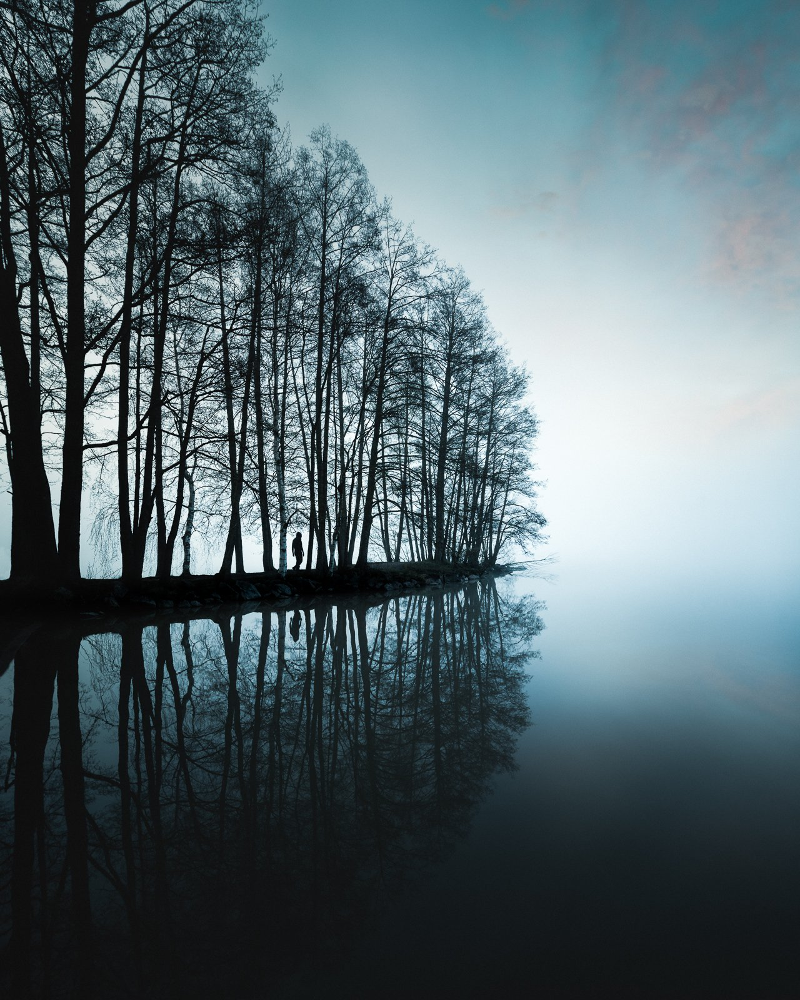](https://foundation.app/@mikkolagerstedt/in-the-solitude/6)

Early Morning Mist

[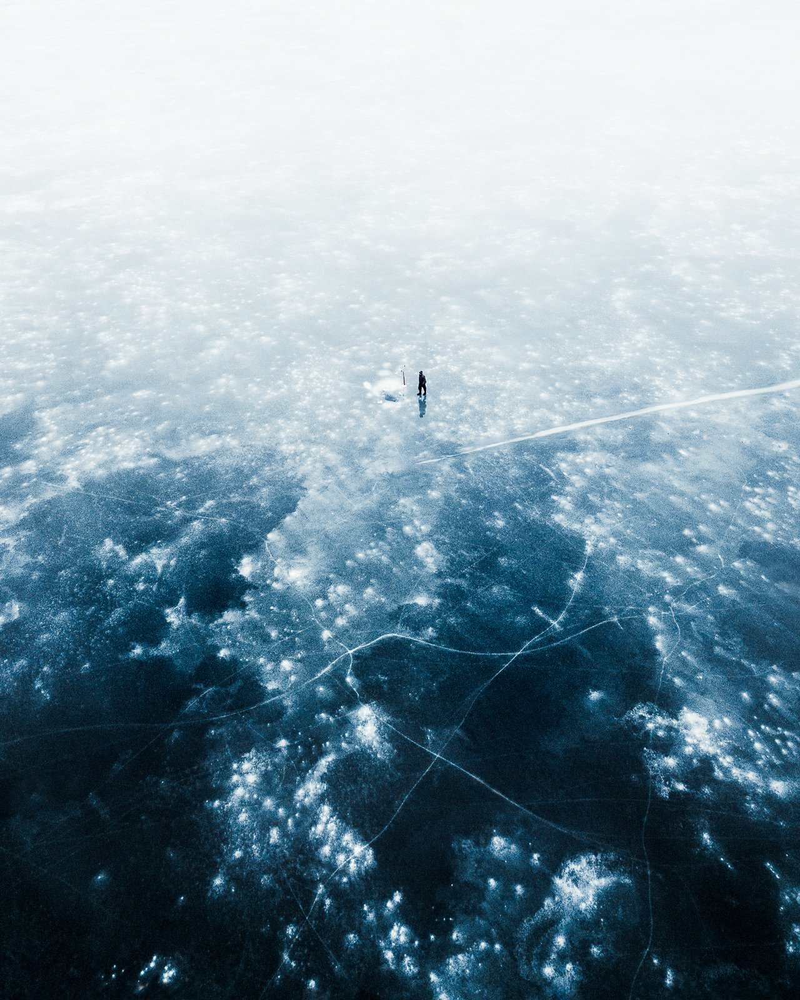](https://foundation.app/@mikkolagerstedt/in-the-solitude/2)

On Thin Ice

[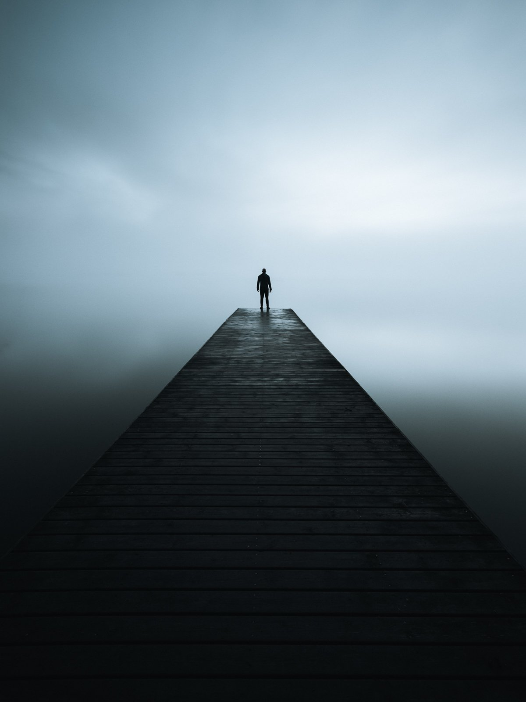](https://foundation.app/@mikkolagerstedt/in-the-solitude/7)

Reminiscence

[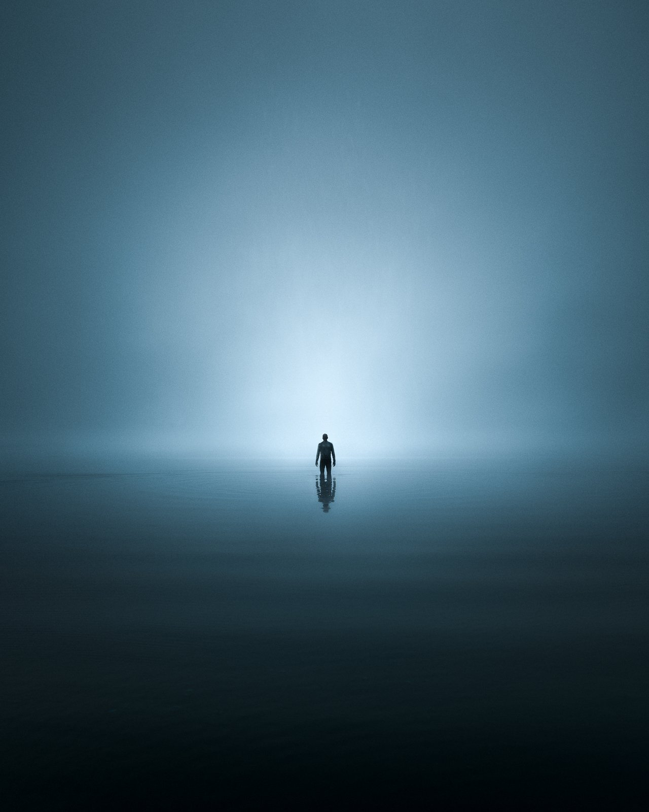](https://foundation.app/@mikkolagerstedt/in-the-solitude/3)

Morning Echo

Searching

[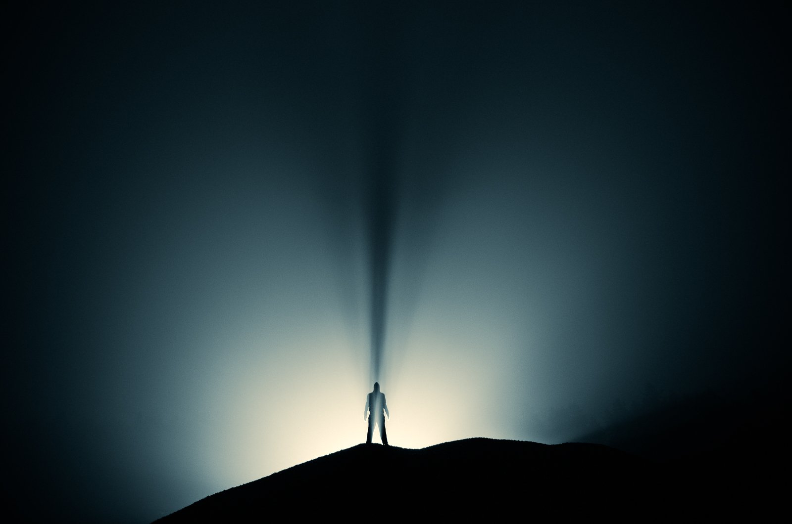](https://foundation.app/@mikkolagerstedt/in-the-solitude/10)

Stranger

[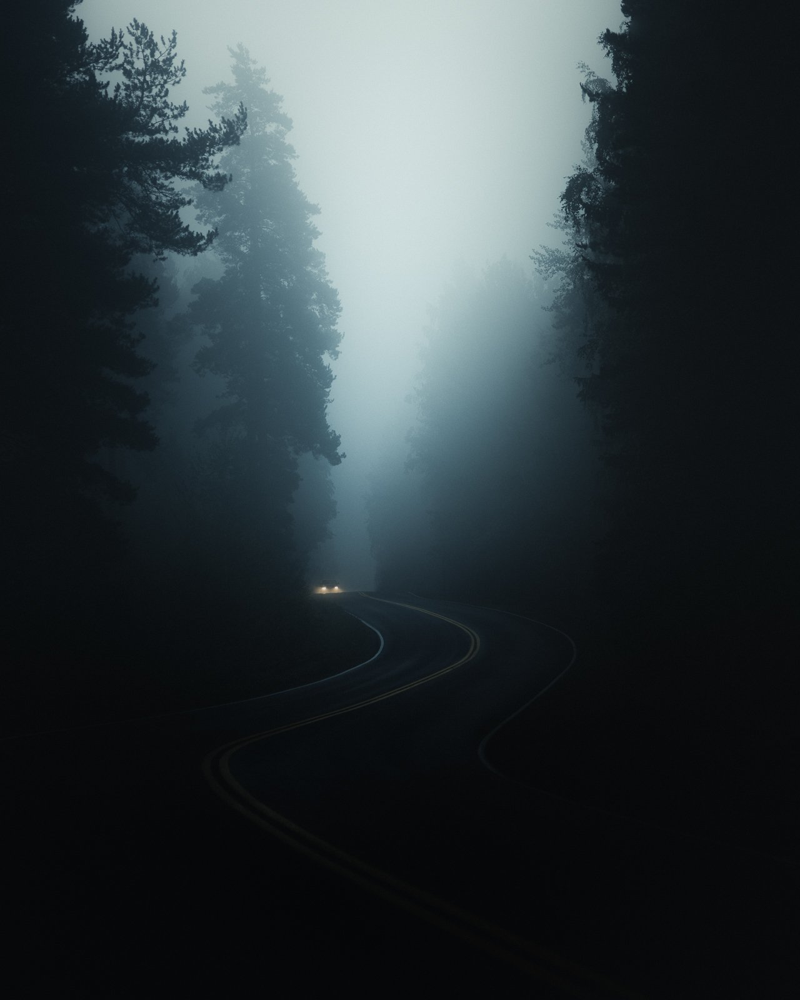](https://foundation.app/@mikkolagerstedt/in-the-solitude/4)

Journey - SOLD

[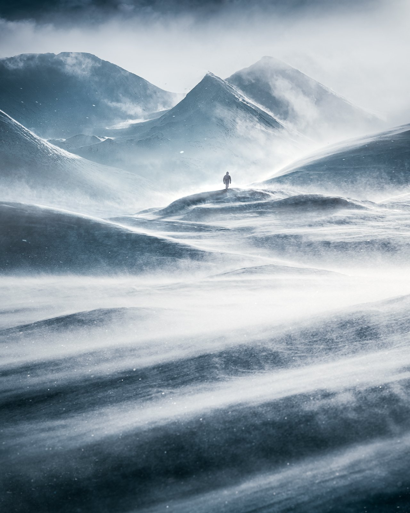](https://foundation.app/@mikkolagerstedt/in-the-solitude/5)

Windswept - SOLD

## [DESCENT](https://foundation.app/@mikkolagerstedt/in-the-solitude/1)

Life is not always easy, and you can't always see the beauty while in the storm. On this day, we started our way up in a snowstorm and battled through it to find solitude. After the day had almost passed and the sky was beginning to clear, on the descent, the blistering wind made the scenery look like a still from a movie. It was one of those unique moments where you feel alive as you battle through the elements.

Location: Norway  
Year: 2017

## [Silence](https://foundation.app/@mikkolagerstedt/in-the-solitude/9)

There are places you visit hundreds of times before you can see the place as you envisioned. It took me over six years to get the conditions for this location as I imagined. The trees, balanced with the sun, barely visible through the mist. Dark and atmospheric silence.

Location: Finland  
Year: 2022

## [Early Morning Mist](https://foundation.app/@mikkolagerstedt/in-the-solitude/6)

Lake in the early spring is a sight to experience. When it's calm and misty, every sound and breeze feels like you are alone in this World. As the sun was about to rise, I saw this strip of trees reflected in the still water. I placed my camera on the tripod and captured this self-portrait.

Location: Finland  
Year: 2020

## [On Thin Ice](https://foundation.app/@mikkolagerstedt/in-the-solitude/2)

The winter was almost over after a week of rain. Everything looked dull, yet I headed to my favorite place to see what the lake looked like. And to my surprise, I saw a man ice-fishing in the lake. I knew I had to get higher to capture him, so I flew my drone and was amazed at how the ice looked from above. The patterns of the ice looked like they would soon swallow this poor man if he weren't careful. The feeling of solitude was present while I watched him enjoy the moment.

Location: Finland  
Year: 2018

## [REMINISCENCE](https://foundation.app/@mikkolagerstedt/in-the-solitude/7)

When the weather gets colder at night, and the lake water is warmer than the air, you can find mist rising from the lake. This spring night's calm made me excited to explore the lake. I saw this pier, walked to the end, and stood there for a few minutes. I was taking in the beauty of the night.

Location: Finland  
Year: 2022

## [Morning Echo](https://foundation.app/@mikkolagerstedt/in-the-solitude/3)

Even if you want everything to be clear, sometimes you must endure uncertainty. As I woke up on this beautiful, misty morning at the shore of this lake, I didn't know what to expect of the day. As the mist was getting thicker, I wanted to capture this powerful moment, so I walked into the lake and took this self-portrait. A moment of bliss when everything was surrounded by mist.

Location: Finland  
Year: 2018

## [Searching](https://foundation.app/@mikkolagerstedt/in-the-solitude/8)

When you spend the whole night trying to find ways to capture the beauty of the world, you might see yourself contemplating why you are here and what the meaning of life is. The thick mist surrounding you feels cold on the skin. Chilling you to the core. Don't fall; keep your eyes on the horizon. Eventually, the fog will disappear.

Location: Finland  
Year: 2022

## [Stranger](https://foundation.app/@mikkolagerstedt/in-the-solitude/10)

When you feel lost in the darkness, you can always find a way to light up your path. On this evening, my brother and I wanted to capture the beautiful mist in a way that created a story. This is my brother posing for 60 seconds as I took a photograph using car lights to light up the scenery—a stranger of the night on a misty evening.

Location: Finland  
Year: 2011

## [Journey](https://foundation.app/@mikkolagerstedt/in-the-solitude/4) SOLD

Early morning commute on my favorite photogenic road. I drove through the mist, found a spot to park my car, and framed the photograph I wanted to capture. It was now about timing. As I heard a car approaching, I captured it coming through the fog. A few years later, as I drove to see what this road looked like, I was devasted as all the trees surrounding it were cut down. The road now looks completely different, but I'm hopeful it will be once again as beautiful as it was this morning.

Location: Finland  
Year: 2018

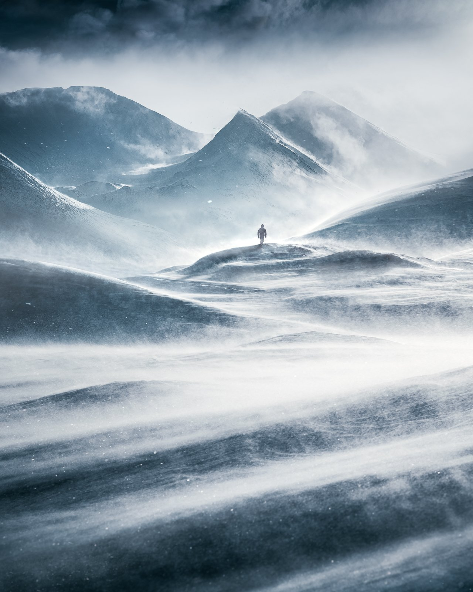

## [Windswept](https://foundation.app/@mikkolagerstedt/in-the-solitude/5) SOLD

As a photographer, you strive to be in the right moment at the right time. And when you are, everything comes together. We were left in awe of this moment that felt like a movie in Swedish Lapland. A moment that shows the power of nature in a way I've never experienced before.

Location: Sweden  
Year: 2020