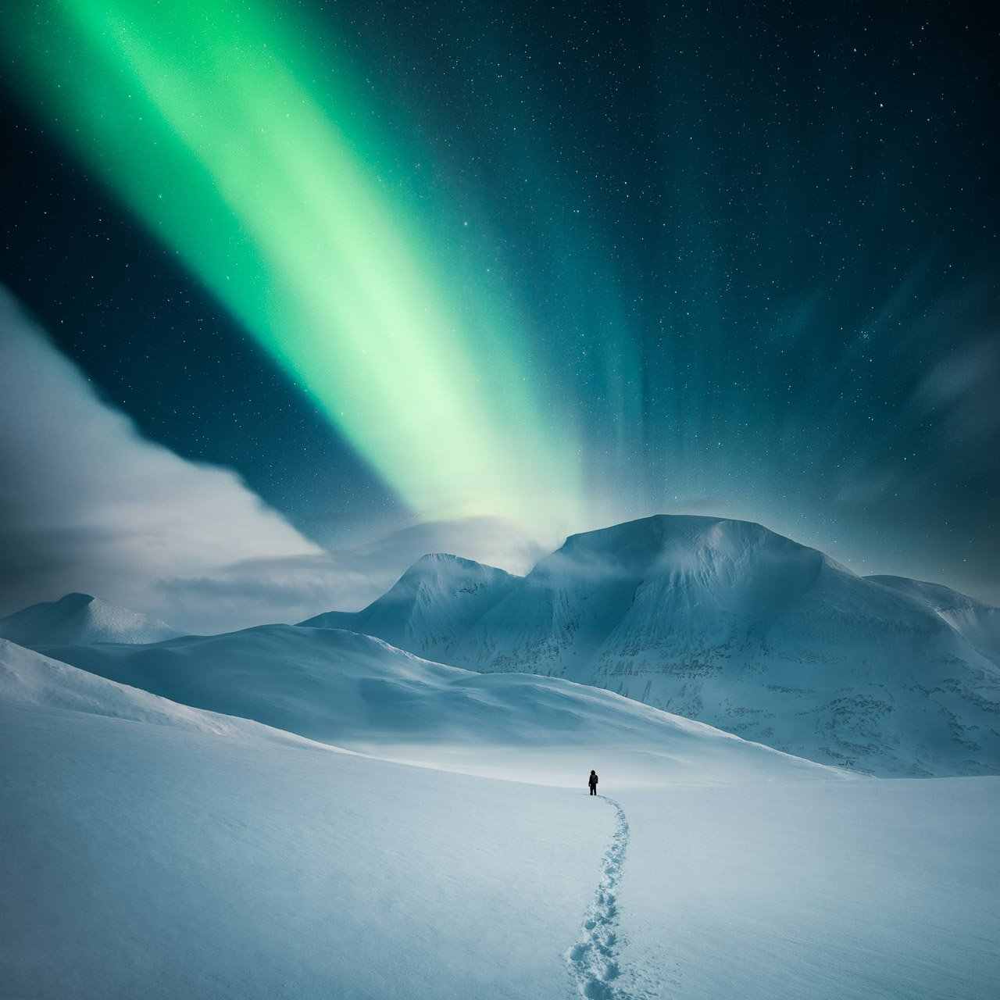

# Learn Photography & Editing

Transform your photography and editing skills, taking your work from ordinary to extraordinary!

## [The Complete Photography Bundle](/complete-bundle)

How to improve your landscape photography? Elevate your photography with the Complete Photography Bundle! Including all of Mikko's tutorials, presets, and eBooks in one package, it's the ultimate deal to enhance your photography and gain the recognition your photos deserve.

## [EPIC Preset Collection](/epic-presets)

You have never seen anything like this for Lightroom or Camera RAW! Unleash your editing in Lightroom and create visually stunning images with ease!

## Ebooks & Video Tutorials

### [Composite Photography Video Tutorial](/composite-photography-video)

Master the art of creating realistic photo manipulations from start to finish in this comprehensive course.

### [Atmosphere eBook](/atmosphere-ebook)

Discover the secrets of crafting mood and atmosphere in photography, from conceptualization to the final piece.

### [Star Photography Masterclass](/star-photography-tutorial)

Unlock the mysteries of breathtaking astrophotography, from capturing stunning images to expert editing techniques.

## Visit my free tutorials

Check out the free tutorials to get started improving your photography and editing.

[Visit Tutorials](/tutorials)