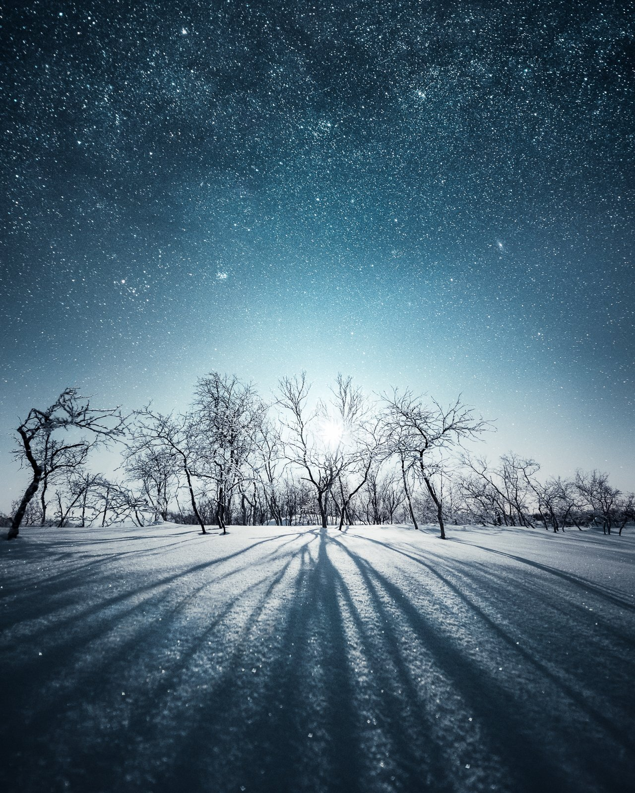

## links to NFTs

[SUPERRARE](https://superrare.com/mikkolagerstedt)

[FOUNDATION](https://foundation.app/@mikkolagerstedt?tab=home)

[Editions on opensea](https://opensea.io/collection/mikko-lagerstedt-long-shadows-edition)

[LIGHT ARTIST Collective](https://opensea.io/collection/light-art-annual?search%5BsortAscending%5D=true&search%5BsortBy%5D=UNIT_PRICE&search%5BstringTraits%5D%5B0%5D%5Bname%5D=Artist&search%5BstringTraits%5D%5B0%5D%5Bvalues%5D%5B0%5D=Mikko%20Lagerstedt)

### [LONG SHADOWS](https://opensea.io/collection/mikko-lagerstedt-long-shadows-edition)

"Long Shadows" is my genesis edition released using Manifold Studio. Edition of 32. Sold out, you can find the secondary on OpenSea.

[**VIEW ON OPENSEA**](https://opensea.io/collection/mikko-lagerstedt-long-shadows-edition)

---

### [1/1 ON Foundation](https://foundation.app/collection/mikko-lagerstedt?sortOrder=DEFAULT)

The most meaningful and highly curated selection of my photography work from the past 15 years.

[**VIEW ON FOUNDATION**](https://foundation.app/collection/mikko-lagerstedt?sortOrder=DEFAULT)

---

### About my NFTS

As the art world moves towards a more digital version, I have chosen to give back with my NFTs. Adding my art to your collection will contribute to a brighter future. Each sale of my 1/1 NFT will give back to our precious planet. 10% of the sale profit will be donated to preserve the oceans, and 100 trees will be planted with each sale.