*As the art world moves towards a more digital version, NFTs are part of my story. My legacy. You can find my NFTs on* [*SuperRare*](https://superrare.com/mikkolagerstedt)*,* [*Foundation*](https://foundation.app/@mikkolagerstedt)*, and* [*OpenSea*](https://opensea.io/account?tab=created)*.*

## The jOURNEY

*NFT Photography Collection by Mikko Lagerstedt*

Landscape photography is a journey to capture the beauty and majesty of the natural world. It's about discovering hidden gems, chasing the perfect light and weather, and immersing oneself in nature's raw and wild beauty. But truly creating extraordinary landscape photographs takes more than just a camera and a good eye. It takes a combination of passion, dedication, and a willingness to take risks.

This collection includes 10 of my most beloved work minted to the blockchain from the past 15 years of my photography journey. I have captured hundreds of thousands of photographs throughout my journey, and this highly curated collection is the best of the best boiled down to ten artworks. This is my legacy.

Each of the 1/1 pieces from the Journey collection includes a signed limited edition fine art print. I go through each piece on this page, from the latest mint to the first one.

[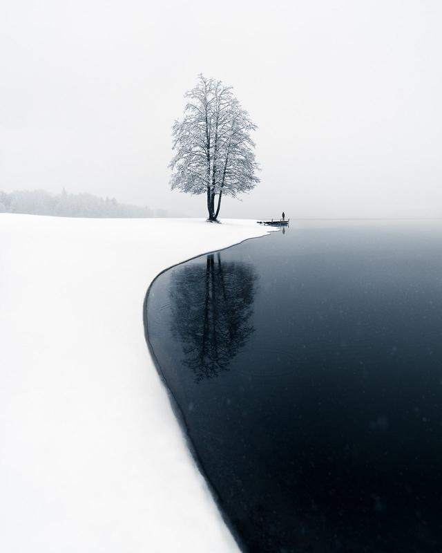](https://superrare.com/0xa9cf3fb2c4538ac95e0c822758ec745fcfed8360/reflect-219)

Reflect (Copy)

[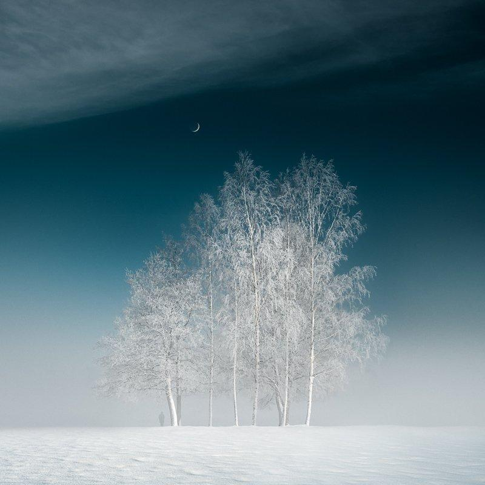](https://foundation.app/@mikkolagerstedt/mikko-lagerstedt/7)

In The Mist (Copy)

[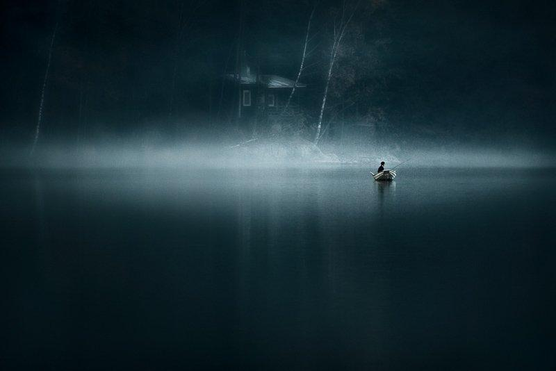](https://foundation.app/@mikkolagerstedt/mikko-lagerstedt/5)

Alone - Sold (Copy)

First Snow (Copy)

Between Two Worlds (Copy)

Infinite (Copy)

Lost World - Sold (Copy)

[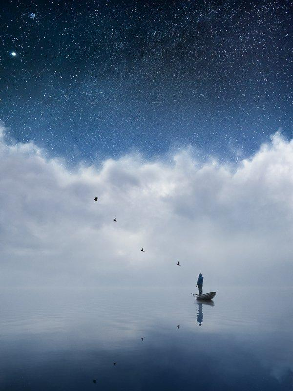](https://foundation.app/@mikkolagerstedt/mikkolagerstedt/3)

Dream - Sold (Copy)

[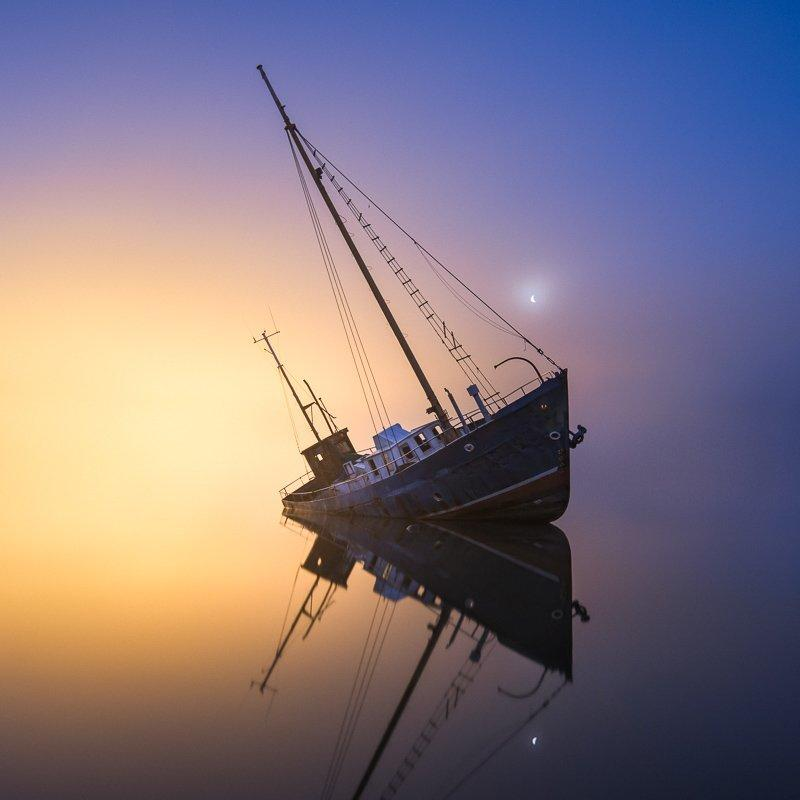](https://foundation.app/@mikkolagerstedt/mikkolagerstedt/1)

Evening Mist - Sold (Copy)

[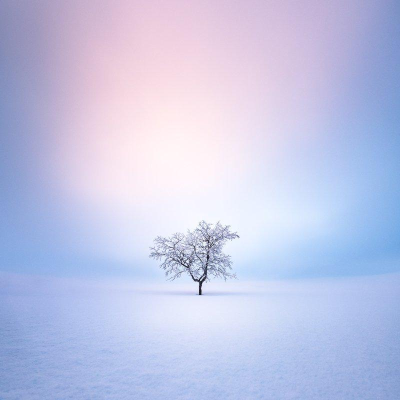](https://foundation.app/@mikkolagerstedt/foundation/132166)

Solitude - Sold (Copy)

[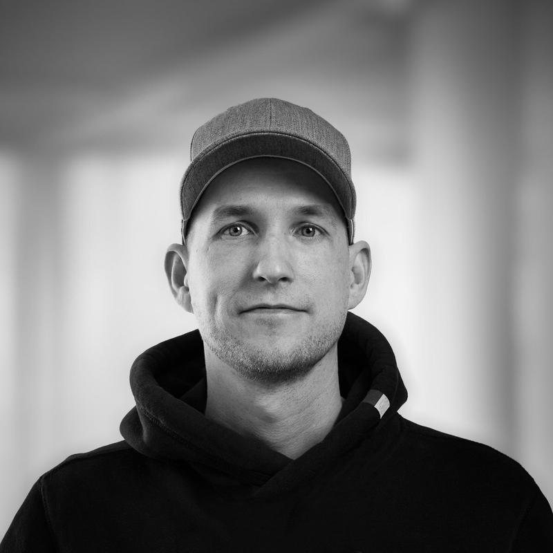](https://superrare.com/0xa9cf3fb2c4538ac95e0c822758ec745fcfed8360/reflect-219)

### [REFLECT - SUperRare Genesis](https://superrare.com/0xa9cf3fb2c4538ac95e0c822758ec745fcfed8360/reflect-219)

*Captured on 26th, October 2017*

Some moments leave you speechless and connect you to the present moment. When you are open, things start to align. The moment snow lights up the landscape, there is magic in the air. Landscape photography is about the weather and how it shapes the view. This scenery was not an exception.

The stark contrast between the two sides of open water and land creates a mystical view. As I took photographs of the scene, I saw a man slowly walking into the pier. While waiting, I found a composition to capture the scenery, with the tree's reflection in its full glory—a rare photograph and moment.

Capturing unique moments sparked my love for photography 15 years ago. Since the NFT space, I knew this would be my genesis on SupeRare.

[View on SuperRare](https://superrare.com/0xa9cf3fb2c4538ac95e0c822758ec745fcfed8360/reflect-219)

*Minted on December 7th, 2022*

---

### [IN THE MIST](https://foundation.app/@mikkolagerstedt/mikko-lagerstedt/7)

*Captured on 9th, February 2022*

After a cold winter night, sometimes, when there is no wind, you can catch mist at the lake. On this beautiful morning, I never planned to take any photographs, but I always take my camera with me wherever I go. This moment is a perfect example of why it's worth the effort.

Once I saw the fog, I walked around this area and saw people ice-skating on the lake. I saw this beautiful part of the park where the trees were isolated from the rest with the fog. I waited for some time. A person walked from the lake to this small part of the park, and while he approached the trees, I captured this view.

[View on Foundation](https://foundation.app/@mikkolagerstedt/mikko-lagerstedt/7)

*Minted on November 7th, 2022*

---

### [AlonE - SOLD](https://foundation.app/@mikkolagerstedt/mikko-lagerstedt/5)

*Captured on October 20th, 2009*

A quiet moment of solitude at one of my favorite places in the World.

As I was capturing the views, I saw a fisherman slowly rowing and trying to catch something. While he was rowing and changing places, I took over 100 photographs of the moment. Finally, one that is still one of my favorite photographs. A lonely fisherman and a small cabin in the background. It is one of the most artistic photographs in my catalog. It looks like a timeless painting.

The journey makes this one of the most important photographs I have ever captured. I won my first award with this photograph in the Nikon Photography Competition. Getting second place, I felt so proud of my work, which grew my passion for photography. This made me pursue it as my career.

The Alone photograph has been exhibited around the World, from Helsinki to Seattle, and featured on magazine covers and articles. The primary collector receives a signed limited edition print of the photograph.

*Minted on October 20th, 2022*

---

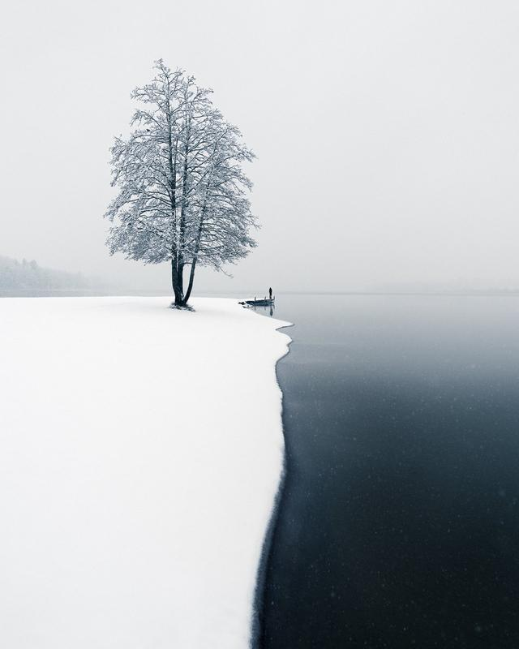

### [First Snow](https://foundation.app/@mikkolagerstedt/mikko-lagerstedt/4)

*Captured on October 2017*

There is something magical about the first snow of the season and how it lights up the landscape. The snow might be gone in a few days or even hours, but it leaves you open to what is to come.

I have photographed this unique tree for many years—hundreds of times. But I have never encountered a more beautiful view than on this October day. As I stood there waiting for something to happen, everything aligned. The stark contrast between the two sides of open water and land creates a mystical view—a special moment.

Some moments leave you speechless. The First Snow photograph is one of those moments where I felt humbled by the beauty of nature. It is one of my most popular photographs shared and published Worldwide.

[View on Foundation](https://foundation.app/@mikkolagerstedt/mikko-lagerstedt/4)

*Minted on September 6th, 2022*

---

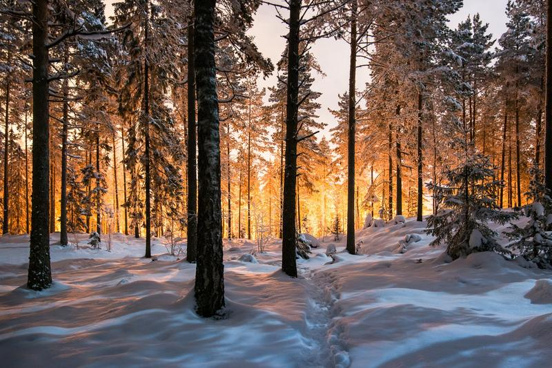

### [Between Two Worlds](https://foundation.app/@mikkolagerstedt/mikko-lagerstedt/3)

*Captured on December 23rd, 2012*

Winter night in a forest in Finland. Trees covered in frost. Looking back to this beautiful night, I captured one of my favorite photographs of this magical place. The light in the background comes from a skiing track illuminating the horizon. Moon slightly lit the foreground with sidelight. All this created a surreal moment in time, an almost three-dimensional view.

Once I captured this photograph, I couldn't believe it—a dream shot of a unique view on a cold night.

[View on Foundation](https://foundation.app/@mikkolagerstedt/mikko-lagerstedt/3)

*Minted on August 31st, 2022*

---

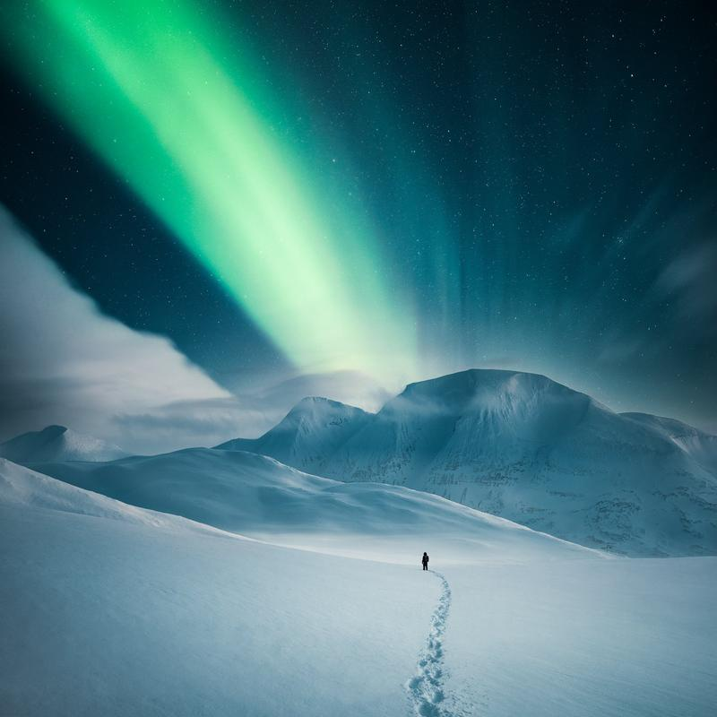

---

### [Infinite](https://foundation.app/@mikkolagerstedt/mikko-lagerstedt/2)

*Captured on February 2020*

The light expands through space and time. One can get lost in the cold—vast views of endless snow-covered mountains. The untouched landscapes of the Swedish Lapland are unmatched. An overwhelming sense of peace and tranquility. Floating in silence, feeling infinite.

[View on Foundation](https://foundation.app/@mikkolagerstedt/mikko-lagerstedt/2)

*Minted on August 29th, 2022*

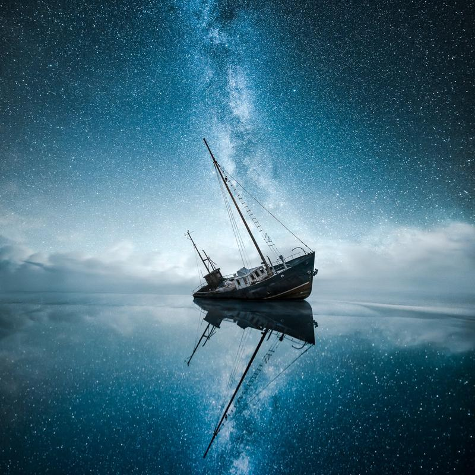

### [The Lost World - Sold](https://foundation.app/@mikkolagerstedt/mikko-lagerstedt/1)

*Created on April 2015*

The perseverance. From lost to found, dark to light, and broken to healed. In 2013 I photographed this shipwreck, and two years later, I created this image from those photographs.

This artwork is part of my photography legacy and one of the pinnacles that got me noticed around the World. It's the most recognizable work I have ever created.

This shipwreck was half-sunken and barely on the water's surface. A new owner has fixed the boat, and it is roaming the seas again, making this image never to be created again.

This piece is also on the cover of my photography book Landscapes with Soul. The collector will receive a copy of the signed hardcover book and a fine art print.

*Minted on August 9th, 2022*

---

### [Dream - Sold](https://foundation.app/@mikkolagerstedt/mikkolagerstedt/3)

*Created on April 2013*

A composite work of letting go of all things. Let your sorrow, fear, and old perception flow into the abyss. Be one with the moment. Float between clouds and the night sky. Let go and dream.

*Minted on April 30th, 2022.*

---

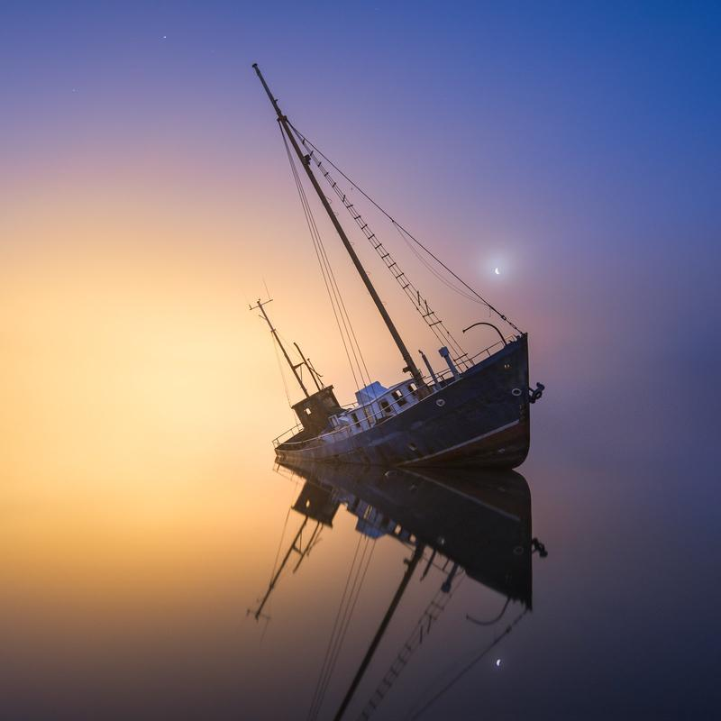

### [Evening Mist - Sold](https://foundation.app/@mikkolagerstedt/mikkolagerstedt/1)

*Captured on August 2013*

Autumn night on the coast of Finland. Looking back on this beautiful night, I captured one of my favorite photographs of this shipwreck. The colder weather made mist arise from the sea. The thick fog caused the ship to look like it was floating in space. The light from the left side of the photograph comes from a nearby factory. Moon was slightly visible through the mist. All this created a surreal moment in time.

Once I captured this photograph, I couldn't believe it—a dream shot. The ship is half-sunken, barely on the water's surface, with few rocks keeping it standing in this place. The boat has now been fixed, roaming the seas again, hopefully never returning to this location.

*Minted on April 19th, 2022*

---

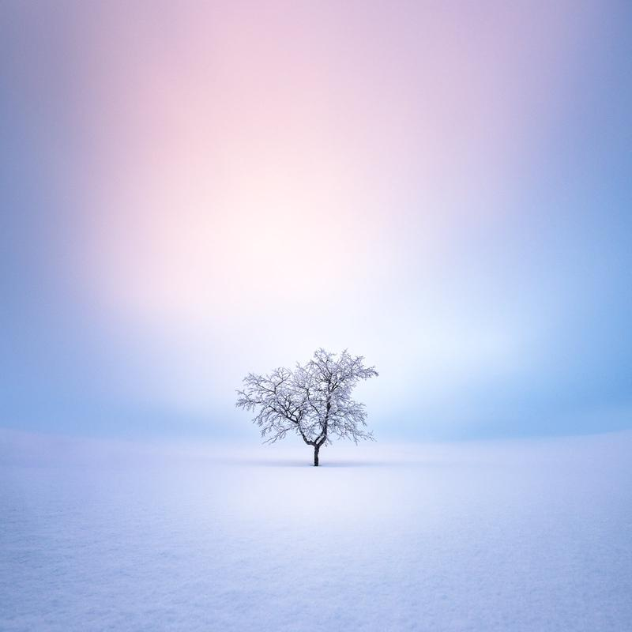

### [Solitude - Sold](https://foundation.app/@mikkolagerstedt/foundation/132166)

*Captured on February 2018*

A winter morning solitude. This photograph represents a unique moment in time in the wilderness. I captured it in one of the most surreal and beautiful moments I have ever witnessed.

With luck on my side, I saw this frost-covered lonely tree amidst the low moving clouds. Sun was rising, and light filtered through the clouds. Battling the waist-deep snow, I finally got an angle that made justice to the scenery—pure joy in the cold.

*Minted on January 2022.*

---

### **What are NFTs?**

NFTs, or non-fungible tokens, are digital assets that represent ownership of a unique item or asset. They are stored on a blockchain, which is a decentralized and secure digital ledger, and they can be bought and sold like other assets.

One way to think about NFTs is to compare them to physical collectibles, like trading cards or fine art prints. Just like each physical collectible is unique and valuable, NFTs represent unique digital items that can be owned and traded. NFTs are difficult to forge or reproduce, making them attractive to collectors and creators who want to protect their digital assets.

# **About Mikko**

My first inspiration for photography happened before I even had a camera. I was driving to a summer cabin in 2007. After a long rainy day, the sun began to shine, and the mist rose from the ground. With a small point-and-shoot camera, I took some photographs. From that moment on, I decided I'd start capturing moments like those. I was in graphic design school, which was my last year. So after graduating in November 2008, I saved money and bought my first DSLR camera.

Learning the technical side was small compared to how having a camera changed how I saw everything. Every time I stepped outside, I started to see what the camera saw. I began to view each moment differently. I remember driving, seeing different things, and thinking wow, that could look amazing as a photograph. At first, I photographed everything, from macro to portraits to landscapes and everything in between. The first year I got my camera, I captured well over 10 000 photographs. After that, the catalog on my computer started growing, and I then started using software to edit the shots I had taken.

In 2009 I started sharing my photographs on different platforms online. Flickr was the first one I started using. The first image I shared on Flickr was a long exposure shot of stars. After that, most of the photography I shared was macro and landscape photography with vibrant colors.

As I saw what type of photographs people liked, my style began to evolve. The first image that got to the explore page on Flickr was a late-night view of a misty river. Getting recognition for my photos felt terrific. I also posted photographs to a site called 1X, which was curated, and only the best work was displayed. It was a fantastic challenge to create beautiful work to get featured. I started to get into 1X with my photos, so in 2010, I participated in my first photo contest. With my photograph, Alone earned second place in the competition. I felt so proud of my work, which increased my interest in photography.

Back in 2010, I shared my first photos on my Facebook page. The page started to grow slowly initially, but in 2014 it went from 10 thousand followers to 500 000. Today, I have 1.5 million followers on Facebook.

My work has evolved since I picked up photography, but some things have stayed the same. For example, a lonely subject was something I had already captured back in 2009, and since then, it has been one of the key elements in my photography. Looking back at my photography, I can see that the past had a significant role in my art. My best friend passed away when I was 19, and I think it is one reason I have unintentionally used a single subject in my pictures. I hope you enjoy this introspection into my World of photography.