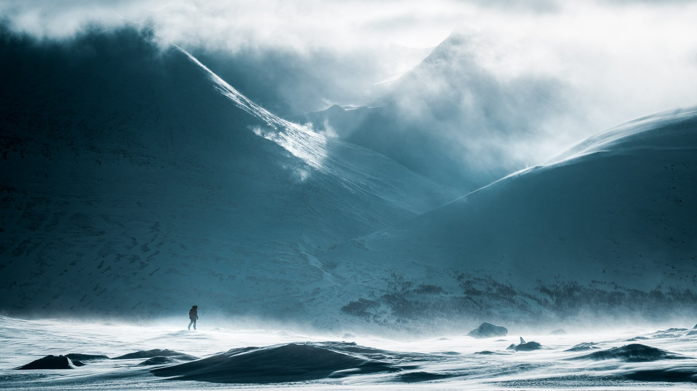

## Photography by Mikko Lagerstedt

As the art world transitions to a more digital format, my legacy includes NFTs. This page showcases my photography on the blockchain.

[SUPERRARE](https://superrare.com/mikkolagerstedt) | [FOUNDATION](https://foundation.app/@mikkolagerstedt) | [OPENSEA](https://opensea.io/mikkolagerstedt/created) | [EXCHG](https://exchange.art/mikkolagerstedt/nfts)

## NFT Collections and Editions

[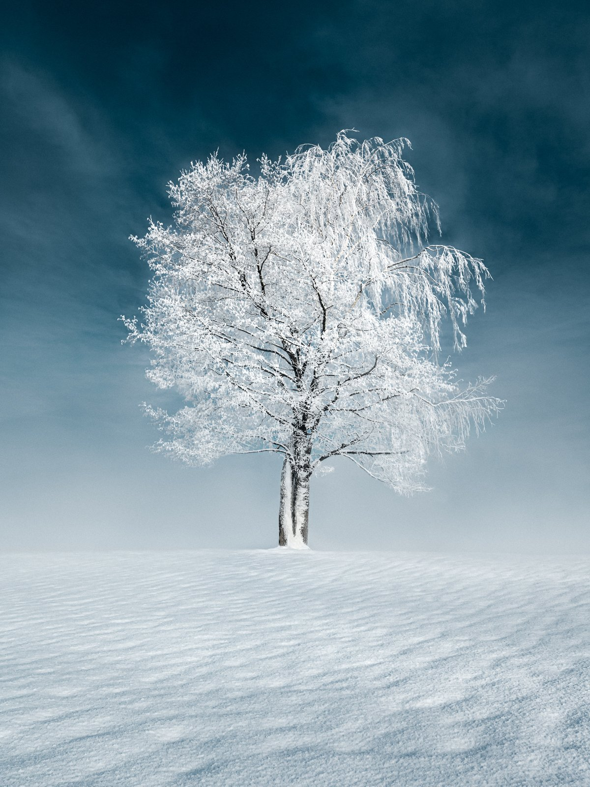](/resilience)

#### [Resilience](/composite-photography-video)

A collection including some of Mikko’s favorite minimalistic landscape photography.

[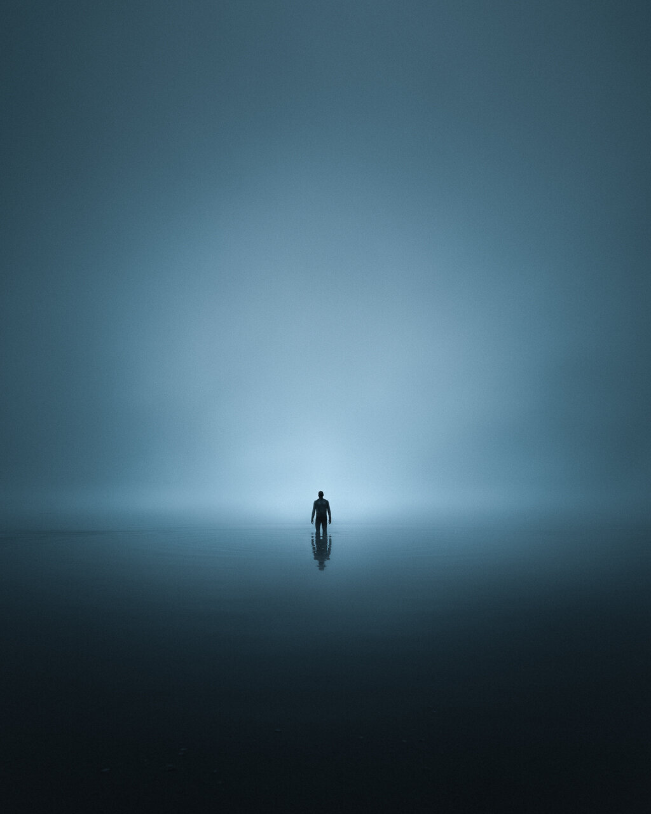](/in-the-solitude)

#### [In The Solitude](/in-the-solitude)

Fine art photography collection by Mikko Lagerstedt.

#### [Slices of Nights](/slices-of-nights)

A collection of night photography capturing the beauty of the night sky.

[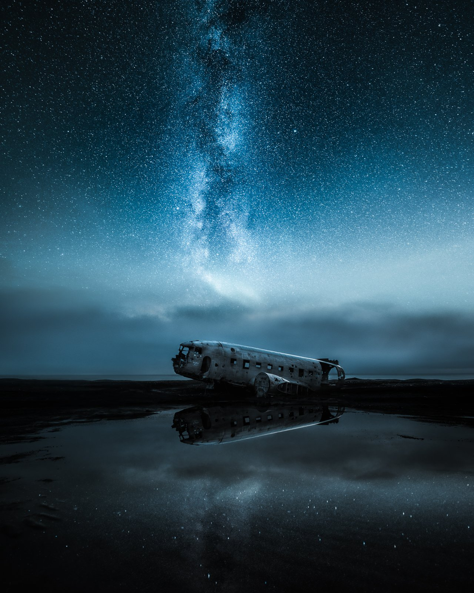](/editions)

#### [EDITIONS](/editions)

Fine art photography editions by Mikko Lagerstedt.

[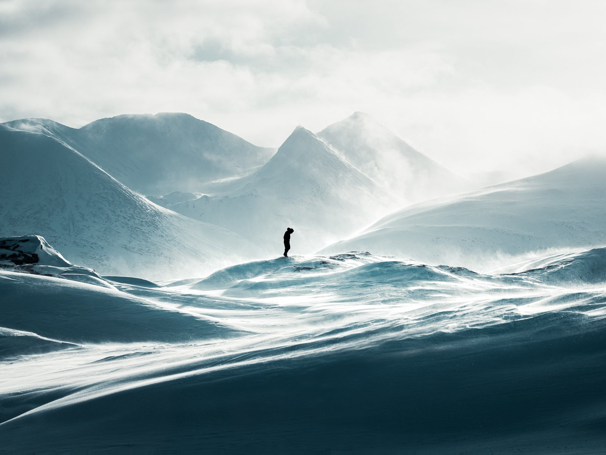](https://opensea.io/collection/light-alpha-collection?search[stringTraits][0][name]=Artist&search[stringTraits][0][values][0]=Mikko%20Lagerstedt)

#### [Light.Art](https://opensea.io/collection/light-alpha-collection?search[stringTraits][0][name]=Artist&search[stringTraits][0][values][0]=Mikko%20Lagerstedt)

Mikko’s work in Alpha Collection by Light Art.

## 1/1 photography Pieces

Landscape photography is a journey to capture the beauty and majesty of the natural world. It's about discovering hidden gems, chasing the perfect light and weather, and immersing oneself in nature's raw and wild beauty. However, creating extraordinary landscape photographs takes more than just a camera and a good eye. It takes a combination of passion, dedication, and a willingness to take risks. My most beloved work minted to the blockchain from the past 15 years of my photography journey. I have captured hundreds of thousands of photographs throughout my journey, and this highly curated collection is the best. This is my legacy.

[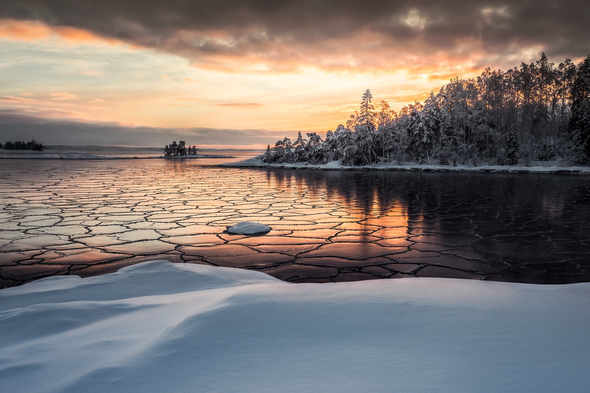](https://foundation.app/@mikkolagerstedt/mikko-lagerstedt/15)

Frozen Patterns

[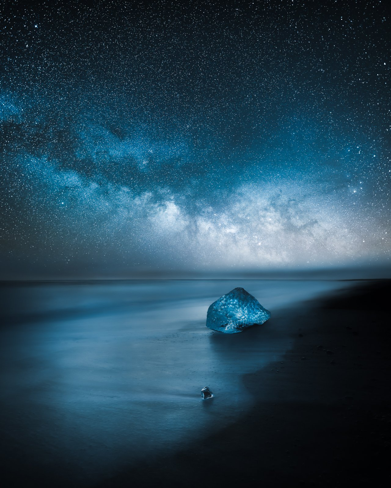](https://superrare.com/artwork/eth/0x5d6a3585d581a438a3fdad23796ab97692297a22/9)

Transformation

[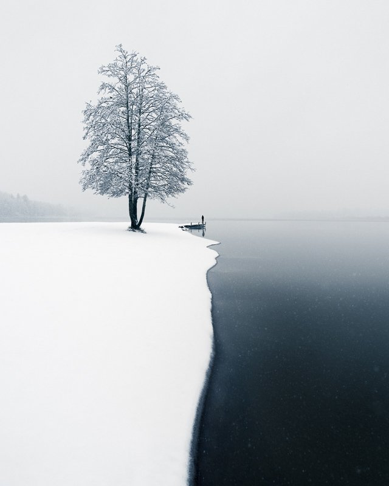](https://superrare.com/artwork/eth/0x5d6a3585d581a438a3fdad23796ab97692297a22/4)

First Snow

[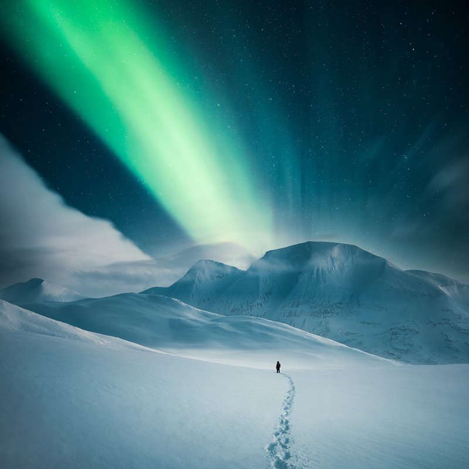](https://superrare.com/artwork/eth/0x5d6a3585d581a438a3fdad23796ab97692297a22/2)

Infinite

[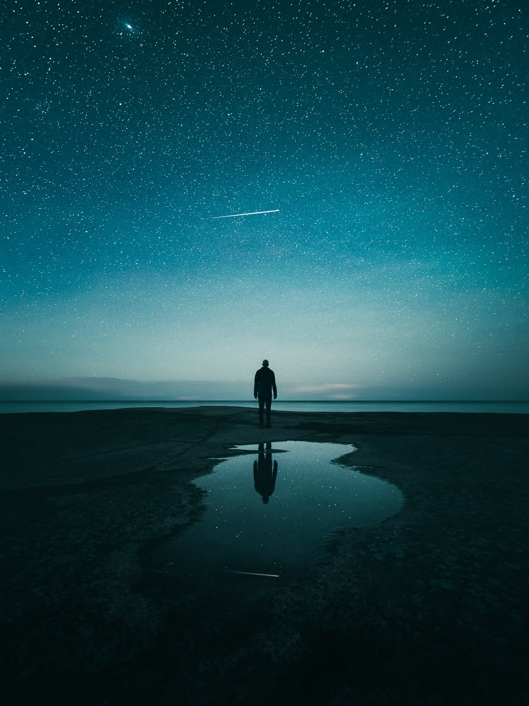](https://foundation.app/@mikkolagerstedt/mikko-lagerstedt/14)

Celestial Echo - Collected

[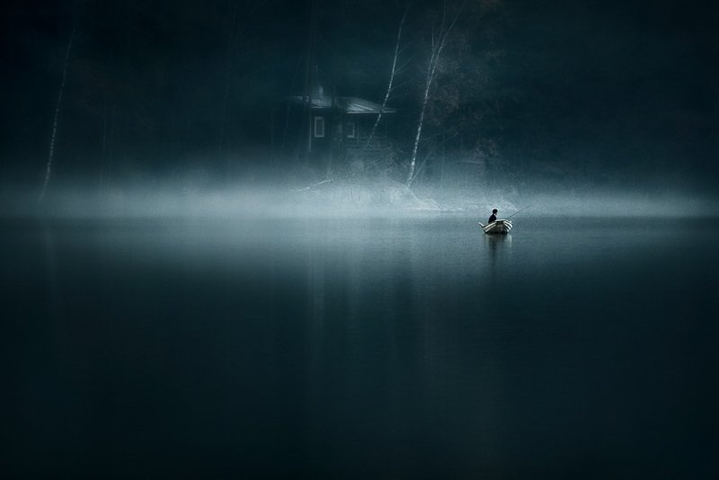](https://foundation.app/@mikkolagerstedt/mikko-lagerstedt/5)

Alone - Collected

Between Two Worlds - Collected

[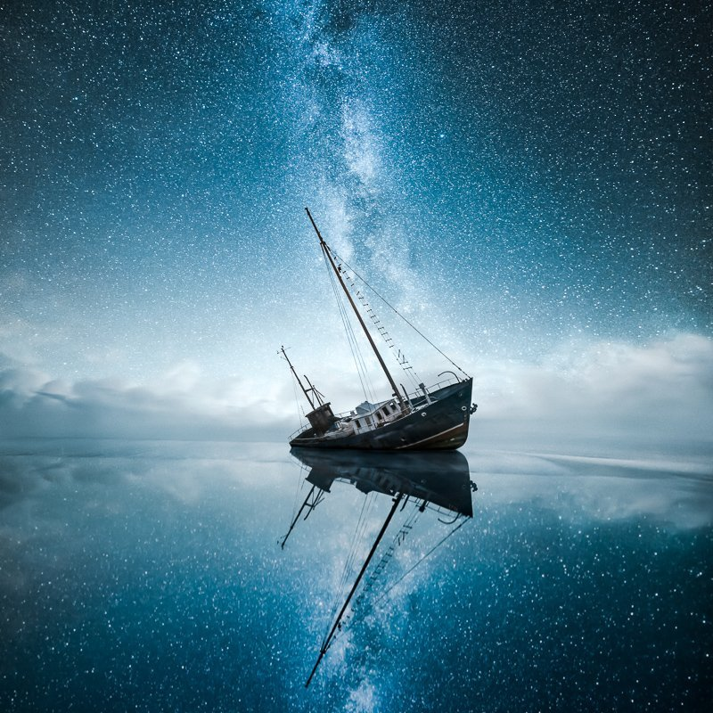](https://foundation.app/@mikkolagerstedt/mikko-lagerstedt/1)

Lost World - Collected

[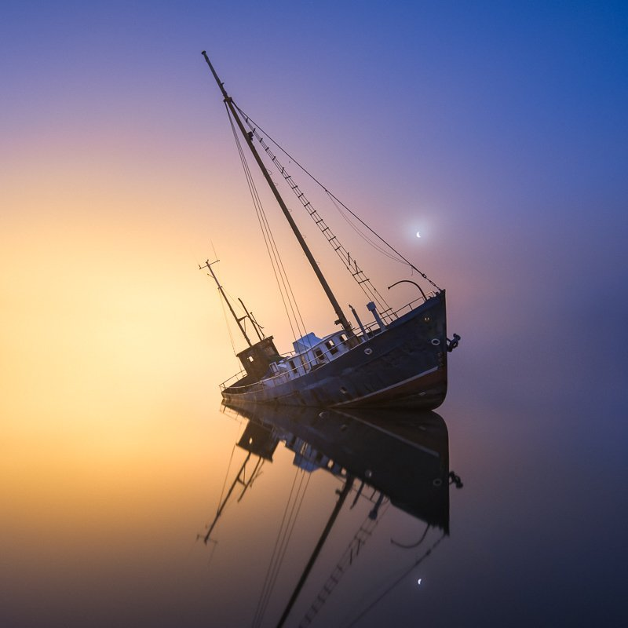](https://foundation.app/@mikkolagerstedt/mikkolagerstedt/1)

Evening Mist - Collected

[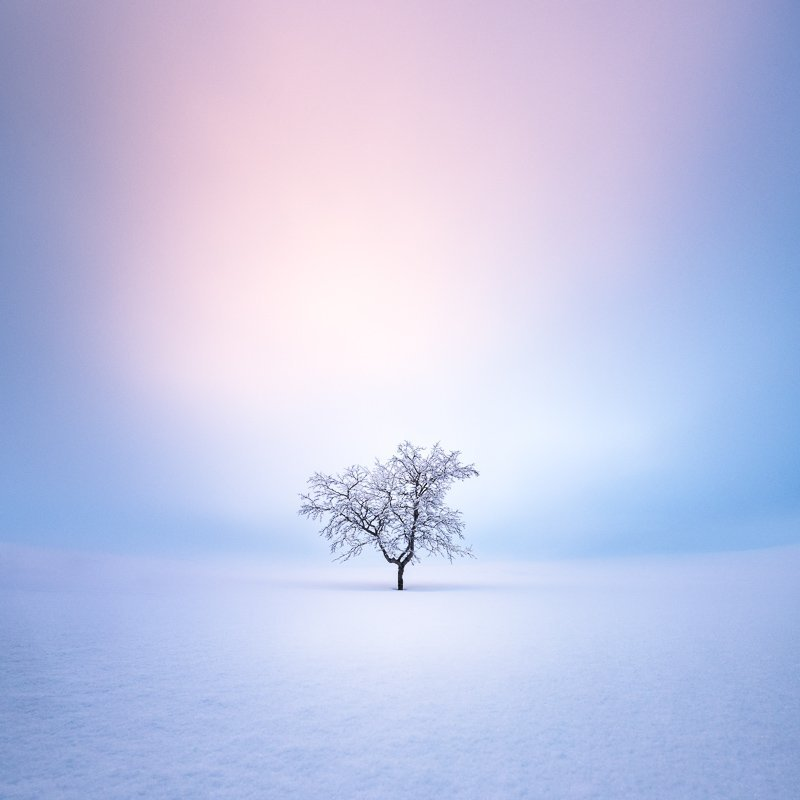](https://foundation.app/@mikkolagerstedt/foundation/132166)

Solitude - Collected

### **What are NFTs?**

NFTs, or non-fungible tokens, are digital assets that represent ownership of a unique item or asset. They are stored on a blockchain, which is a decentralized and secure digital ledger, and they can be bought and sold like other assets.

One way to think about NFTs is to compare them to physical collectibles, like trading cards or fine art prints. Just like each physical collectible is unique and valuable, NFTs represent unique digital items that can be owned and traded. NFTs are difficult to forge or reproduce, making them attractive to collectors and creators who want to protect their digital assets.

# **About Mikko**

My first inspiration for photography happened before I even had a camera. I was driving to a summer cabin in 2007. After a long rainy day, the sun began to shine, and the mist rose from the ground. With a small point-and-shoot camera, I took some photographs. From that moment on, I decided I'd start capturing moments like those. I was in graphic design school, which was my last year. So after graduating in November 2008, I saved money and bought my first DSLR camera.

Learning the technical side was small compared to how having a camera changed how I saw everything. Every time I stepped outside, I started to see what the camera saw. I began to view each moment differently. I remember driving, seeing different things, and thinking wow, that could look amazing as a photograph. At first, I photographed everything, from macro to portraits to landscapes and everything in between. The first year I got my camera, I captured well over 10 000 photographs. After that, the catalog on my computer started growing, and I then started using software to edit the shots I had taken.

In 2009 I started sharing my photographs on different platforms online. Flickr was the first one I started using. The first image I shared on Flickr was a long exposure shot of stars. After that, most of the photography I shared was macro and landscape photography with vibrant colors.

As I saw what type of photographs people liked, my style began to evolve. The first image that got to the explore page on Flickr was a late-night view of a misty river. Getting recognition for my photos felt terrific. I also posted photographs to a site called 1X, which was curated, and only the best work was displayed. It was a fantastic challenge to create beautiful work to get featured. I started to get into 1X with my photos, so in 2010, I participated in my first photo contest. With my photograph, Alone earned second place in the competition. I felt so proud of my work, which increased my interest in photography.

Back in 2010, I shared my first photos on my Facebook page. The page started to grow slowly initially, but in 2014 it went from 10 thousand followers to 500 000. Today, I have 1.5 million followers on Facebook.

My work has evolved since I picked up photography, but some things have stayed the same. For example, a lonely subject was something I had already captured back in 2009, and since then, it has been one of the key elements in my photography. Looking back at my photography, I can see that the past had a significant role in my art. My best friend passed away when I was 19, and I think it is one reason I have unintentionally used a single subject in my pictures. I hope you enjoy this introspection into my World of photography.