[← Back to Learn](/learn)

## Preset Collection Saga

*Night Sky Landscape Presets For Lightroom Classic and CC*

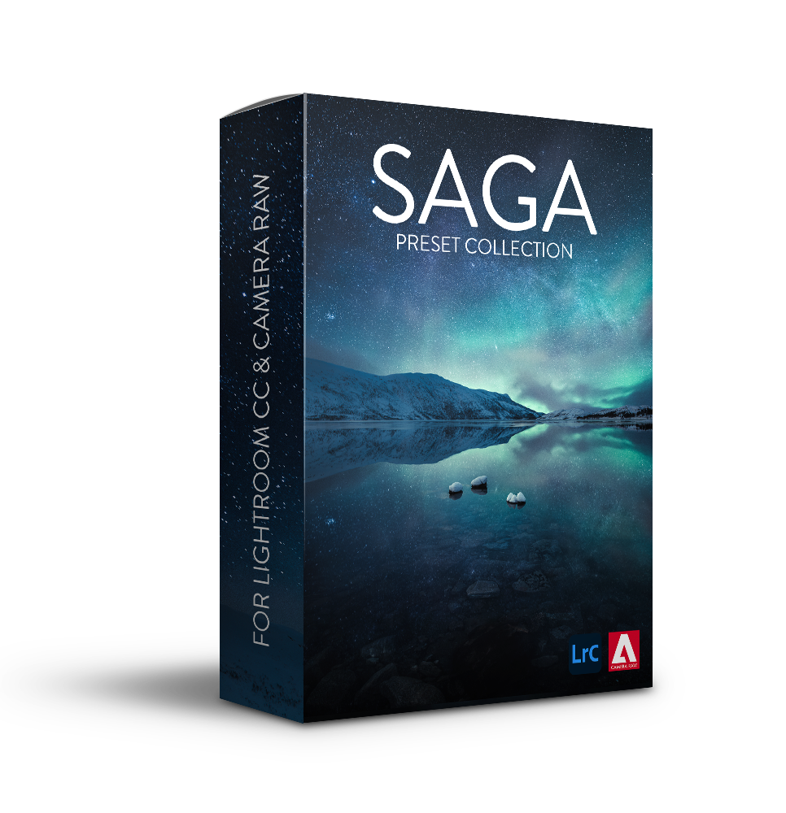

180+ Presets  

Night photography presets  

One-click editing  

Instant download

### ONLY AVAILABLE IN [THE COMPLETE PHOTOGRAPHY BUNDLE](https://owl-alpaca-3p8z.squarespace.com/complete-bundle)

This preset collection is perfect for you if you feel inspired to capture the night sky and landscape photography. This complete photography collection uses the same step-by-step process as the [Phase Presets](/phase-presets).

With progressive editing presets, you can control every essential part of your post-processing, from creating atmospheric photographs to removing noise and light pollution from your nighttime photos. This collection is optimized for Lightroom CC & 6, but it also works in older versions of Lightroom.

### Who is it for?

The Saga Collection is especially for a beginner to an advanced nighttime photographer who aspires to learn more about Lightroom and post-processing. There is plenty of fine art landscape suitable presets as well. Look no further for the most comprehensive Astro- & landscape photography preset collection!

Before

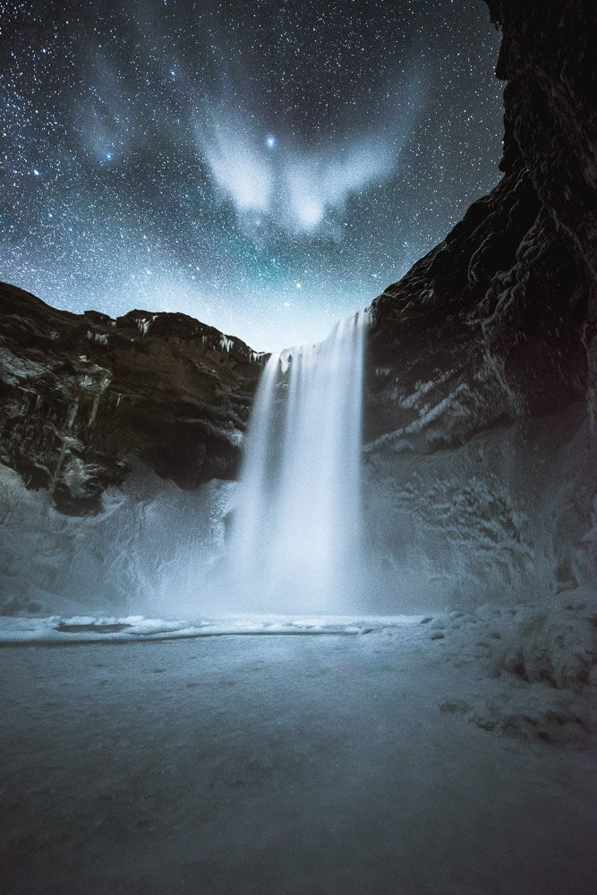

After

Before

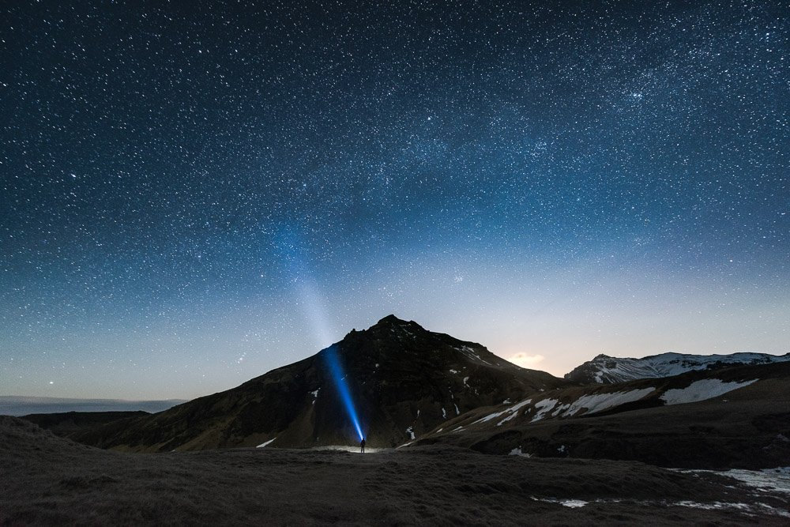

After

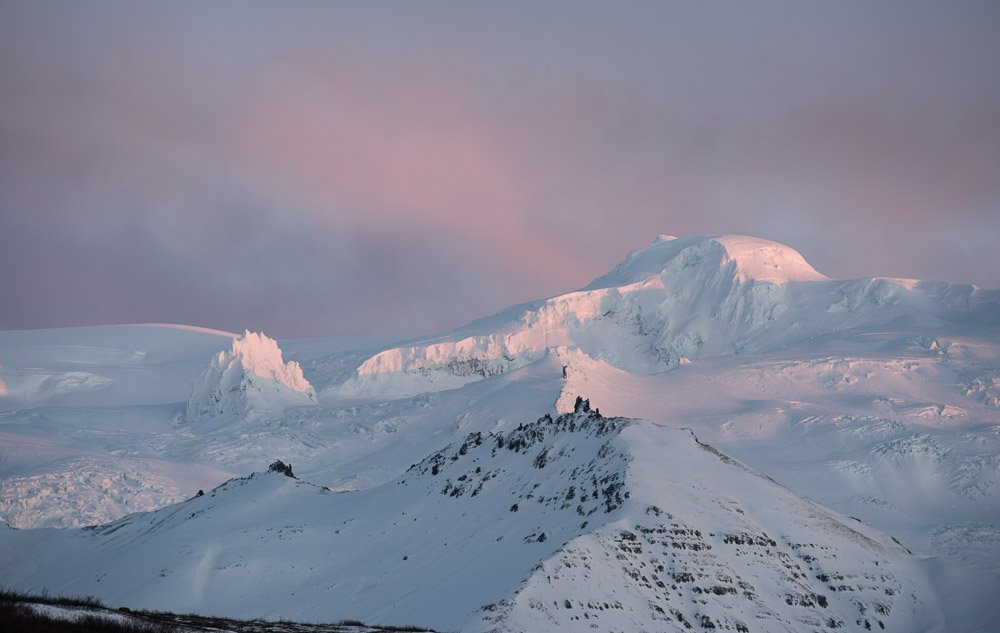

Before

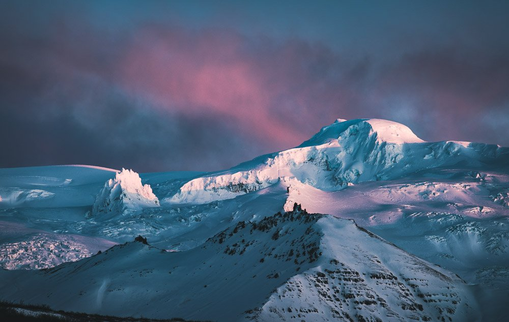

After

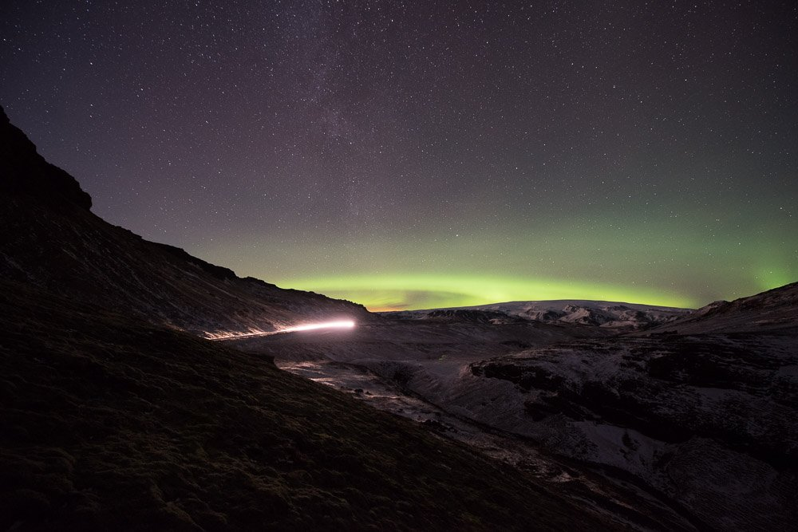

Before

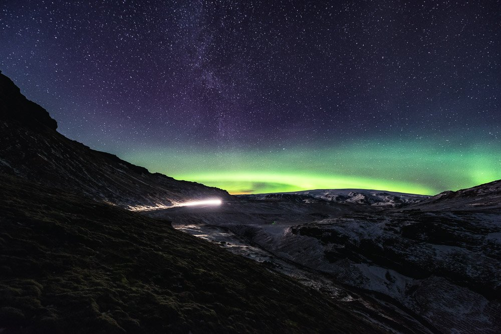

After

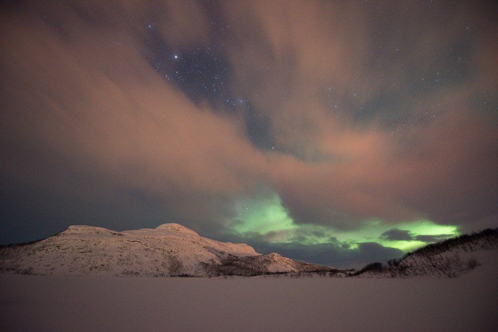

Before

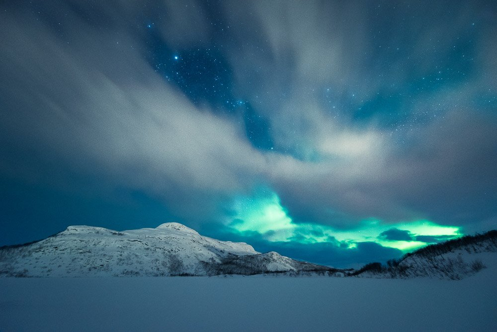

After

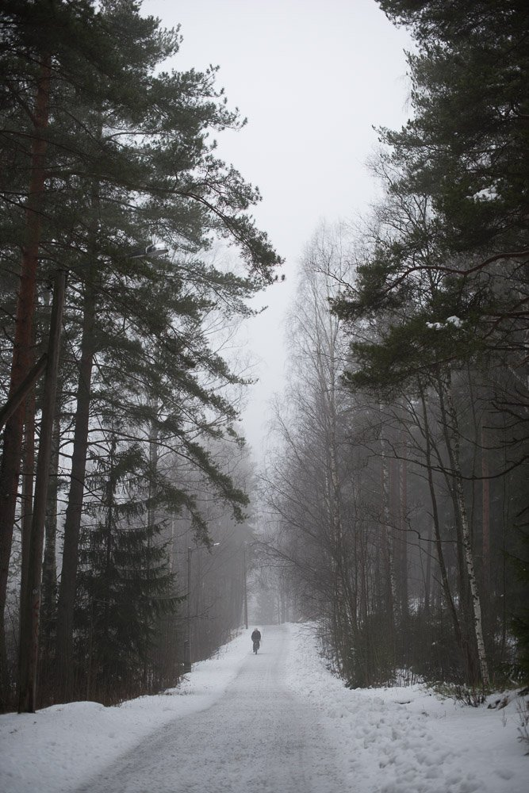

Before

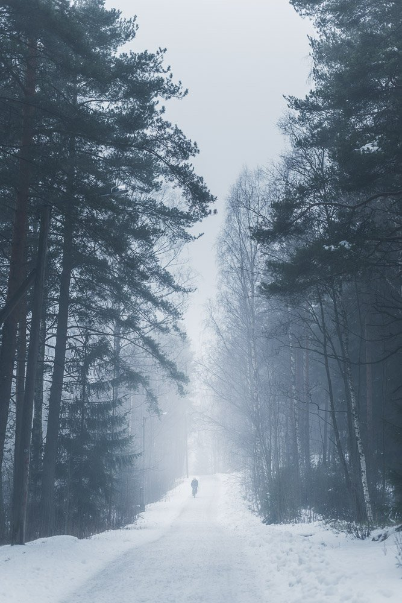

After

### What is included?

#### Over 180 Presets

* 54 Presets for Star and Landscape Images – A unique set of presets created to suit night sky and landscape photographs.
* 23 Local Adjustment Presets – Add detail to the stars, remove light pollution, and create depth.
* 37 Graduated Filters For Star Photographs – Balance your image and boost the Milky Way with these presets.
* 14 Graduated Filters for Landscape Photographs – Use these filters to create a sense of depth in your landscape photograph.
* 5 Remove Light Pollution Presets – Easiest way to eliminate light pollution.
* 20 Color Presets – Add color effects to your images.
* 18 Effect Presets – When creating that overall atmosphere, use these presets.
* 3 Noise Reduction Presets – Suitable for most night sky images shot with High ISO.
* 3 Sharpening Presets – Final sharpening before export.
* 7 Export Presets – To suit your exporting categories. From Instagram to Facebook and printed media.

  *After payment, you will get a link to the presets. You can pay either with a PayPal account or with credit cards.*

  *If you have any questions or want to pay with a different payment method, contact us:* [*hello@mikkolagerstedt.com*](mailto:hello@mikkolagerstedt.com)

  *A step-by-step tutorial on how to install the presets:*[*http://www.mikkolagerstedt.com/blog/2014/1/29/how-to-install-lightroom-presets*](http://www.mikkolagerstedt.com/blog/2014/1/29/how-to-install-lightroom-presets)