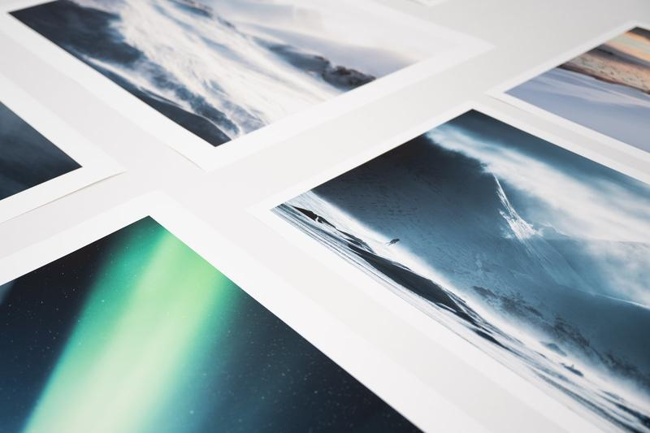

# Print & Shipping information

*We believe in creating exquisite fine art prints that transform spaces. We have associated with* [*Dialab*](http://www.dialab.com/fine-art-prints/)*, an Hahnemühle-certified studio in Finland, to create the best photography prints.*

### **Fine art Print Information**

* Open edition prints: Hahnemühle matte paper 210 gsm.
* Limited edition prints: Life expectancy up to 200 – 400 years with some Digigraphie materials.
* HDR-inks reproduce 98% of the Adobe RGB profile.
* Each print has an additional 2–8 cm white framing space around the photograph.

### Payment

* PayPal, Apple Pay or Credit Card
* Taxes are added in the checkout when appropriate.

### Shipping

* Fine Art print shipping is available internationally. Shipping and handling costs are added in the checkout.
* Fine Art paper prints will ship in protective tubes.
* Prints are unframed unless in request.
* Please allow 7 - 20 business days from the date of purchase to the delivery date.

### Copyright

When you purchase one of the fine art prints, you buy the actual physical copy. Unless expressly authorized in writing, you may not scan, duplicate, copy, resell, publish, or otherwise utilize the image without prior written authorization. You will own the print, not the rights to the original image.

### Privacy

We value your privacy and will never share your address, email, or phone number.