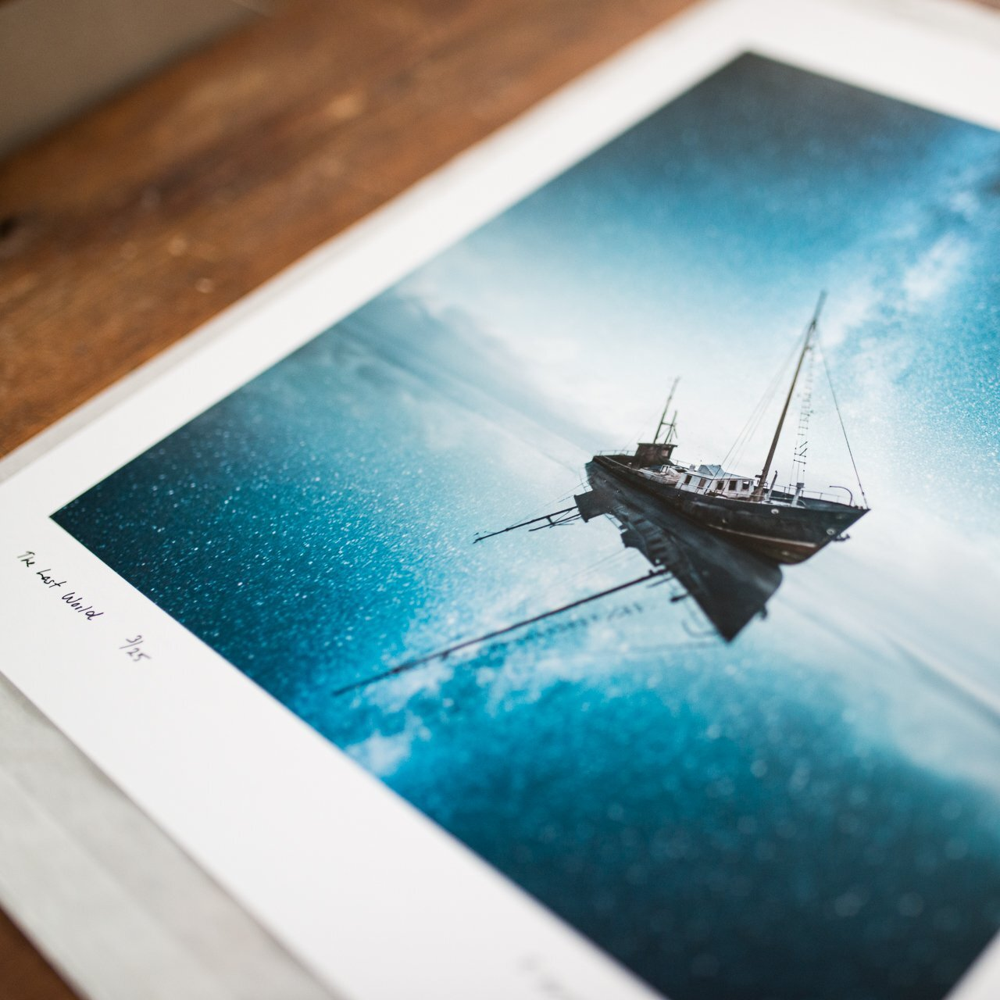

# Print Information

*We deliver inspiring wall art straight to your home and office, making your space beautiful. We believe in creating exquisite fine art prints that transform spaces. We have associated with* [*Dialab*](http://www.dialab.com/fine-art-prints/)*, an Hahnemühle-certified studio in Finland, to create the best photography prints.*

### [What paper Should you choose?](/what-paper-should-you-choose)

Every limited edition fine art print will be reviewed, signed, and numbered by Mikko Lagerstedt. Open-edition prints are not signed.

### Fine art prints

* Framed and open edition prints: Hahnemühle matte paper 210 gsm.
* Limited edition prints: Life expectancy: up to 200 years – 400 years with some Digigraphie materials.
* HDR-inks reproduce 98% of the Adobe RGB profile.
* Each print has an additional 3–10 cm of white framing space around the photograph.

### Hahnemühle Photo Rag (Matte)

The beautiful, smooth surface and feel of the Photo Rag make this paper very versatile. It is ideal for printing both black and white and color photographs and art reproductions with impressive pictorial depth. Excellent for hard lighting conditions for its smooth and anti-reflecting surface.

### Hahnemühle Bamboo (eco)

Bamboo represents spirituality and natural and resource-saving paper production. Particularly suitable for warm-toned colors and monochrome prints, Bamboo highlights the sensuality of images.

### Hahnemühle FineArt Baryta (pearl)

FineArt Baryta is a paper that sets the benchmark for high color depth, large color gamut, and image definition. Using barium sulfate in the premium inkjet coating ensures the typical gloss that makes this paper a genuine replacement for traditional Baryta papers from analog laboratories.

### PAYMENT

* Bank Transfer (email orders), PayPal, or Credit Card.
* Credit Cards: MasterCard, Visa, American Express.

### SHIPPING

* Fine Art print shipping is available internationally.
* Fine Art paper prints will ship in protective tubes.
* Prints are unframed unless in request (any additional costs added to the final price).
* Please allow 7 - 20 business days from the date of purchase to the delivery date.

### COPYRIGHT

When you purchase one of the fine art prints, you are buying the actual physical copy. Unless expressly authorized in writing, you may not scan, duplicate, copy, resell, publish, or otherwise utilize the image in any manner without prior written authorization. You will own the print, not the rights to the original image.

### PRIVACY

We value your privacy and will never share your address, email, or phone number.

