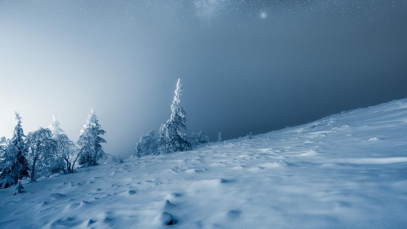

# Resilience

Life is about resilience and staying positive despite the challenges we face. Trees are the perfect example of strength because they face many challenges in their lifetime, yet they continue to grow and thrive despite obstacles. They symbolize the power of perseverance and the ability to overcome barriers. When we see a tree standing tall and proud despite its trials, we are reminded that we can overcome our challenges.

Resilience is an NFT collection, including some of my favorite minimalistic landscape photography. It’s a tribute to my wife, who has been there for me since the day I started my photography journey.

Each piece of this collection has a story. You can view those stories below. Each primary collector of the RESILIENCE collection will receive airdrops from Mikko throughout the year.

* [Embracing Darkness](https://opensea.io/assets/ethereum/0xf65185bf3014c7d32ecba96d72302eca734f16bd/3) Edition of 10 (1st airdrop to the collectors).
* [Fragile](https://opensea.io/assets/ethereum/0xf65185bf3014c7d32ecba96d72302eca734f16bd/5) Edition of 10 (2nd airdrop to the collectors)
* *THIRD and final airdrop TBA.*

### [Resilience on Foundation](https://foundation.app/collection/resilience-mikko-lagerstedt)

[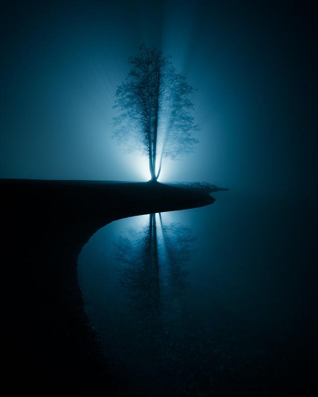](https://foundation.app/@mikkolagerstedt/resilience-mikko-lagerstedt/9)

Ying Yang

[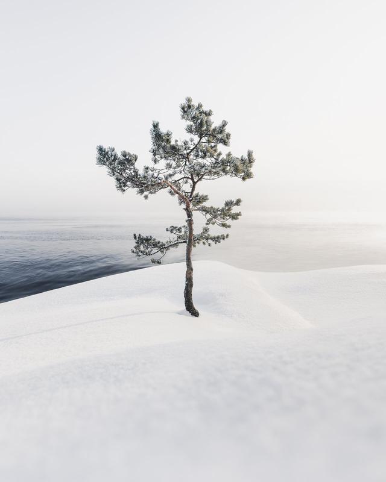](https://foundation.app/@mikkolagerstedt/resilience-mikko-lagerstedt/10)

Resilience

[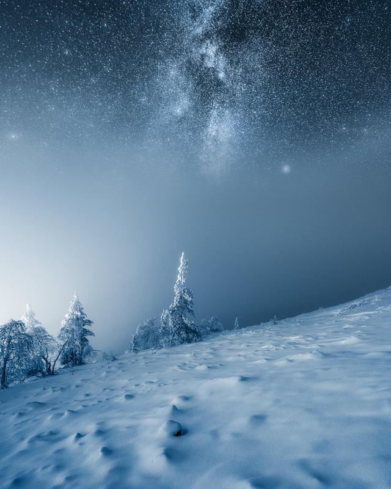](https://foundation.app/@mikkolagerstedt/resilience-mikko-lagerstedt/7)

Cold Night

[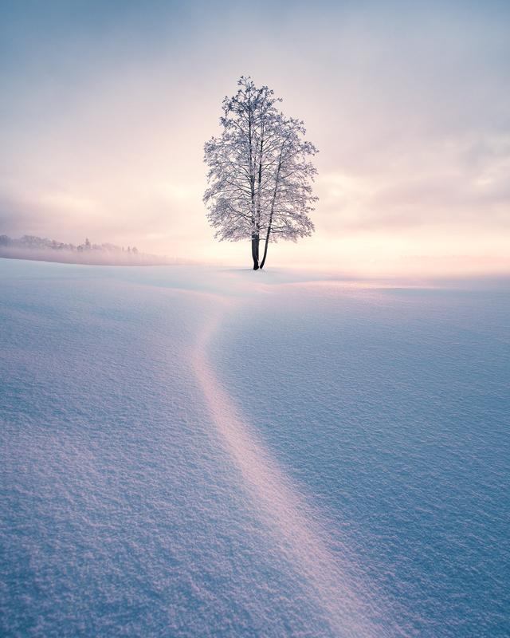](https://foundation.app/@mikkolagerstedt/resilience-mikko-lagerstedt/5)

Winter Solitude / SOLD

[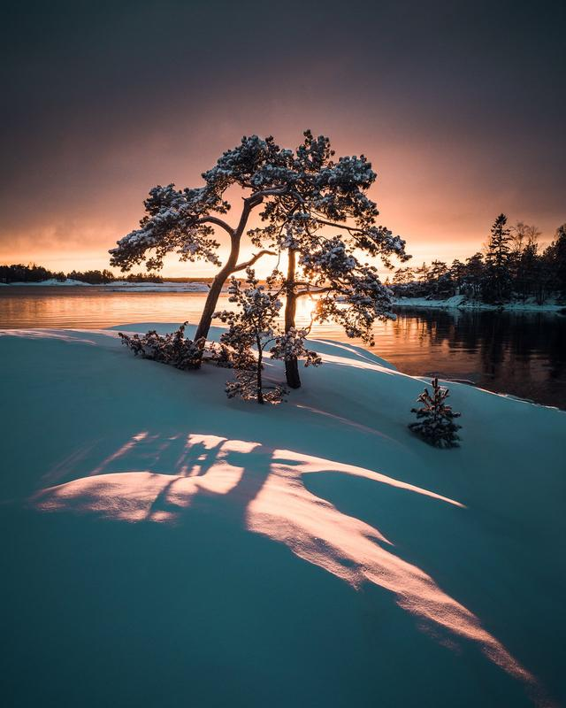](https://foundation.app/@mikkolagerstedt/resilience-mikko-lagerstedt/4)

Family / SOLD

Wonder / SOLD

[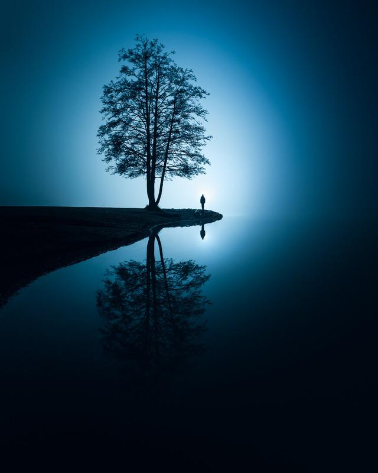](https://foundation.app/@mikkolagerstedt/resilience-mikko-lagerstedt/2)

Balance / SOLD

[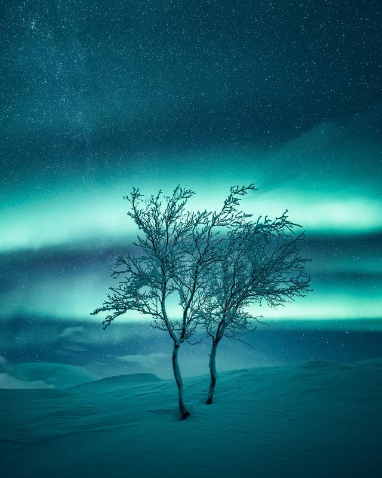](https://foundation.app/@mikkolagerstedt/resilience-mikko-lagerstedt/6)

Two / SOLD

[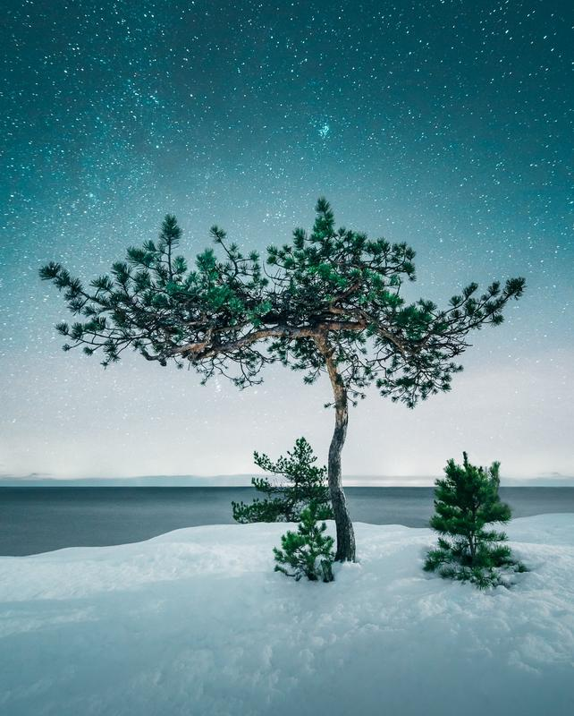](https://foundation.app/@mikkolagerstedt/resilience-mikko-lagerstedt/3)

Serenity / SOLD

### [Ying Yang](https://foundation.app/@mikkolagerstedt/resilience-mikko-lagerstedt/9)

An autumn evening at the lake. The mist had settled in, and the trees loomed in the background, covered in a soft haze. I noticed the lake's surface reflected the trees like a mirror. I set up my camera on a tripod and started to take long exposure shots, trying to capture the reflection of a tree in the water. But as I looked through the viewfinder, I realized that the background fog blended in too much with the tree, making the image look bland and uninteresting.

I aimed the flashlight at the background fog, carefully adjusting the light's angle. As I snapped the picture, I saw the image transform before my eyes. The tree stood out clearly against the mist; the water's reflection was sharp, and the background fog was now illuminated with rays of light like an ethereal glow. The scene came to life with the added light.

The reflection of the tree in the water and the contrast of the illuminated fog against the dark tree reminded me of the concept of Yin and Yang. The idea is that opposites can complement each other and that light and dark coexist harmoniously. It takes a unique vision to see things differently. To see beyond the mist and the fog and to find beauty in the unexpected.

### [Resilience](https://foundation.app/@mikkolagerstedt/resilience-mikko-lagerstedt/10)

This winter morning, the cold air made the mist rise from the sea. I've seen this small tree many times, but it always felt impossible to capture. It's beautiful yet so little. The steep ledge of rock it lives in is slippery, especially in winter. Light from the right side of the ridge created a beautiful foreground sight. As the gentle breeze made small waves in the water, it was a delightful moment. Just like this tree, we can weather the storms of life and come out stronger on the other side. We may bend and sway, but as long as we hold fast to our roots and remain dedicated, we can endure and thrive.

### [Cold Night](https://foundation.app/@mikkolagerstedt/resilience-mikko-lagerstedt/7)

I was on a mission to capture beautiful winter scenery in the Finnish Lapland. As I looked up, I saw a break in the clouds, so I decided to head up. After a warm climb, the cold breeze greeted me. As I went up, I was amazed by all those frozen trees. They endure the harshest conditions and usually with a heavy load of snow on top of it all. As I captured my first shots, I started seeing the stars. As the wind pushed through, it made the low clouds move fast. I captured this scenery with two horizontal captures—a cold yet beautiful view of resilient trees and snow-covered terrain.

### Winter solitude

What I love about seasonal photography is that there is only a tiny chance to capture a place with the perfect light. Sometimes, when you least expect, you capture a scene just as you envisioned. The rare moment when I captured this view was also a freezing one. As the cold air rolled in as the sun was about to set, the scenery turned beautiful. The light hitting the foreground snow with the glow in the mist made it look amazing—my favorite tree in the world. I captured this moment in time, freezing it forever in a photo. It was a rare and fleeting moment, and I feel incredibly fortunate to have witnessed it.

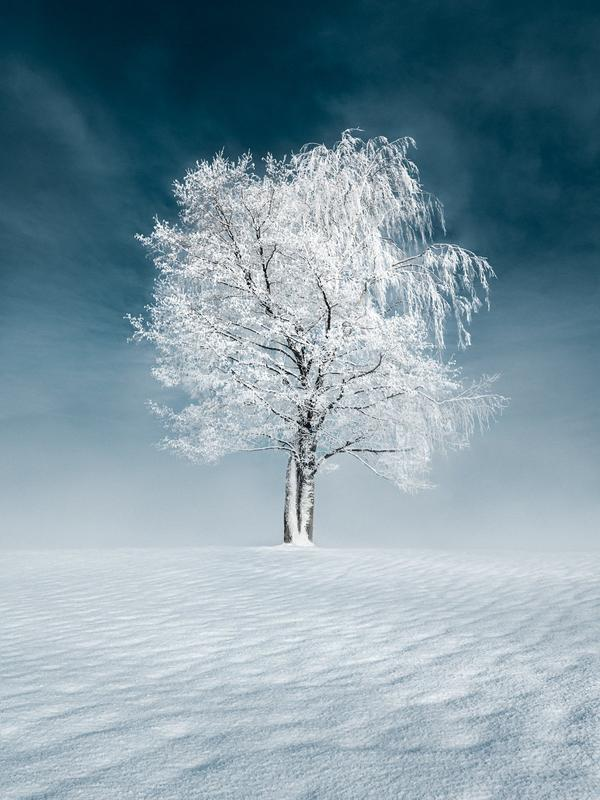

### Wonder

Magic is in the air in the early morning after a cold night. These cold moments are when you feel alive—reminding me why I do what I do. This tree is one of those that I have photographed for years but never captured in its full glory until this morning. The fresh snow, frost-covered branches, and light behind created an eerie look to this majestic birch. It reminds me of something out of a movie. And if you look closely enough, you can see that it's not just one tree but two tangled together. It adds another layer of wonder and magic to the scene, making it even more special.

### family

This place on the coast of Finland is one of my favorites. It's a place to gather my thoughts and feel the refreshing air. It makes you feel alive. While going around this area earlier that day, it wasn't looking special. The light was flat, and the sky was full of grey clouds. As the sun was about to set, there was a break on the horizon. And as I saw the light, I rushed back to this spot to capture the spectacle. The light made the place look alive. It was casting shadows on the fresh new snow—a moment of peace and tranquility. Trees have so much meaning to me. The trees in the foreground looked like a family to me, each unique yet all connected. It was a moment of peace and calmness that I was fortunate to capture.

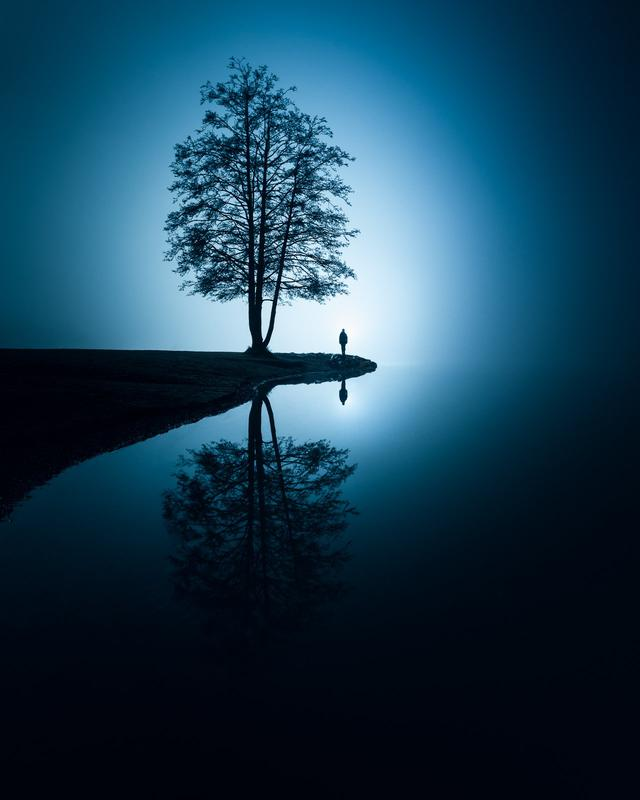

### Balance

One of the most important pieces in my collection. An extraordinary view of my favorite tree at night. This photograph is unique because it was the first time I went out to photograph after my back surgery. My wife was carrying my camera bag and tripod, as I couldn't lift them yet. I placed the tripod in the shallow water and asked my wife to pose for me with a flashlight in her hand. After a long exposure, I was amazed at how the photograph turned out. It reminds me of the moment when you are drifting into sleep.

### Two

Whenever I visit Finnish Lapland, I feel at home. It's an area with beautiful landscapes and fantastic light, especially in the winter. On this night, the northern lights were so powerful that they lit up the view in green. These little birch trees are remarkably resilient. With strong winds and harsh conditions, they fight for survival. I saw these two and wanted to capture them with the beautiful sky. This photograph is a testament to the beauty and spirit of Finnish Lapland. Every time I look at it, I am transported back to that magical night and reminded of the power and brilliance of nature.

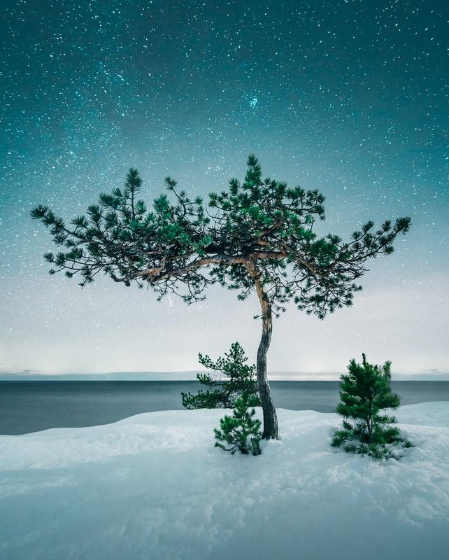

### Serenity

Under the moonlight, the light can be extraordinary. The slight breeze from the sea adds a subtle movement to the otherwise still waters, adding to the overall serene mood of the view. I was drawn to a pine tree standing alone in the foreground, its branches reaching the sky. The interplay of light and shadow on the tree was mesmerizing, and I knew I had to capture the moment. The interplay of light and shadow, combined with the beauty of the pine tree, creates a captivating photograph that invites the viewer to pause and appreciate the moment's serenity.