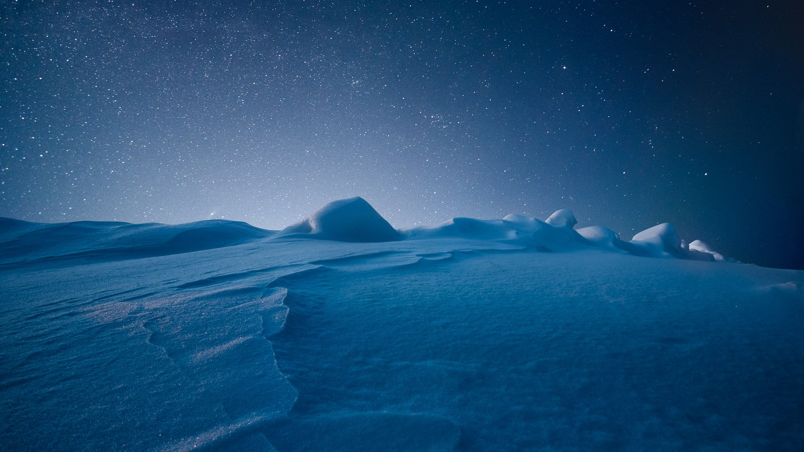

# SLICES OF NIGHTS

I have been fascinated by the beauty of the night sky ever since I started photography over 15 years ago. The photographs I have captured over time are a testament to my creative vision. Each piece I create is unique, showcasing my signature style while capturing the essence of the night in various ways.

The collection includes vertoramas, composites, and single captures, each telling its story. I invite you to explore this unique series of works I have created with passion and dedication: countless nights awake and countless hours of photography and editing. I don’t use AI in my photography.

[SLICES OF NIGHTS](https://exchange.art/series/Slices%20of%20Nights)

[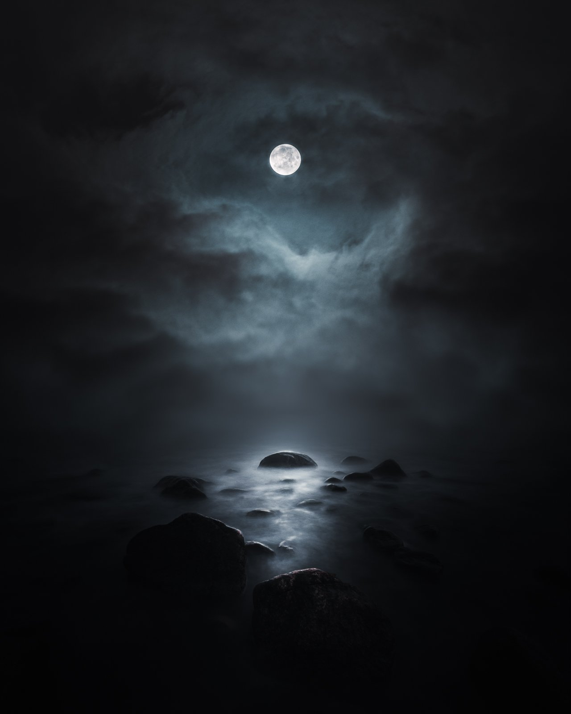](https://exchange.art/single/CBNMGvhmS5knAKte5wj13tQ67YsWFW28MdjEMfD6ht7e)

A Passing Moment

[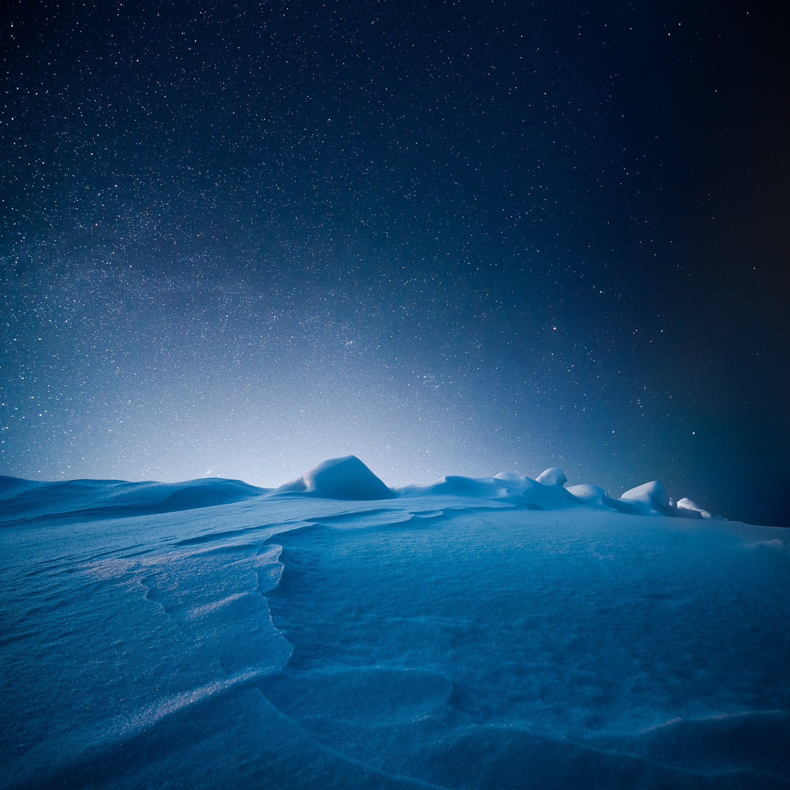](https://exchange.art/single/81uSeW39VAHr3ZgFHEjBdv8t6TFzPksWcWhRfaMSv1yC)

Night Glow

[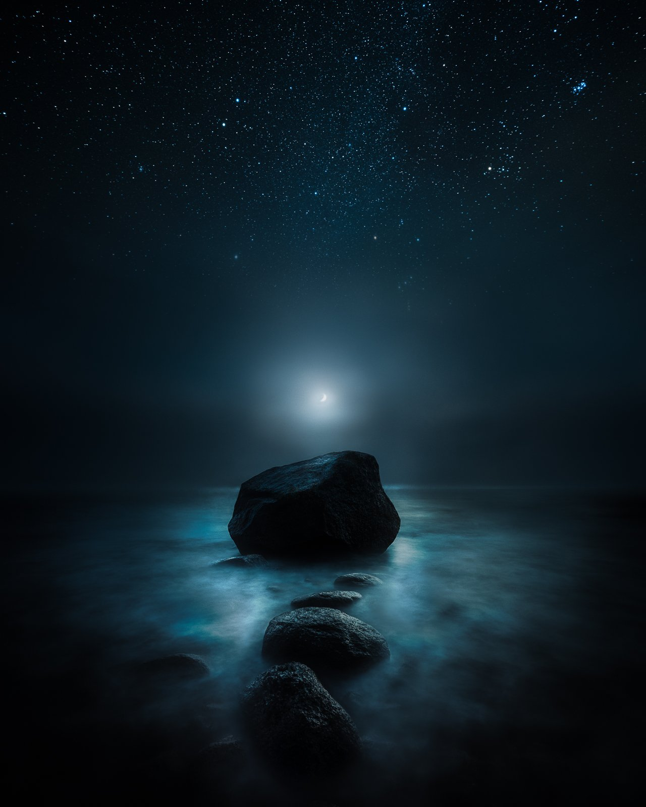](https://exchange.art/single/5vmc79VvQUmRWzZihQQiADSMaLcGKKVvFCotYEL7zqhK)

Crashing Waves

[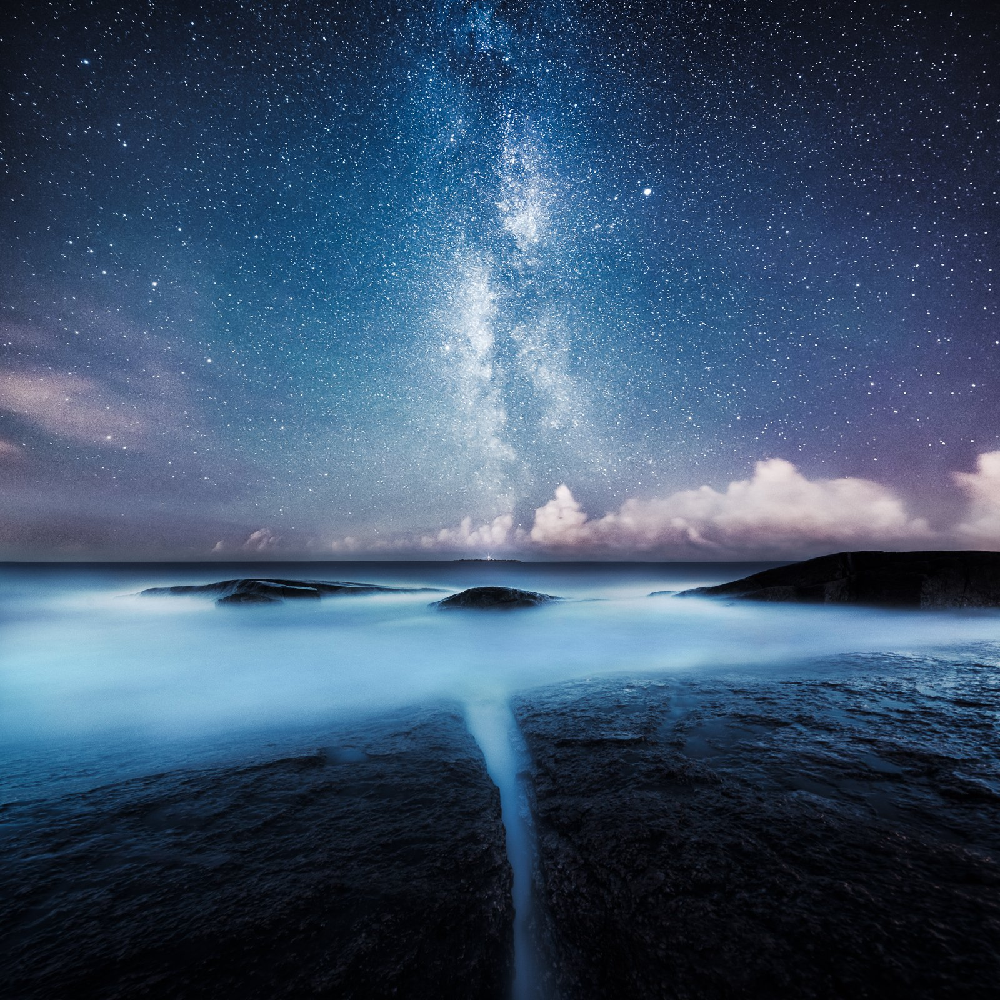](https://exchange.art/single/GjZdSHzHi4ewgrcQhneHqaogxWVx3CAK3mMxRLgt8TN3)

Divided – SOLD

[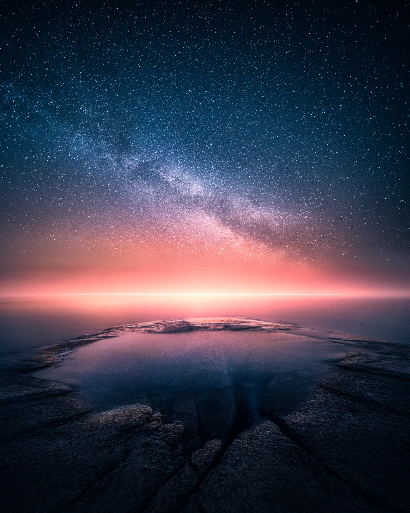](https://exchange.art/single/5FjPLvkCkAonnVRND9gtEZg46tysktX9EmSWAvCHZajt)

When Two Worlds Collide – SOLD

[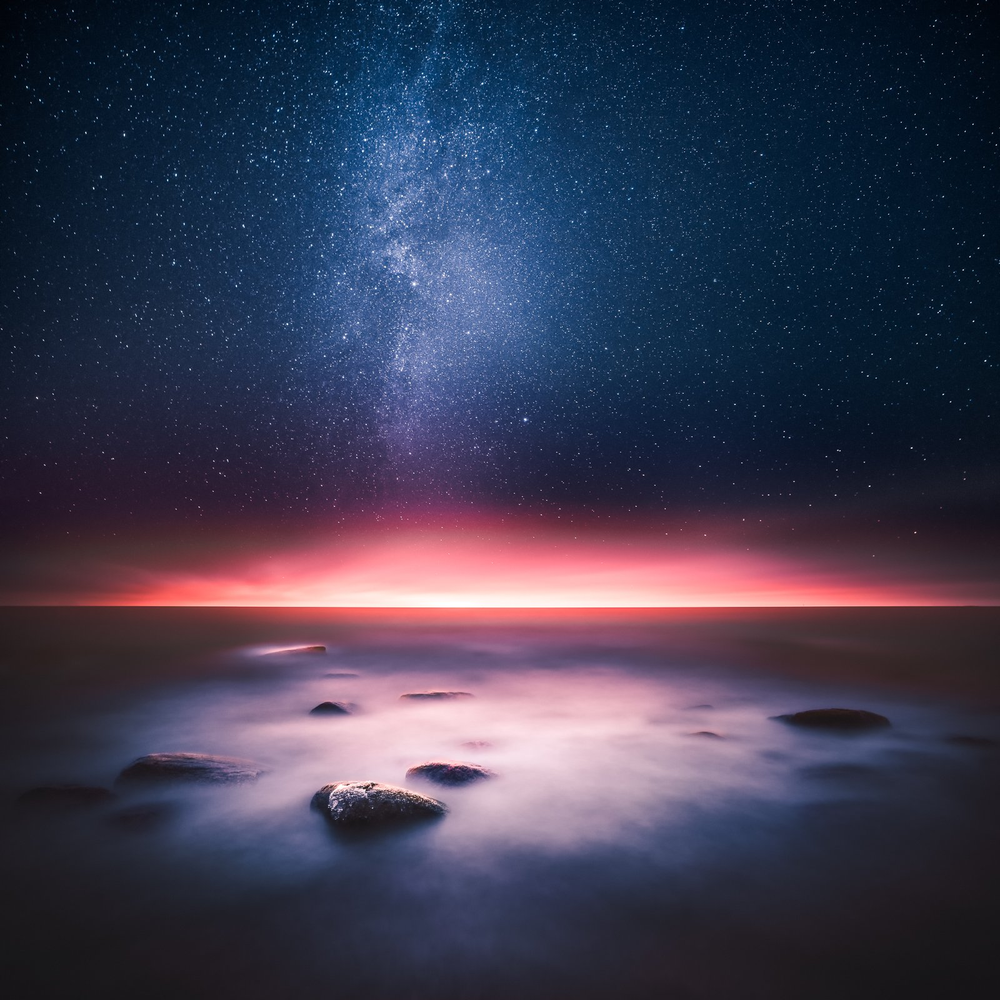](https://exchange.art/single/2QZ4Rdaf8oumAZvheruZBuwgoiTTvkZs62ZrAKGuemi3)

Whole Universe Surrenders – SOLD

[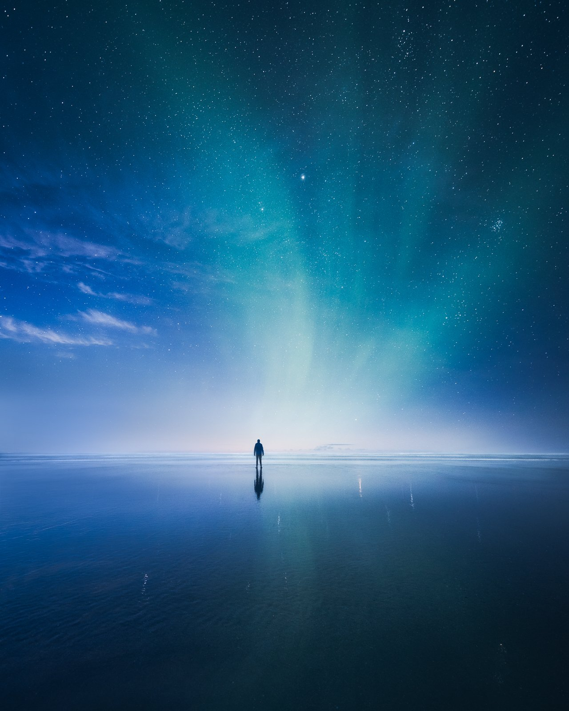](https://exchange.art/single/9vFPA3H1UCdGhKeCo4KFEASTTfWhhhu77RMc5Rxf33bv)

Tranquil Night – SOLD

[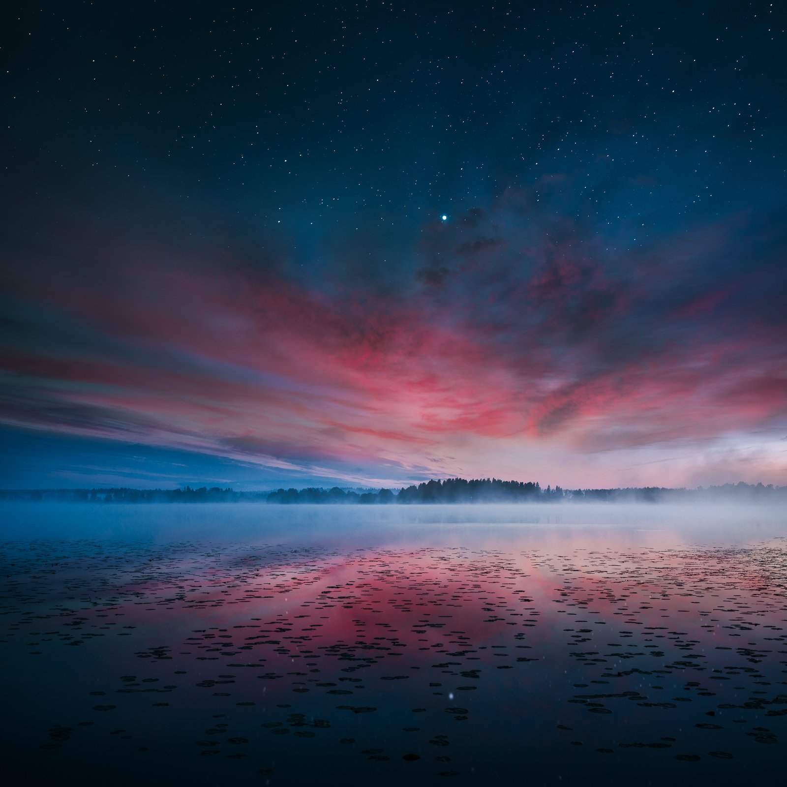](https://exchange.art/single/GL2N6nkcaivtcM2b1yJedStPQqhTB4w9ifWfVxs3MbU9)

Red Dawn – SOLD

[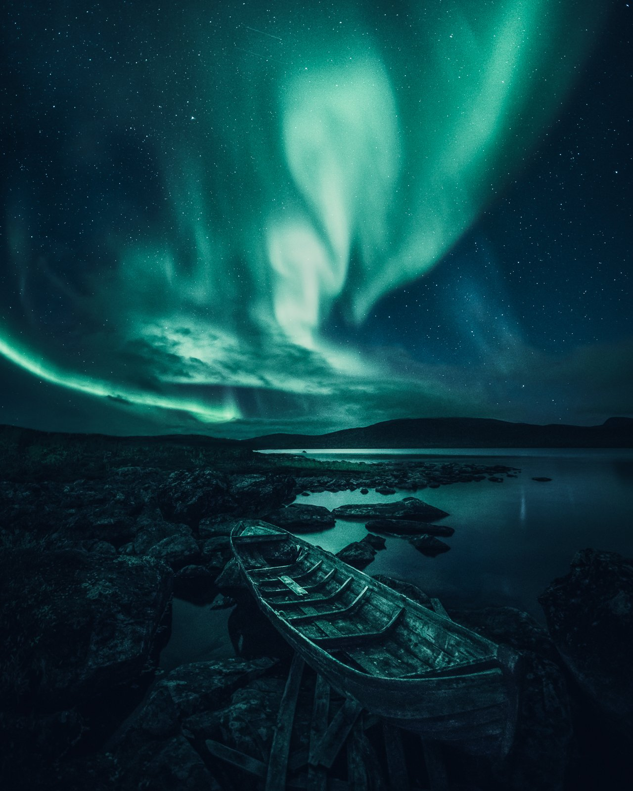](https://exchange.art/editions/GNrvdBgcjeL41rvcPhGfjbdxfrr6ELvkfMtDqnEseVdw)

Poetic Light – Edition

### A Passing Moment

A Passing Moment – The sound of the waves crashing in the surrounding darkness creates an unforgettable experience that makes you feel alive. I wanted to capture the feeling of watching the moon rise from the horizon. To achieve this, I took two photographs from the exact location at different focal lengths. The resulting composite accurately conveys the atmosphere of the nighttime scene. It isn't easy to describe the emotions that arise from such a moment, but it truly makes you appreciate the present.

*Location: Porvoo, Finland*

[View on Exchange](https://exchange.art/single/CBNMGvhmS5knAKte5wj13tQ67YsWFW28MdjEMfD6ht7e)

### Crashing Waves

On a serene night, when the sky was starting to clear, and the moonlight was reflecting beautifully in the sea, I had a chance to capture the stunning beauty of the coast. The waves broke quietly as they reached the rocky shoreline, creating a soothing and peaceful atmosphere. The soundscape was unparalleled, and I was amazed by how the sound of the waves complemented the moonlit water's beauty.

I wanted to capture this magical moment in my photograph, so I used two separate exposures to ensure my camera captured the exact landscape I wanted: the serene night and the calmness of the sea.

*Location: Porvoo, Finland*

[View on Exchange](https://exchange.art/single/5vmc79VvQUmRWzZihQQiADSMaLcGKKVvFCotYEL7zqhK)

### Night Glow – Sold

The last light of the day is when the stars shine in the night sky—illuminated with beautiful untouched snow on an upward hill. The perspective makes the scenery look bigger than it is. One of my early pieces uses focus stacking to create depth of field.

*Location: Kerava, Finland*

[View on Exchange](https://exchange.art/single/81uSeW39VAHr3ZgFHEjBdv8t6TFzPksWcWhRfaMSv1yC)

[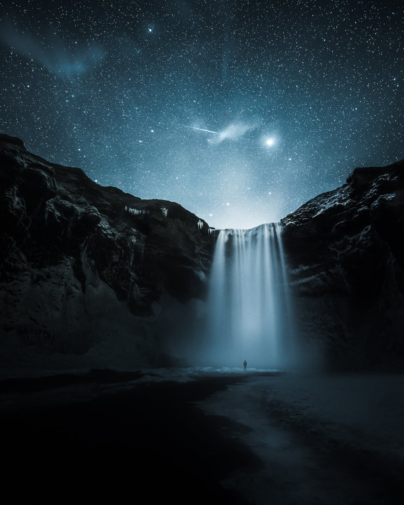](https://exchange.art/editions/ENLkqGYca44Jxnj9GnwUbFRcKZ4C6FeU1eGsWgDDaf3H)

### Cold Shower – Collectors Edition

I spent the night photographing this beautiful waterfall alone. I wanted to immortalize it in my own way. I had no luck with the Northern Lights, but instead, a magnificent view into the stars and the capture of a passing meteorite.

I left my camera on the tripod and ran underneath the waterfall. I was completely soaked after capturing this view. Even if I didn't have to go all the way under the stream, it was a unique moment, with a beautiful waterfall and the sound of the power of nature.

ISO 6400, 15 mm, f/2.8 and 30 sec.

*Location: Skógafoss, Iceland – 2016*

**Available only if you collect an edition or 1/1 from this series.**

[View on Exchange](https://exchange.art/editions/ENLkqGYca44Jxnj9GnwUbFRcKZ4C6FeU1eGsWgDDaf3H)

### poetic Light – SOLD OUT

It was a magical moment when the Northern Lights lit up the night sky with their dance. The display on this particular night was absolutely spectacular, leaving me bursting with excitement. Fortunately, I was in the right place at the right time, thanks to a bit of planning and some good luck. It was a night in Northern Finland I will never forget. The old boat in the view added to the charm, making it feel like a scene from a Finnish literary classic, Kalevala.  
  
This is a single-exposure photograph that was captured using a 12 mm lens—Edition of 30.*Location: Kilpisjärvi, Finland*

[View on Exchange](https://exchange.art/editions/GNrvdBgcjeL41rvcPhGfjbdxfrr6ELvkfMtDqnEseVdw)

### Divided – SOLD

While chasing the Milky Way, I spent the whole night photographing various views; finally, after four hours of trying to find foregrounds, I stumbled upon this unique, divided piece of rock. I placed my camera on a low angle and captured the beauty of the foreground details. I then tilted the camera to capture the Milky Way, perfectly aligned with the divided foreground. Creating one of my most iconic photographs.

*Location: Meri-Pori, Finland*

[View on Exchange](https://exchange.art/single/GjZdSHzHi4ewgrcQhneHqaogxWVx3CAK3mMxRLgt8TN3)

[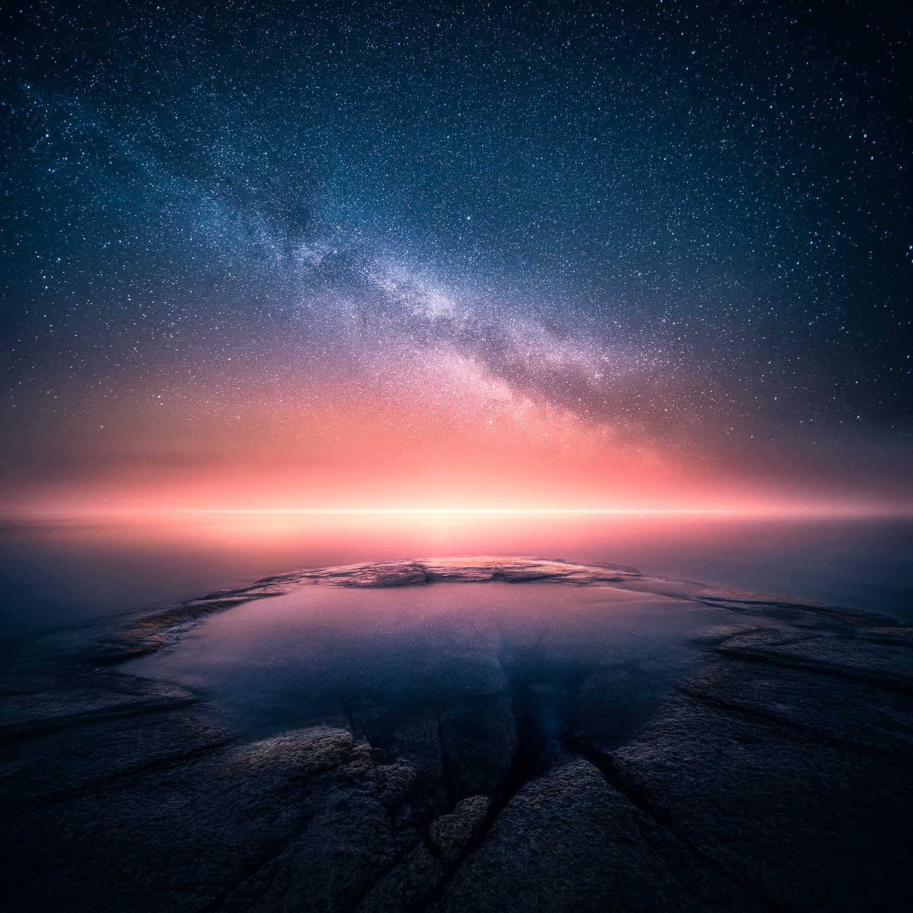](https://exchange.art/single/5FjPLvkCkAonnVRND9gtEZg46tysktX9EmSWAvCHZajt)

### When Two Worlds Collide – SOLD

Ever since I started photography, I have been intrigued by how to convey emotion with my photography. One of the most captivating forms of photography I have encountered is surrealism. It can make you pause and take a closer look at an image, trying to interpret its meaning.

A photograph that particularly stands out to me is this one taken on the coast of Finland during the last light of the day. The striking contrast between the night sky and the serene coastline creates a dream-like atmosphere, making the viewer feel transported into another world. This surrealistic image perfectly exemplifies how a photograph can evoke emotions and transport the viewer to another realm.

This piece combines two captures from the same location, first at sunset and later from the same vantage point at night. I spent numerous days and nights trying to get the perfect conditions to do this dual exposure view, and finally, I captured it how I envisioned it.

*Location: Porvoo, Finland*

[View on Exchange](https://exchange.art/single/5FjPLvkCkAonnVRND9gtEZg46tysktX9EmSWAvCHZajt)

### The Whole Universe Surrenders – SOLD

"To the mind that is still, the whole universe surrenders." - Lao Tzu.

I used two exposures to create this surreal effect of the night sky blending with the sunset. After capturing the beauty of the sunset I left my camera on the tripod and continued to wait until the stars appeared so I could capture the same vantage point with stars.

*Location: Porvoo, Finland*

[View on Exchange](https://exchange.art/single/2QZ4Rdaf8oumAZvheruZBuwgoiTTvkZs62ZrAKGuemi3)

### Tranquil Night – SOLD

Often, in the darkness of the night, one can experience the most exquisite moments of landscape photography. The gentle symphony of the Northern Lights on the quiet shore of Northern Norway was such an extraordinary moment.

While photographing the surrounding stony beaches, I shot on this beach where the Northern Lights and stars reflected on the wave-soaked sand.

*Location: Hamingberg, Norway*

[View on Exchange](https://exchange.art/single/9vFPA3H1UCdGhKeCo4KFEASTTfWhhhu77RMc5Rxf33bv)

### Red dawn – SOLD

The Finnish Lakeland is one of the most beautiful places on earth, and its scenic beauty inspires me to create art. In this piece, I aim to capture the magical beauty of the sunrise and stars. To begin with, I spent hours capturing the stars in the clear night sky. I waited patiently for the sun to rise, and as it did, the clouds were lit up with a soft, misty glow.

The ethereal atmosphere created by combining the rising sun and the stars was truly breathtaking. With attention to detail, I combined these two images to create a composite artwork that captures the beauty of nature in all its surreal glory.

*Location: Lakeland, Finland*

[View on Exchange](https://exchange.art/single/GL2N6nkcaivtcM2b1yJedStPQqhTB4w9ifWfVxs3MbU9)