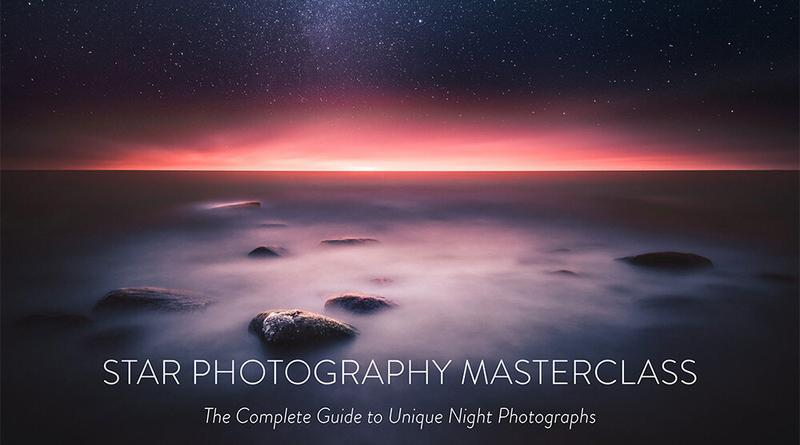

## Camera Gear For Star And Milky Way Photography

A list of three different equipment budgets for star photography. The list has only equipment from brands I have used. If you are on a limited budget, get used gear instead of new. Usually, camera bodies are much cheaper when bought as used. *Last Update: March 2018*

### budget About $1.500

* [Nikon D7500](http://amzn.to/2p9KlS1) - [Canon 80D](http://amzn.to/2hMZk2V) - [Sony A77 II](http://amzn.to/1LHSC4U)
* Wide Angle Lens with Manual Focus: Samyang / Rokinon 10 mm f/2.8 - For [Nikon](http://amzn.to/1HAPYMs), [Canon](http://amzn.to/1H4rj1g), and [Sony](http://amzn.to/1H4roSB)
* Wide Angle Lens with Autofocus: Tokina 11 - 16 mm f/2.8 Pro II - For [Nikon](http://amzn.to/1H4rucT) and [Canon](http://amzn.to/1CQ5Hlm)
* Tripod: [Manfrotto 055XProB Kit](http://amzn.to/1FXNxhs), [Sirui ET-1204 Kit](http://amzn.to/1ep6P9E), and [Induro 475-214 Grand Turismo Kit](http://amzn.to/1H4rLww)

### budget about $2.250

* Full-Frame Cameras [Nikon D610](http://amzn.to/1ep7sjn) - [Canon 6D](http://amzn.to/1T9M0ON)
* Wide Angle Lens with Manual Focus: Samyang / Rokinon 14 mm f/2.8 - For [Nikon](http://amzn.to/1JGWjW2) and [Canon](http://amzn.to/1Iyrcxs)
* Tripod: [Manfrotto 055XProB Kit](http://amzn.to/1FXNxhs), [Sirui ET-1204 Kit](http://amzn.to/1ep6P9E) and [Induro 475-214 Grand Turismo Kit](http://amzn.to/1H4rLww)

### budget About $5.500

* Full Frame Cameras: [Nikon D850](http://amzn.to/2HzEAnp), [Canon 5d Mark IV](http://amzn.to/2FFrh4w), [Sony A7SII](http://amzn.to/2FH7Lo9)
* Wide Angle Lenses: [Nikon 14 - 24 mm f/2.8](http://amzn.to/1IyrZhK), [Sigma 14 mm f/1.8 (Canon)](http://amzn.to/2pacHM5), and for Sony: [Nikon 14 - 24 mm f/2.8](http://amzn.to/1IyrZhK) (+ [Metabones Mount](http://amzn.to/2FIQMlh))
* Tripod: [Manfrotto MT055CXPRO3](http://amzn.to/1H4tzFW), [Sirui ET-2204 & E-20 BH](http://amzn.to/1Iyur84) and [Induro CLT303PHQ3](http://amzn.to/1H4u5nh)

### useful accessories

* Extra Batteries - Search by Camera
* Memory Card: [128 GB SD](http://amzn.to/1Uh93ZA) or [128 GB CompactFlash](http://amzn.to/1GUB273) or [Lexar XQD](http://amzn.to/2FH9Tfw) (Check which your camera uses)
* Remote Controller Hähnel Giga T Pro II: [Nikon](http://amzn.to/1H4uIgy), [Canon](http://amzn.to/1epddOe) and [Sony](http://amzn.to/1FXUShc)
* [Headlamp](http://amzn.to/1LI0bIJ) & [Flashlight](http://amzn.to/1RVSu1m)

### Useful apps

* [Photo Pills](http://www.photopills.com/) (iPhone) - Best tool for Star and Other Photography
* [The Photographer's Ephemeris](http://photoephemeris.com/) (iPhone, Android & Desktop) - Great tool for Sunrises, Moon Phases, etc.
* [Stellarium](http://www.stellarium.org/) (Desktop) - Great Overall Program for Star Photography
* [Google Earth](https://www.google.com/earth/) - Excellent Planning Software from Google

Learn more from my Star Photography Masterclass.

Star Photography Tutorial - Complete Guide to Unique Night Photographs