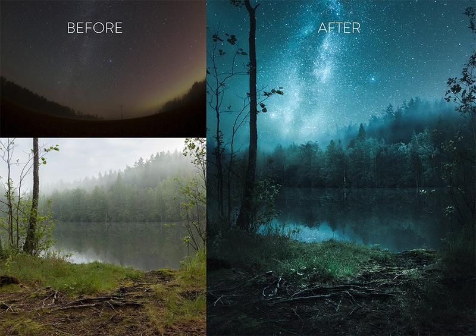
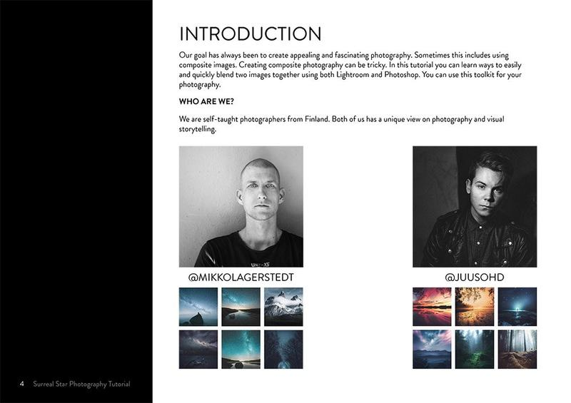
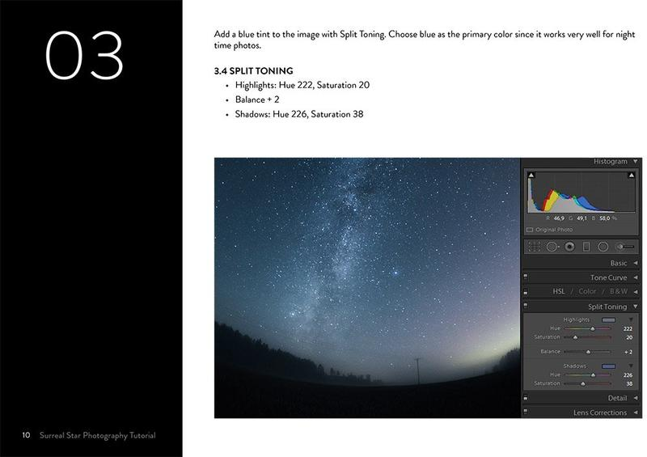
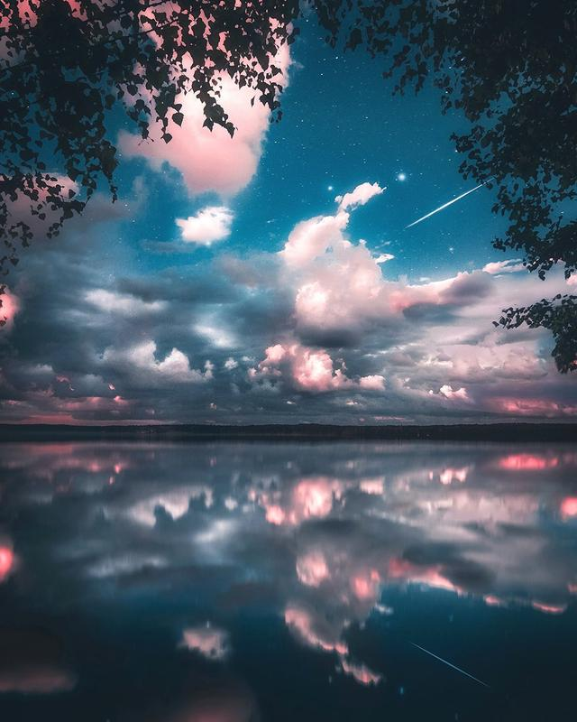
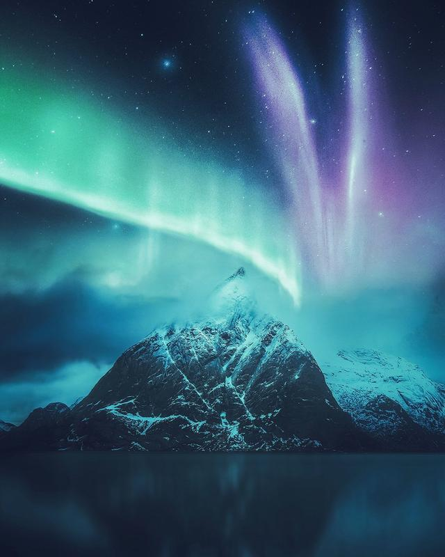
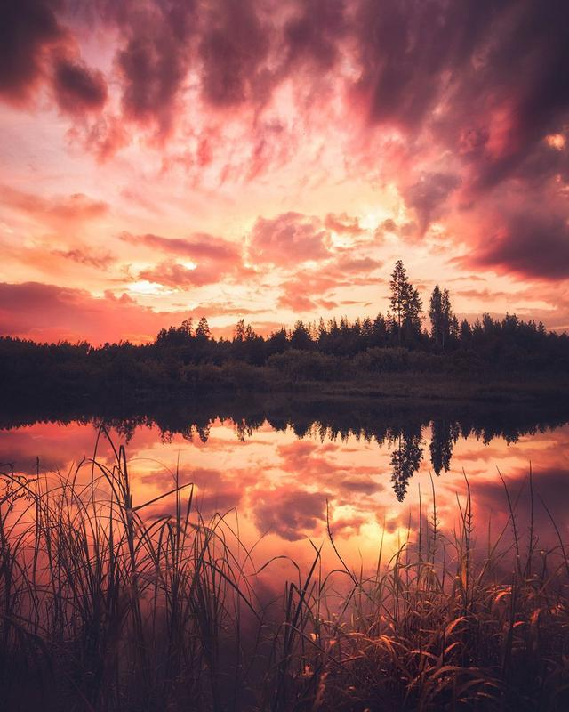
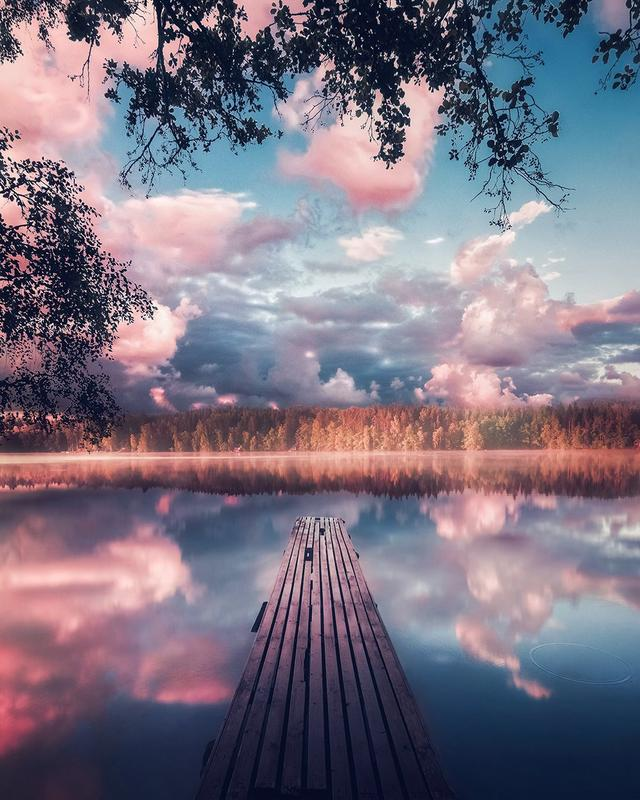

[← Back to Learn](/learn)

## INTRODUCTION

A collaborating tutorial with [JuusoHD](http://www.instagram.com/juusohd) and [Mikko Lagerstedt](http://www.instagram.com/mikkolagerstedt). Our goal has always been to create appealing and fascinating photography. Sometimes this includes using composite images. Creating composite photography can be tricky. In this tutorial, you can easily and quickly blend two images together using both Lightroom and Photoshop.

## You will learn

* How to Create Composite Milky Way and Night Sky Photographs
* How to Edit Star & Foggy Landscape Photographs in Lightroom
* Learn How [JuusoHD](http://www.instagram.com/juusohd) Creates His Unique Dreamy Look
* How to Follow The Steps with Juuso's Source Photographs
* How to Easily Blend Photographs in Photoshop
* Why Use These Tricks and Tools
* Includes Final Image PSD with Layers

---

### Star Photography Composite Tutorial

Credit Card or PayPal Account
  
Direct Download After Payment
  
30-Day Money-Back Guarantee
  
Completely Risk-Free

## 29,90€

*VAT incl.*

[Buy Now](https://sowl.co/FFb0Z)

[View fullsize
](https://images.squarespace-cdn.com/content/v1/63ceaffd33529a45e572bf90/1674548320106-6F60CULCPFFARE102V3S/Surreal-Night-edit-34.jpg)

[View fullsize
](https://images.squarespace-cdn.com/content/v1/63ceaffd33529a45e572bf90/1674548321350-XCJF702YB8NTVN8S25SL/Surreal-Night-edit-4.jpg)

[View fullsize
](https://images.squarespace-cdn.com/content/v1/63ceaffd33529a45e572bf90/1674548322362-0MBVYPW5GWLGRGC5VUT7/Surreal-Night-edit-10.jpg)

### Juuso's Images created with the techniques in the Tutorial

### Example pages from the e-Book Tutorial