[← Back to Learn](/learn)

## Learn the secrets of stunning astrophotography

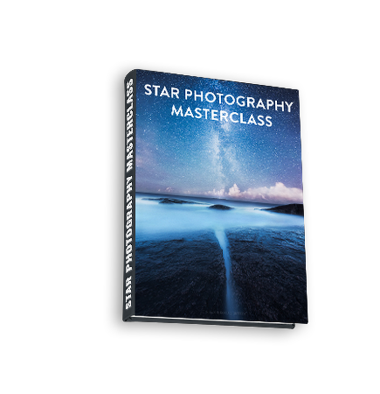

### Star Photography Masterclass

Capture and edit star photography
  

Three in-depth tutorials  

How to capture Milky Way
  

Inspiration exercises
  

Instant download

## 17€

[Buy Now](https://transactions.sendowl.com/products/258380/BF97E0B3/purchase)

## INTRODUCTION

Discover the secrets of breathtaking astrophotography with our Star Photography Masterclass! Learn how to capture and edit stunning images of the night sky, Milky Way, and stars, regardless of your experience level. This comprehensive guide will walk you through the entire process, from planning and scouting locations to capturing and post-processing your starry masterpieces.

Unlock Your Astrophotography Potential!

As a self-taught photographer with years of experience, I've honed my skills through trial and error. Now, I'm sharing the valuable techniques and tools I've gathered from my journey in this Masterclass, which have helped me create my viral series Edge,' 'Atmosphere,' and 'Visions of Depths.'

## What You Will Learn

* How to capture stunning astrophotography: Milky Way, Night Sky, and Stars
* Essential equipment for astrophotography and post-processing
* Location scouting and timing for perfect star photographs
* Mastering focus, composition, and camera settings for star photography

  + In-depth editing tutorials in Lightroom/Camera Raw and Photoshop

    - Create surreal and dreamy star photographs
    - Utilize light pollution and moonlight in your astrophotography
* Photography inspiration exercises to spark your creativity

Invest in your astrophotography skills today and capture awe-inspiring night sky images with the Star Photography Masterclass.

---

### Don't just take our word for it! The Star Photography Masterclass has received glowing praise:

*"This e-book by Photography Mikko Lagerstedt is a great piece of advice for you night shooters and creative guys out there. I was lucky to check this for Mikko before publication and I can say I learned a LOT about things related to night photography. Worth every penny for sure!"*  
**– Felix Inden**  
*http://www.felixinden.com/*

*"It's a Superb resource and must read for anyone getting into Astrophotography whether beginner or advanced!"*  
**– Raico Rosenberg**   
*http://www.raicorosenberg.com/*

*"Downloaded and did first read through...great tips, phenomenal photos, fabulous eBook! Can't wait to put some of those great tips to use!"*  
**– Julie D.**

*"Thank you, just downloaded - this is what has been missing from my life!"*  
**– Monika K.**

*"Read the book! Definitely worth every penny! Now I want more!"*  
**– Caleb R.**

---

### Example pages from the e-Book (Overall 71-pages)

[View fullsize
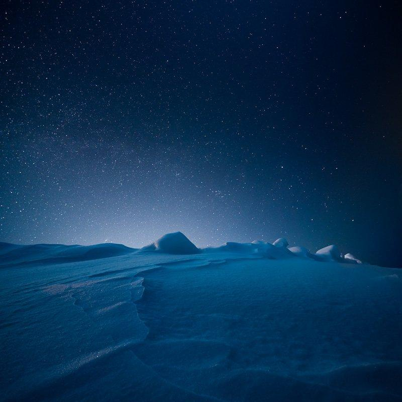](https://images.squarespace-cdn.com/content/v1/63ceaffd33529a45e572bf90/1674548203372-ESWKNPFQ0JN0P8T2N70X/Star-Photography.jpg)

[View fullsize
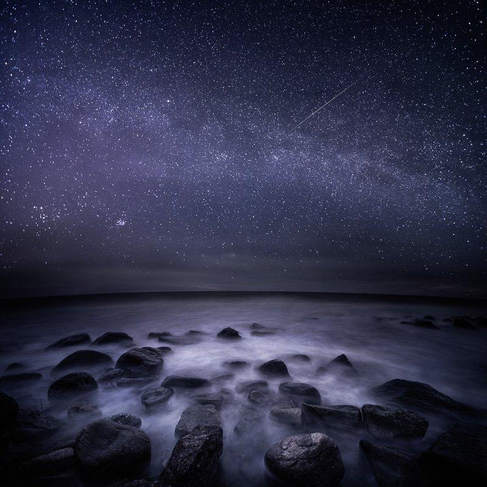](https://images.squarespace-cdn.com/content/v1/63ceaffd33529a45e572bf90/1674548206208-ESLQE3DFSSGDQP429889/Star-Photography-2.jpg)

[View fullsize
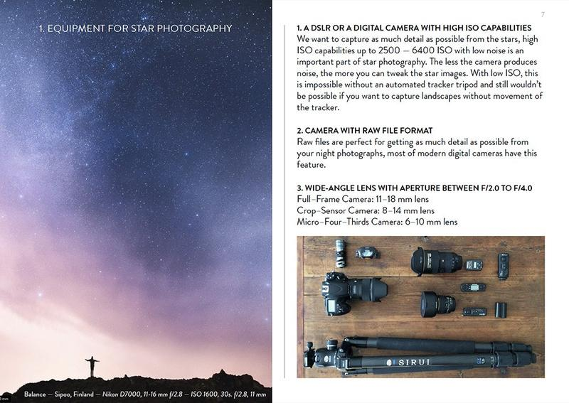](https://images.squarespace-cdn.com/content/v1/63ceaffd33529a45e572bf90/1674548209014-NCE7EMA07HEWAXSWCRBC/Star-Photography-0.jpg)

[View fullsize
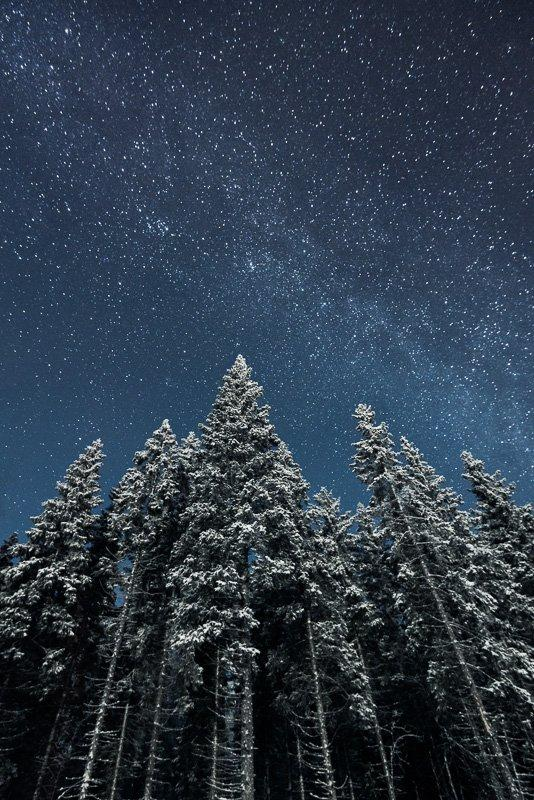](https://images.squarespace-cdn.com/content/v1/63ceaffd33529a45e572bf90/1674548211889-RFA42TOBUE5OBPAEY7XO/Star-Photography-4.jpg)

[View fullsize
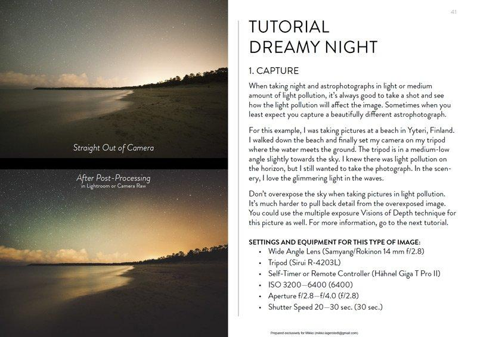](https://images.squarespace-cdn.com/content/v1/63ceaffd33529a45e572bf90/1674548214245-NV9LWIBR66E08MB3RYNR/star-photographytutorial.jpg)

[View fullsize
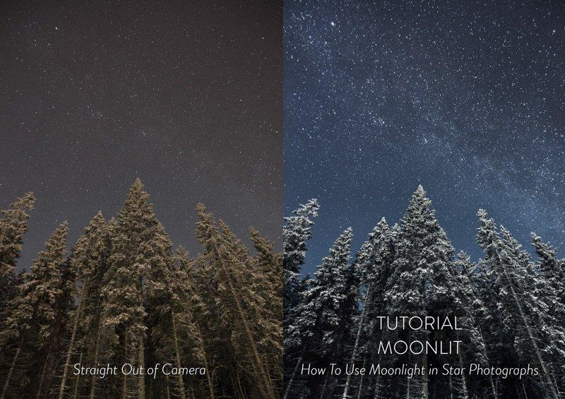](https://images.squarespace-cdn.com/content/v1/63ceaffd33529a45e572bf90/1674548216416-0IMP6387KWS48DD9ALWM/star-photographytutorial2.jpg)

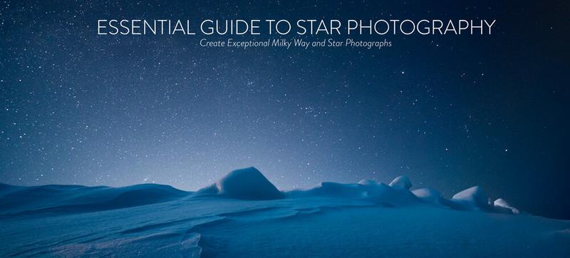

Essential Guide to Star Photography - What Do You Need to Create Exceptional Milky Way and Night Sky Photographs

### INCLUDES THE FOLLOWING TUTORIALS

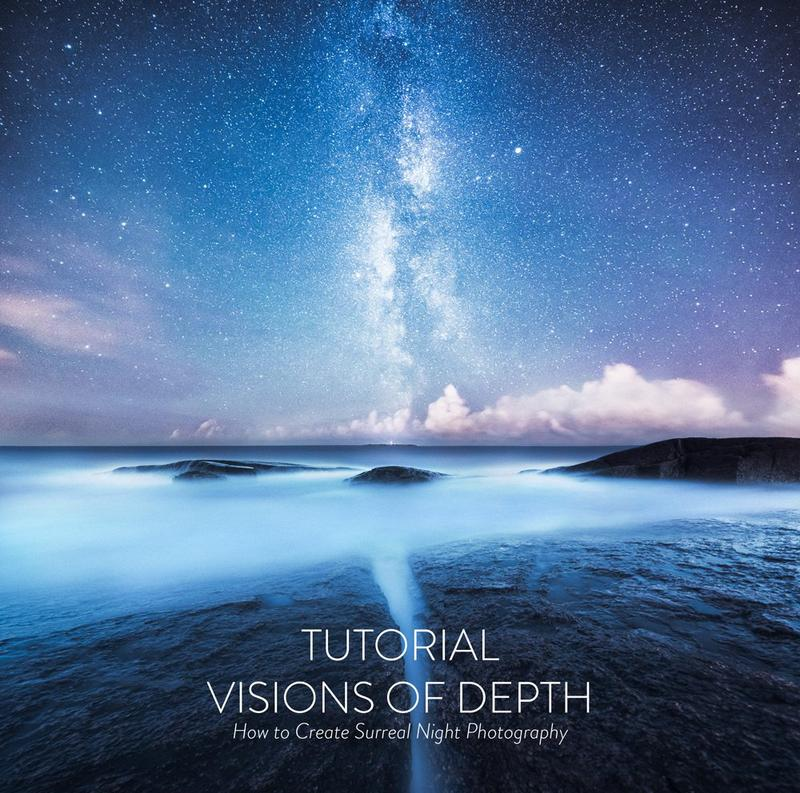

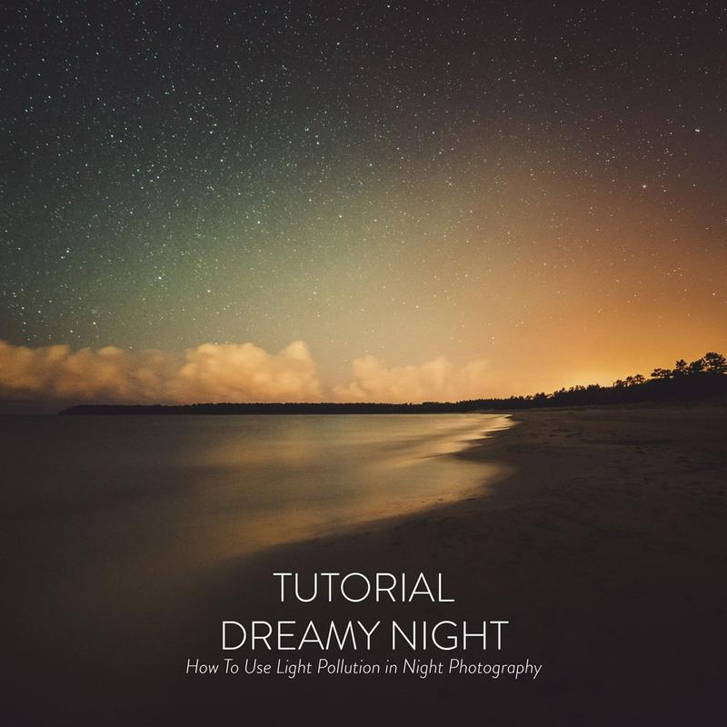

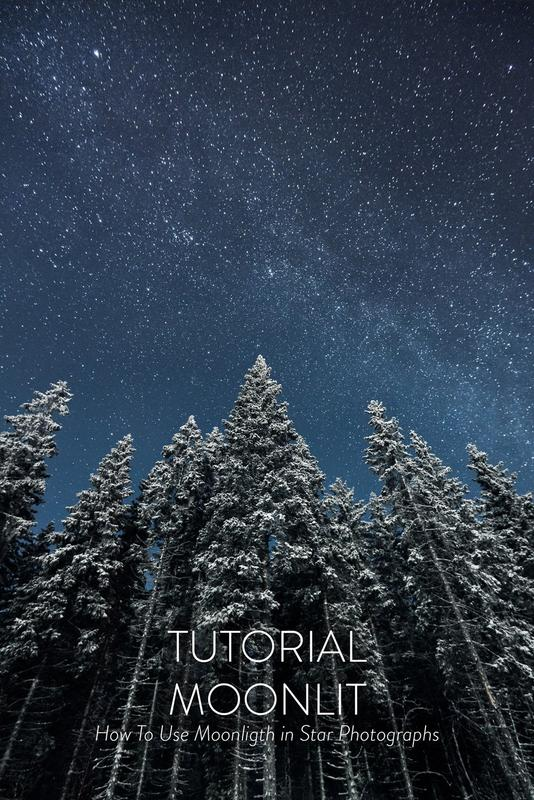

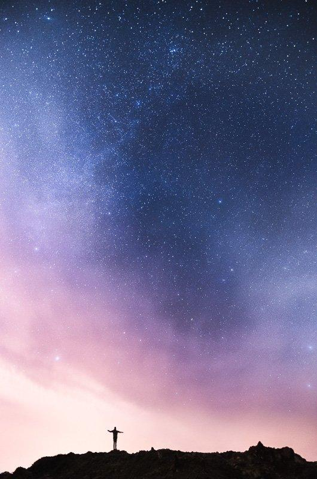

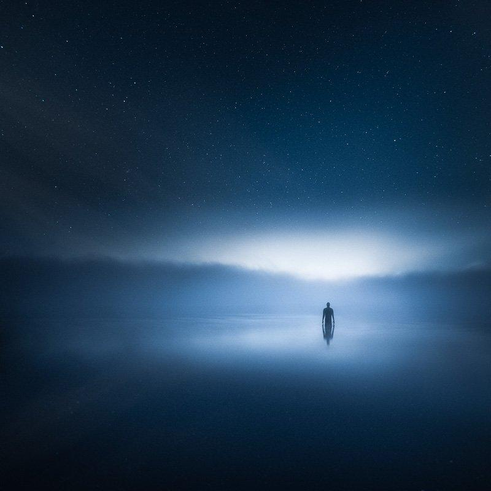

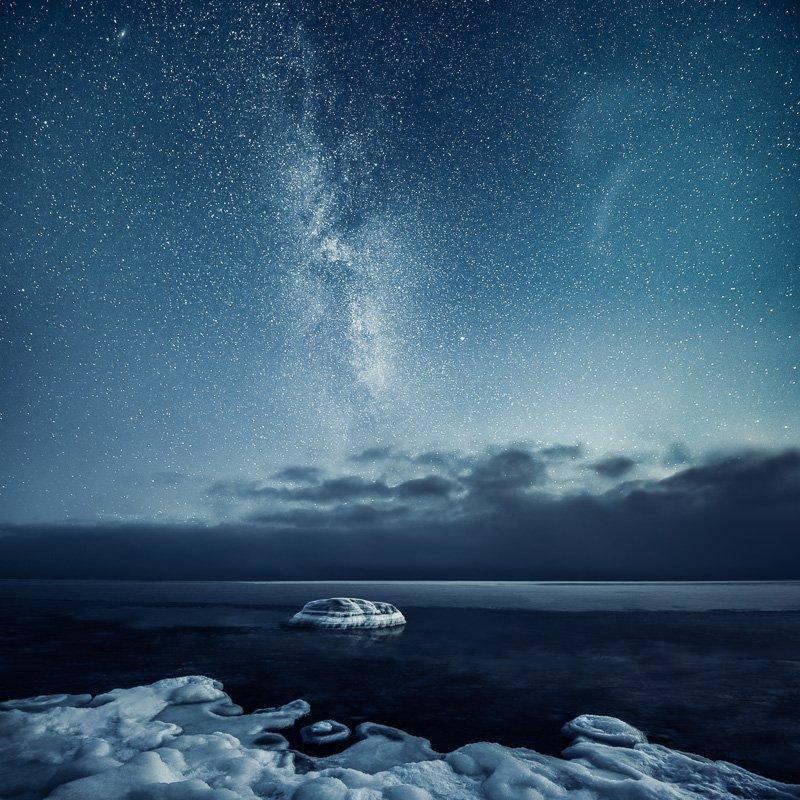

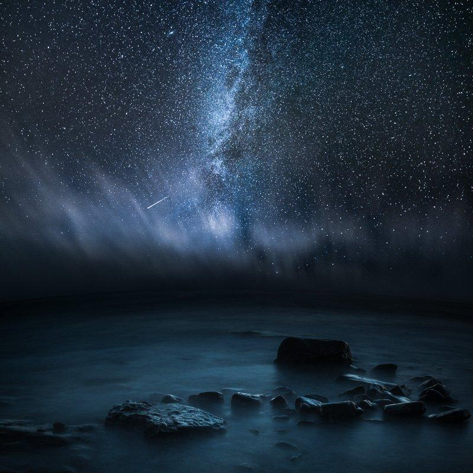

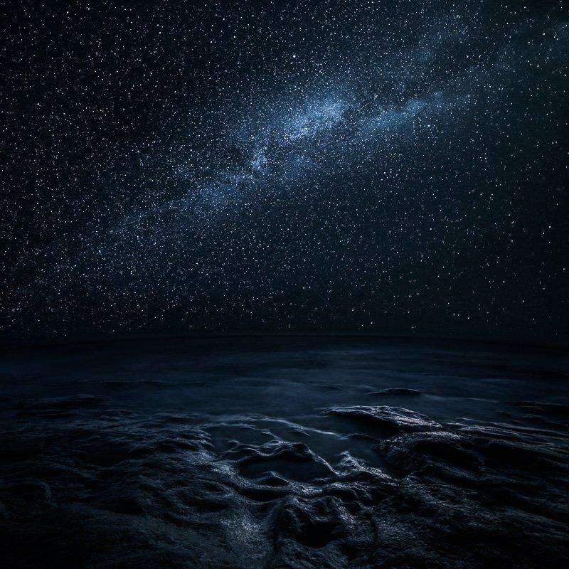

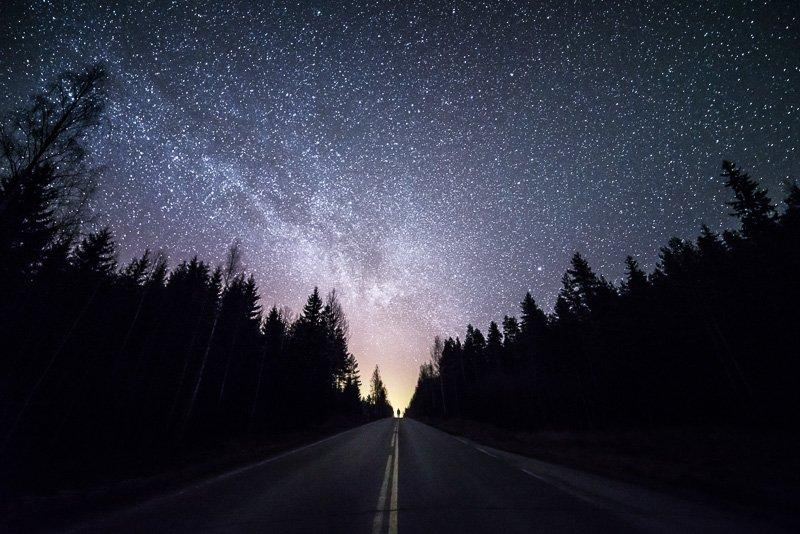

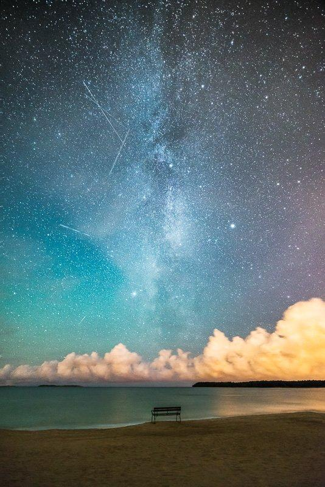

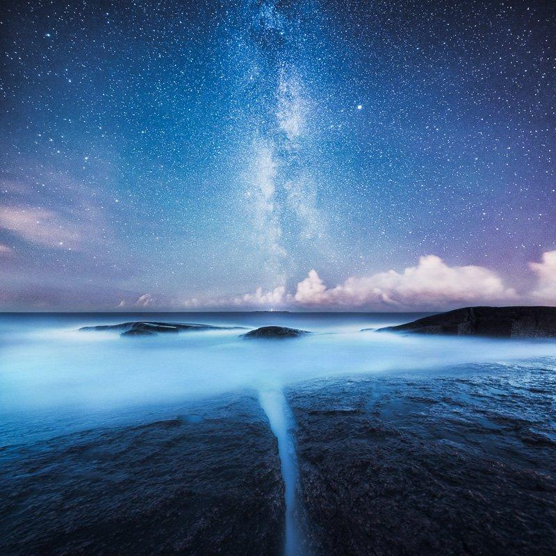

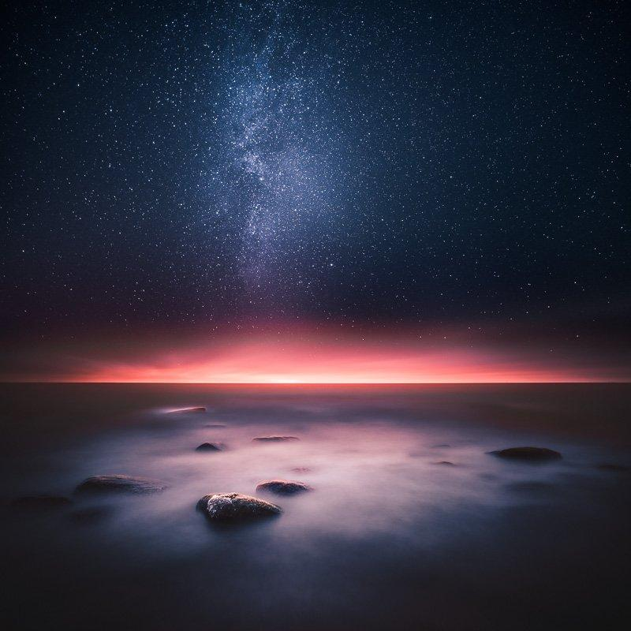

### Images created with the techniques in the masterclass: