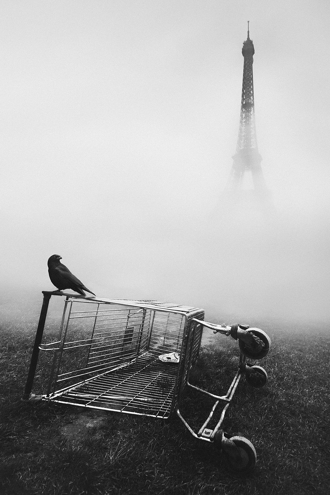

# TIMELESS

Some photographs transcend time and the feeling of timelessness. This limited series of editions includes Mikko Lagerstedt’s photographs, which are highly regarded and are Mikko’s best work in B&W. True classics.

In a world perpetually rushing towards the next fleeting moment, there lies an untouched realm where every tick of the clock holds a story, a memory, a whisper of the eternal. In this realm, Mikko Lagerstedt invites you to enter through his exquisite collection, Timeless.

*EDITION 001*

### paris..

Intertwining an iconic symbol of historical elegance with a stark, somewhat eerie foresight into a possible future, evoking nostalgia and anticipation. The juxtaposition of the Eiffel Tower with a mundane shopping cart, crowned by the ominous presence of a raven, creates a narrative ripe with symbolism and depth.

The view was created with two photographs: the first was the shopping cart with the Eiffel Tower, and the second was the raven captured just minutes later. My curiosity peaked while walking along the park, and I saw the shopping cart lying on the ground, and in the background was the Eiffel Tower, creating this unique atmosphere—one of my favorite pieces.

If you zoom in, you can see a hint of the times we live in the moment of the mint.

[Buy An Edition](https://app.manifold.xyz/c/mikko-lagerstedt-paris)