## Subscribe

Want to improve your photography? Get freshnew tutorials straight to your inbox!

First Name

Last Name

Email Address

Subscribe

Thank you!

## [View Pro Tutorials](/learn)

Featured

[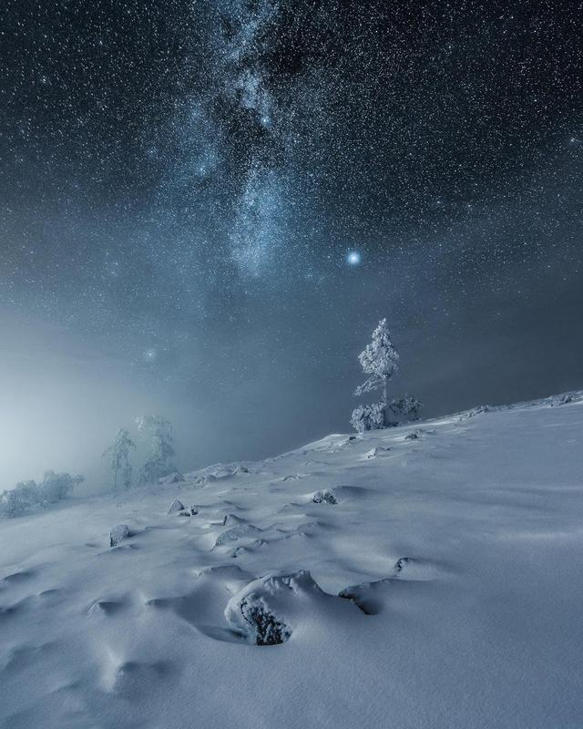](/blog/8-ideas-to-spark-your-creativity-with-photography-projects)

[Mikko Lagerstedt](/blog?author=515aaa6be4b063d29d1c71e9#show-archive)

[8 Ideas to Spark Your Creativity With Photography Projects](/blog/8-ideas-to-spark-your-creativity-with-photography-projects)

[Mikko Lagerstedt](/blog?author=515aaa6be4b063d29d1c71e9#show-archive)

As a photographer, I have discovered that starting a project can help me channel my creativity and bring new dimensions to my work. A project can be a way to explore new techniques, themes, and perspectives, leading to personal and artistic growth.

[Read More →](/blog/8-ideas-to-spark-your-creativity-with-photography-projects)

[Mikko Lagerstedt](/blog?author=515aaa6be4b063d29d1c71e9#show-archive)

[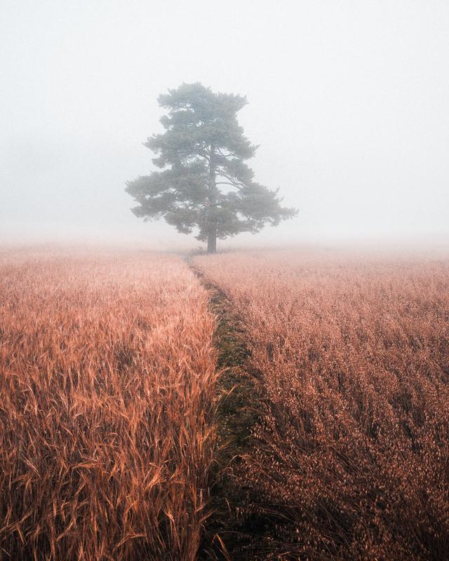](/blog/5-tips-to-capture-beautiful-photographs-nearby)

[Mikko Lagerstedt](/blog?author=515aaa6be4b063d29d1c71e9#show-archive)

[5 Tips to Capture Beautiful Photographs Nearby](/blog/5-tips-to-capture-beautiful-photographs-nearby)

[Mikko Lagerstedt](/blog?author=515aaa6be4b063d29d1c71e9#show-archive)

In this post, I share five tips with you on how you can capture the unnoticed beauty around you.

[Read More →](/blog/5-tips-to-capture-beautiful-photographs-nearby)

[Mikko Lagerstedt](/blog?author=515aaa6be4b063d29d1c71e9#show-archive)

[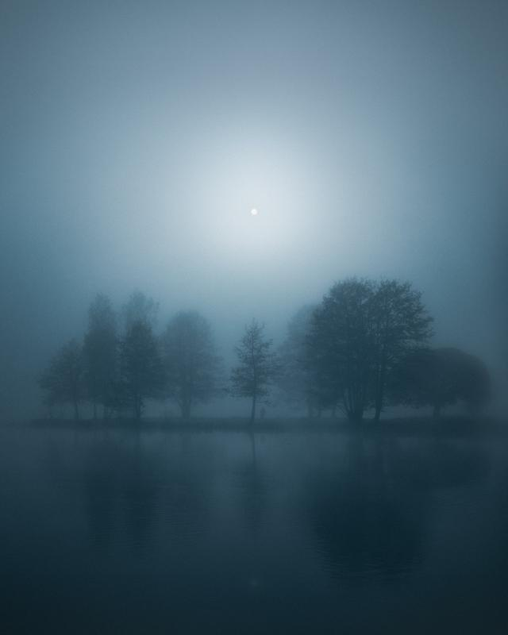](/blog/photography-challenge-with-mikko-discovering-the-unseen)

[Mikko Lagerstedt](/blog?author=515aaa6be4b063d29d1c71e9#show-archive)

[Photography Challenge: A Journey of Discovery with Mikko](/blog/photography-challenge-with-mikko-discovering-the-unseen)

[Mikko Lagerstedt](/blog?author=515aaa6be4b063d29d1c71e9#show-archive)

Discover the hidden gems in your local surroundings with this month's challenge. Can you capture the unnoticed beauty around you? See where the journey takes you. Let’s be creative together!

[Read More →](/blog/photography-challenge-with-mikko-discovering-the-unseen)

[Mikko Lagerstedt](/blog?author=515aaa6be4b063d29d1c71e9#show-archive)

[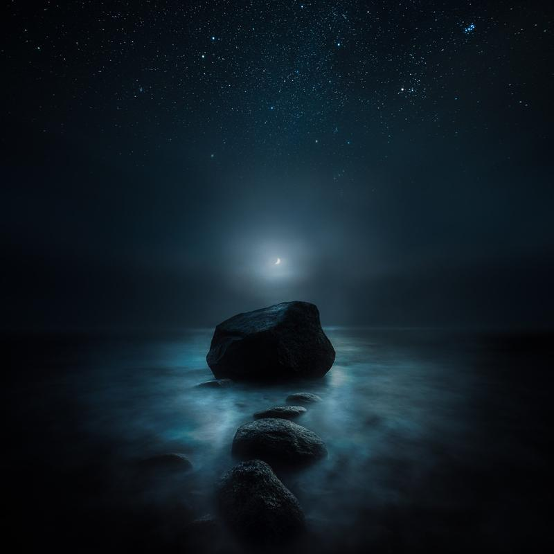](/blog/the-art-of-night-photography)

[Mikko Lagerstedt](/blog?author=515aaa6be4b063d29d1c71e9#show-archive)

[The Art of Night Photography](/blog/the-art-of-night-photography)

[Mikko Lagerstedt](/blog?author=515aaa6be4b063d29d1c71e9#show-archive)

What is the art of night photography? Why should you try out and develop your night photography? In this week’s tutorial, I share my knowledge about night photography and how you can create unique results by heading out in the dark.

[Read More →](/blog/the-art-of-night-photography)

[Mikko Lagerstedt](/blog?author=515aaa6be4b063d29d1c71e9#show-archive)

[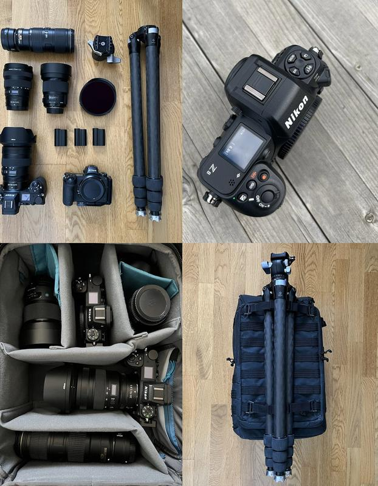](/blog/whats-in-my-camera-bag-in-2023-nikon-z7-ii-or-z8-for-landscape-photography)

[Mikko Lagerstedt](/blog?author=515aaa6be4b063d29d1c71e9#show-archive)

[What's in my camera bag in 2023? Nikon Z7 II or Z8 for landscape photography?](/blog/whats-in-my-camera-bag-in-2023-nikon-z7-ii-or-z8-for-landscape-photography)

[Mikko Lagerstedt](/blog?author=515aaa6be4b063d29d1c71e9#show-archive)

Many people ask about my photography gear. So here is an update to all the gear I use currently and some of the new ones I’ll be receiving shortly. I also recently tried the new Nikon Z8, and it's a great upgrade in some parts...

[Read More →](/blog/whats-in-my-camera-bag-in-2023-nikon-z7-ii-or-z8-for-landscape-photography)

[Mikko Lagerstedt](/blog?author=515aaa6be4b063d29d1c71e9#show-archive)

[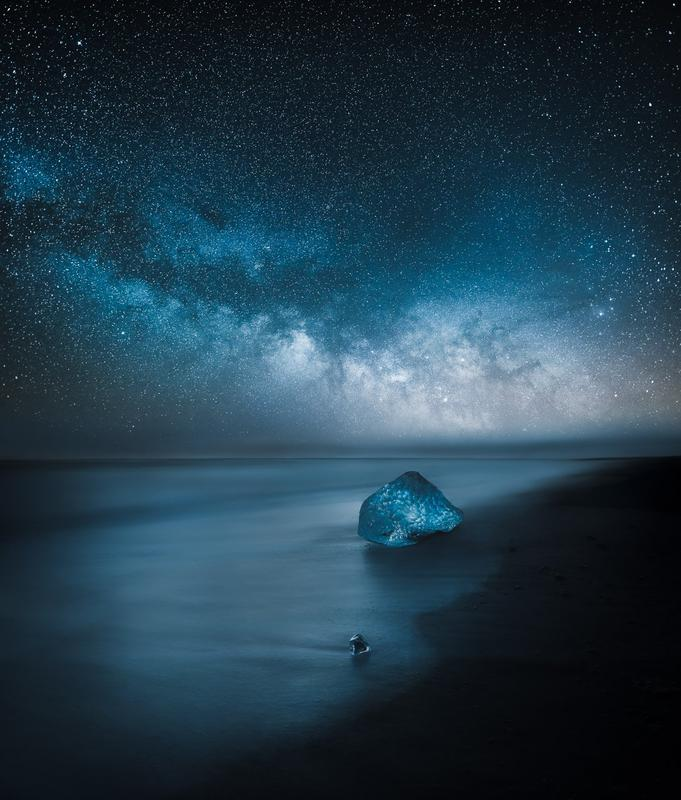](/blog/epic-preset-collection-update-2023)

[Mikko Lagerstedt](/blog?author=515aaa6be4b063d29d1c71e9#show-archive)

[The Best Preset Collection for Landscape Photographers: The EPIC Preset Collection 2023 Update](/blog/epic-preset-collection-update-2023)

[Mikko Lagerstedt](/blog?author=515aaa6be4b063d29d1c71e9#show-archive)

Making the best Preset Collection even better. Using the latest AI advancements and styling options, the EPIC Preset Collection has it all.

[Read More →](/blog/epic-preset-collection-update-2023)

[Mikko Lagerstedt](/blog?author=515aaa6be4b063d29d1c71e9#show-archive)

[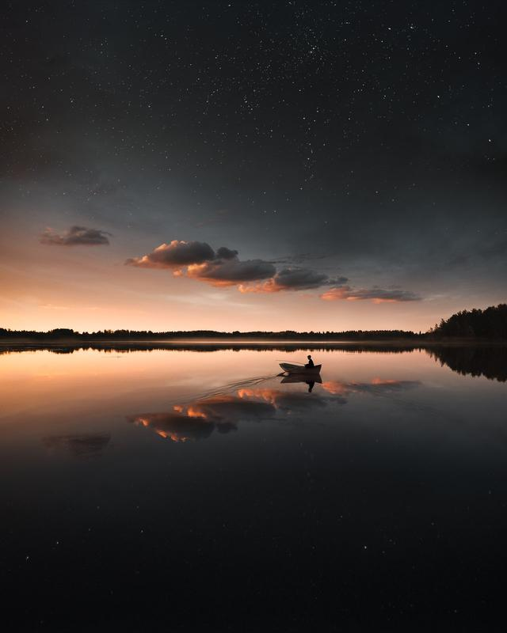](/blog/the-best-ai-image-editing-tools-for-landscape-photographers)

[Mikko Lagerstedt](/blog?author=515aaa6be4b063d29d1c71e9#show-archive)

[The Best AI Image Editing Tools for Landscape Photographers 2023](/blog/the-best-ai-image-editing-tools-for-landscape-photographers)

[Mikko Lagerstedt](/blog?author=515aaa6be4b063d29d1c71e9#show-archive)

The game-changing world of AI-powered image editing tools for landscape photographers. I delve into how AI can help you save time, enhance image quality, and unleash your creativity. Remember, AI is a powerful tool, but your personal touch is what makes your photography truly unique.

[Read More →](/blog/the-best-ai-image-editing-tools-for-landscape-photographers)

[Mikko Lagerstedt](/blog?author=515aaa6be4b063d29d1c71e9#show-archive)

[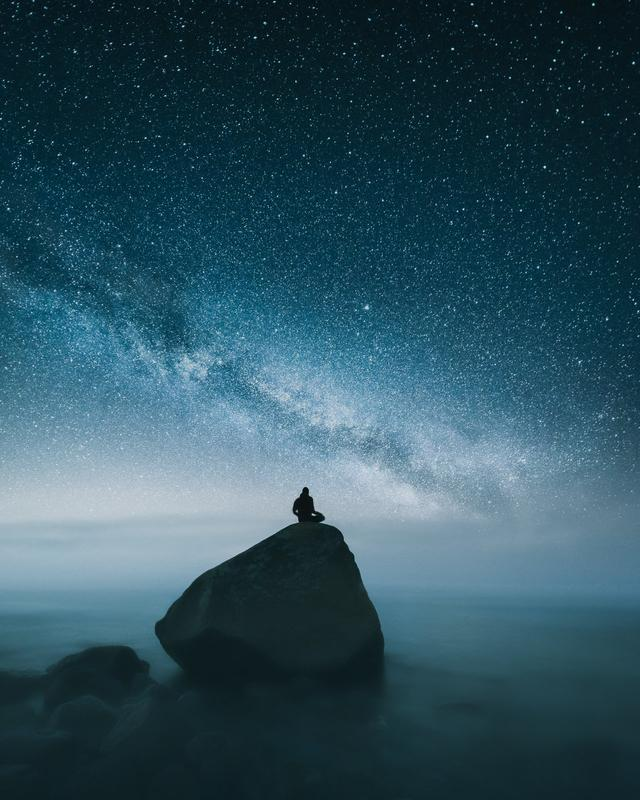](/blog/the-importance-of-a-beginners-mind-in-photography)

[Mikko Lagerstedt](/blog?author=515aaa6be4b063d29d1c71e9#show-archive)

[The Importance of a Beginner's Mind in Photography](/blog/the-importance-of-a-beginners-mind-in-photography)

[Mikko Lagerstedt](/blog?author=515aaa6be4b063d29d1c71e9#show-archive)

Discover how embracing a beginner's mind has shaped my photography journey and learn how this powerful mindset can unlock your creative potential. In this post, we'll explore the importance of curiosity, stepping out of your comfort zone, learning from mistakes, seeking feedback, and practicing mindfulness. Join me in cultivating a beginner's mind to elevate your photography skills and find inspiration in every shot.

[Read More →](/blog/the-importance-of-a-beginners-mind-in-photography)

[Mikko Lagerstedt](/blog?author=515aaa6be4b063d29d1c71e9#show-archive)

[Mikko Lagerstedt](/blog?author=515aaa6be4b063d29d1c71e9#show-archive)

[Capturing the Beauty of Everyday Landscapes](/blog/capturing-the-beauty-of-everyday-landscape)

[Mikko Lagerstedt](/blog?author=515aaa6be4b063d29d1c71e9#show-archive)

In my journey to capture the beauty of everyday landscapes, I've realized that it's not always about traveling far and wide to find breathtaking views. Instead, it's about opening my eyes to the hidden beauty in the world around me, even in the most ordinary places. As I explore my surroundings, I've learned to be more observant. In this blog post, I'll cover several topics that have helped me capture the beauty of everyday landscapes.

[Read More →](/blog/capturing-the-beauty-of-everyday-landscape)

[Mikko Lagerstedt](/blog?author=515aaa6be4b063d29d1c71e9#show-archive)

[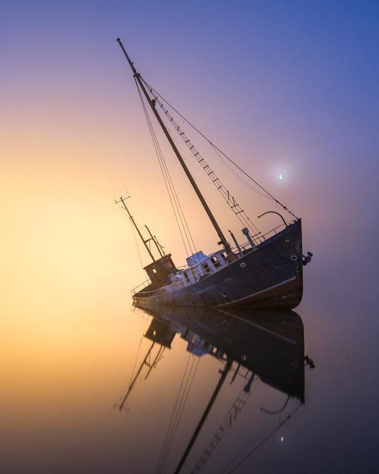](/blog/a-toolkit-to-find-inspiration-for-your-photography)

[Mikko Lagerstedt](/blog?author=515aaa6be4b063d29d1c71e9#show-archive)

[Have You Lost Your Inspiration For Photography? A Toolkit to Find Your Inspiration Back.](/blog/a-toolkit-to-find-inspiration-for-your-photography)

[Mikko Lagerstedt](/blog?author=515aaa6be4b063d29d1c71e9#show-archive)

I provide a toolkit of ten tips for photographers and creatives who have lost their inspiration, including being ready for inspiration, trying new techniques or subjects, getting out of your comfort zone, finding new topics, journaling, seeking inspiration elsewhere, opening your mind, planning a trip, collaborating with others, and seeking new experiences.

[Read More →](/blog/a-toolkit-to-find-inspiration-for-your-photography)

[Mikko Lagerstedt](/blog?author=515aaa6be4b063d29d1c71e9#show-archive)

[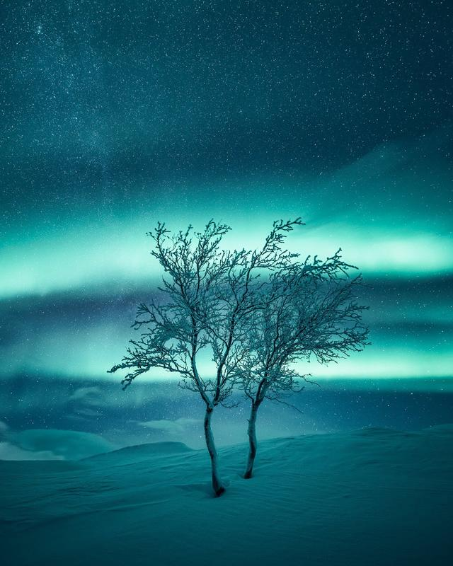](/blog/unlock-your-photography-potential)

[Mikko Lagerstedt](/blog?author=515aaa6be4b063d29d1c71e9#show-archive)

[Unlock Your Photography Potential](/blog/unlock-your-photography-potential)

[Mikko Lagerstedt](/blog?author=515aaa6be4b063d29d1c71e9#show-archive)

Set attainable photography goals to keep growing and improving. By setting specific goals, you'll stay motivated and inspired. Reflect on past experiences, break goals into smaller steps, and track progress in a journal. Experiment with different techniques and styles, and seek feedback to help you improve.

[Read More →](/blog/unlock-your-photography-potential)

[Mikko Lagerstedt](/blog?author=515aaa6be4b063d29d1c71e9#show-archive)

[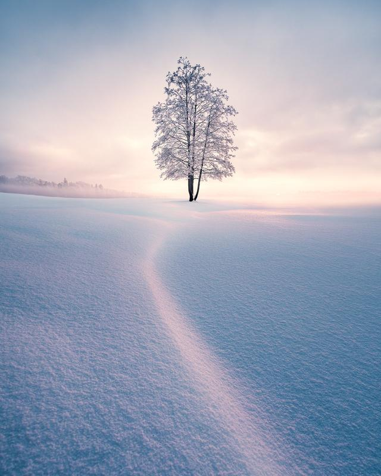](/blog/art-of-capturing-winter-fog-photography)

[Mikko Lagerstedt](/blog?author=515aaa6be4b063d29d1c71e9#show-archive)

[The Art Of Capturing Winter Fog Photography](/blog/art-of-capturing-winter-fog-photography)

[Mikko Lagerstedt](/blog?author=515aaa6be4b063d29d1c71e9#show-archive)

I will guide you through capturing stunning winter fog photographs in this post. You'll learn about finding the right location, choosing the right time of day, using a tripod, experimenting with white balance and compositions, using a polarizing filter, and editing in Lightroom. Let's get started!

[Read More →](/blog/art-of-capturing-winter-fog-photography)

[Mikko Lagerstedt](/blog?author=515aaa6be4b063d29d1c71e9#show-archive)

[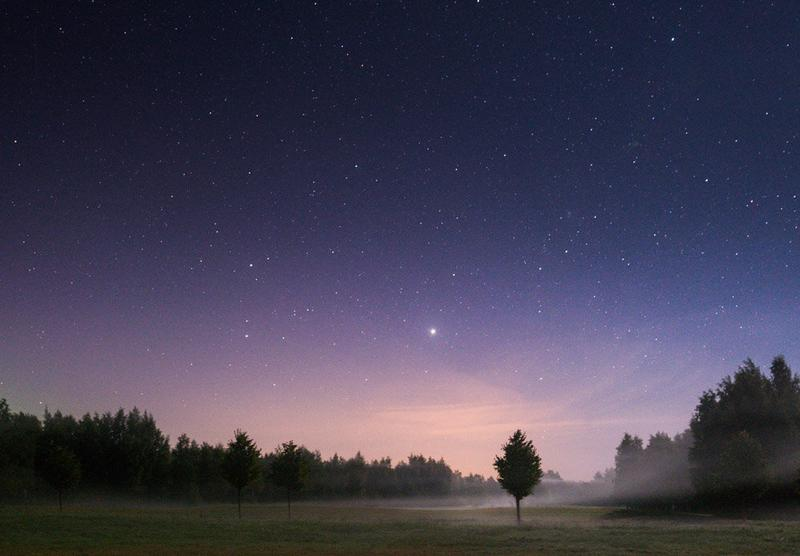](/blog/my-story)

[Mikko Lagerstedt](/blog?author=515aaa6be4b063d29d1c71e9#show-archive)

[My Story](/blog/my-story)

[Mikko Lagerstedt](/blog?author=515aaa6be4b063d29d1c71e9#show-archive)

This week, I wanted to share a story about myself and my work. Why I create and what motivates me as a photographer. I hope you enjoy what I wrote. It was straight from my heart.

[Read More →](/blog/my-story)

[Mikko Lagerstedt](/blog?author=515aaa6be4b063d29d1c71e9#show-archive)

[Mikko Lagerstedt](/blog?author=515aaa6be4b063d29d1c71e9#show-archive)

[Editing Minimalistic Photography in Lightroom](/blog/editing-minimalistic-photography-in-lightroom)

[Mikko Lagerstedt](/blog?author=515aaa6be4b063d29d1c71e9#show-archive)

Let's talk about how to edit minimalistic photographs in Lightroom. As you may know, I often use The Epic Preset collection to edit my photography because it saves me time and gives me a style I enjoy. But in this tutorial, I show you how I edit my minimalistic photographs in Lightroom if I don't use my presets.

[Read More →](/blog/editing-minimalistic-photography-in-lightroom)

[Mikko Lagerstedt](/blog?author=515aaa6be4b063d29d1c71e9#show-archive)

[Mikko Lagerstedt](/blog?author=515aaa6be4b063d29d1c71e9#show-archive)

[Minimalistic Photography](/blog/minimalistic-photography)

[Mikko Lagerstedt](/blog?author=515aaa6be4b063d29d1c71e9#show-archive)

So what does minimalistic photography include? Minimalistic photography is a style of photography that focuses on simplicity and minimalism. In this kind of photography, simple compositions, clean lines, and a limited color palette make it unique.

[Read More →](/blog/minimalistic-photography)

[Mikko Lagerstedt](/blog?author=515aaa6be4b063d29d1c71e9#show-archive)

[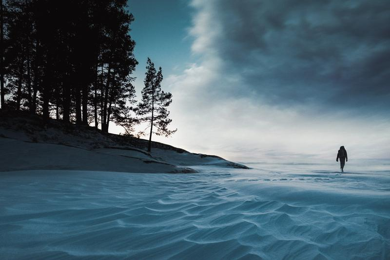](/blog/winter-photography-how-to-photograph-in-difficult-weather)

[Mikko Lagerstedt](/blog?author=515aaa6be4b063d29d1c71e9#show-archive)

[Winter photography – How to photograph in difficult Weather](/blog/winter-photography-how-to-photograph-in-difficult-weather)

[Mikko Lagerstedt](/blog?author=515aaa6be4b063d29d1c71e9#show-archive)

In this post, I share my experience of capturing winter photographs in difficult weather conditions. I provide details about my camera equipment and clothing and share my location choices. I also share an example photograph, the equipment used to capture it, and the editing process in Lightroom using an EPIC Preset Collection.

[Read More →](/blog/winter-photography-how-to-photograph-in-difficult-weather)

[Mikko Lagerstedt](/blog?author=515aaa6be4b063d29d1c71e9#show-archive)

[Mikko Lagerstedt](/blog?author=515aaa6be4b063d29d1c71e9#show-archive)

[Year 2021 in Photos](/blog/year-2021-in-photos)

[Mikko Lagerstedt](/blog?author=515aaa6be4b063d29d1c71e9#show-archive)

[Read More →](/blog/year-2021-in-photos)

[Mikko Lagerstedt](/blog?author=515aaa6be4b063d29d1c71e9#show-archive)

[Mikko Lagerstedt](/blog?author=515aaa6be4b063d29d1c71e9#show-archive)

[How to become a successful photographer?](/blog/how-to-become-a-successful-photographer)

[Mikko Lagerstedt](/blog?author=515aaa6be4b063d29d1c71e9#show-archive)

In this article, I discuss the definition of success and how it applies to photography. Success in photography is not just about financial gain or social media popularity. It's about waking up and feeling proud of your work. To achieve success, you must keep creating and find inspiration in one thing that moves you forward. You must also show up consistently, enjoy the process, and create luck.

[Read More →](/blog/how-to-become-a-successful-photographer)

[Mikko Lagerstedt](/blog?author=515aaa6be4b063d29d1c71e9#show-archive)

[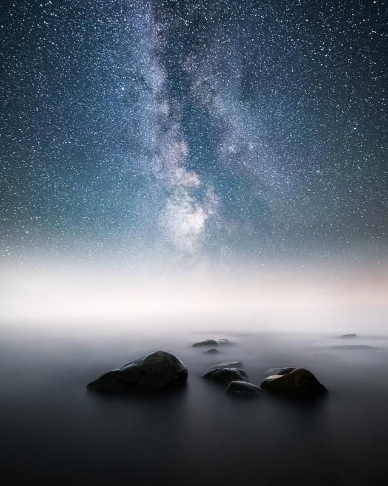](/blog/5-steps-to-create-dreamy-astrophotography-using-a-dual-exposure-technique)

[Mikko Lagerstedt](/blog?author=515aaa6be4b063d29d1c71e9#show-archive)

[5 Steps to Create Dreamy Astrophotography Using A Dual Exposure Technique](/blog/5-steps-to-create-dreamy-astrophotography-using-a-dual-exposure-technique)

[Mikko Lagerstedt](/blog?author=515aaa6be4b063d29d1c71e9#show-archive)

In this article, I share my five-step process for creating dreamy astrophotography using a dual exposure technique in Lightroom and Photoshop CC. I provide detailed information on the camera settings used for the photographs and walk you through the process.

[Read More →](/blog/5-steps-to-create-dreamy-astrophotography-using-a-dual-exposure-technique)

[Mikko Lagerstedt](/blog?author=515aaa6be4b063d29d1c71e9#show-archive)

[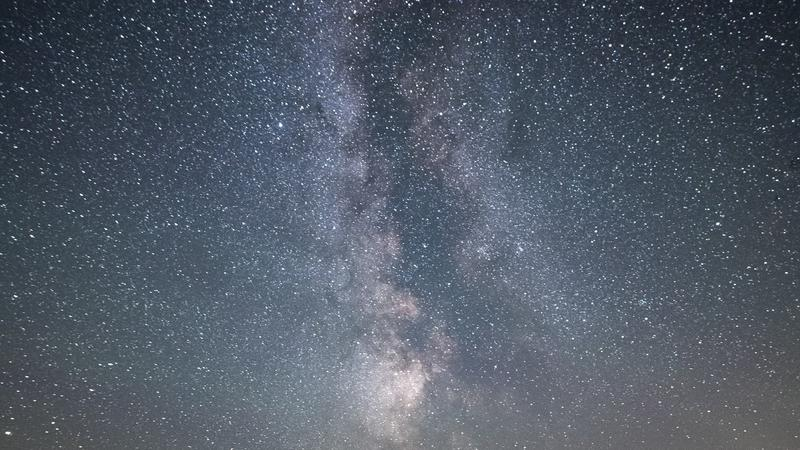](/blog/how-to-edit-astrophotography-in-lightroom)

[Mikko Lagerstedt](/blog?author=515aaa6be4b063d29d1c71e9#show-archive)

[4 Easy Steps to Edit Astrophotography in Lightroom](/blog/how-to-edit-astrophotography-in-lightroom)

[Mikko Lagerstedt](/blog?author=515aaa6be4b063d29d1c71e9#show-archive)

In this tutorial, we'll use my EPIC Preset Collection, which has a dedicated section for night photography. However, you can still follow along and make the adjustments yourself.

[Read More →](/blog/how-to-edit-astrophotography-in-lightroom)

[Mikko Lagerstedt](/blog?author=515aaa6be4b063d29d1c71e9#show-archive)

[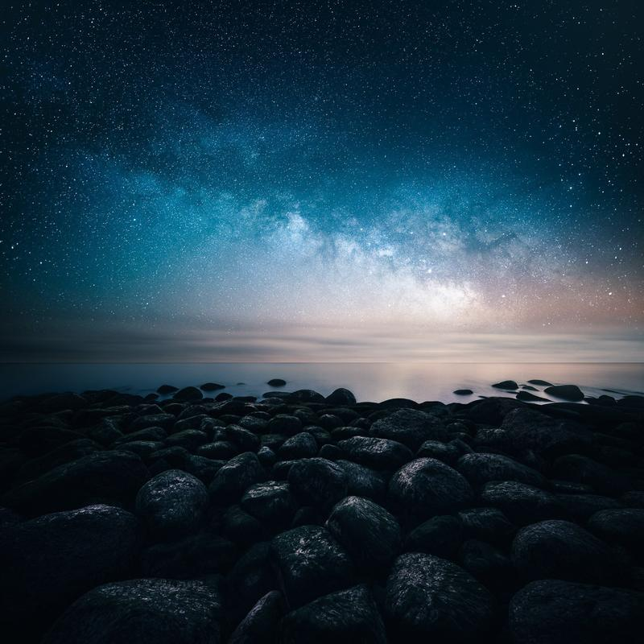](/blog/4-steps-to-capture-beautiful-astrophotography-landscapes)

[Mikko Lagerstedt](/blog?author=515aaa6be4b063d29d1c71e9#show-archive)

[4 Easy Steps to Capture Beautiful Astrophotography Landscapes](/blog/4-steps-to-capture-beautiful-astrophotography-landscapes)

[Mikko Lagerstedt](/blog?author=515aaa6be4b063d29d1c71e9#show-archive)

In this tutorial, I share my process for capturing beautiful astrophotography landscapes in four easy steps. I'll cover the essential gear needed for astrophotography, planning for astrophotography, capturing the astrophotographs, and using the dual exposure technique to take your astrophotography to another level. You'll learn a few tricks from this article whether you are new to astrophotography or an experienced nighttime shooter. So let's get started!

[Read More →](/blog/4-steps-to-capture-beautiful-astrophotography-landscapes)

[Mikko Lagerstedt](/blog?author=515aaa6be4b063d29d1c71e9#show-archive)

[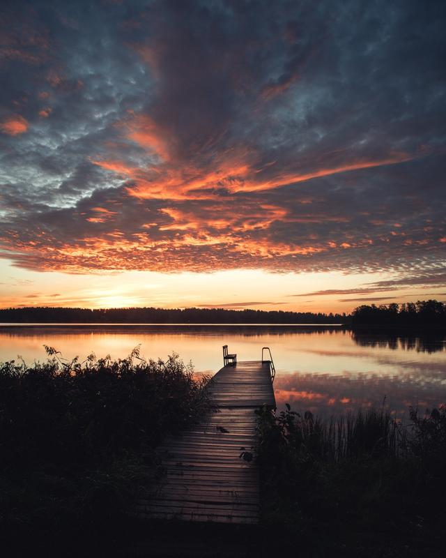](/blog/why-you-need-to-update-to-the-latest-lightroom)

[Mikko Lagerstedt](/blog?author=515aaa6be4b063d29d1c71e9#show-archive)

[Why you need to update to the latest version of Lightroom?](/blog/why-you-need-to-update-to-the-latest-lightroom)

[Mikko Lagerstedt](/blog?author=515aaa6be4b063d29d1c71e9#show-archive)

[Read More →](/blog/why-you-need-to-update-to-the-latest-lightroom)

[Mikko Lagerstedt](/blog?author=515aaa6be4b063d29d1c71e9#show-archive)

[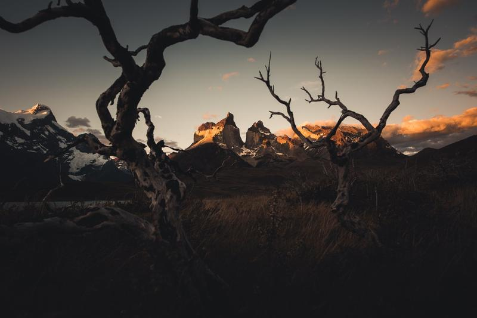](/blog/six-ways-to-improve-your-landscape-photography-instantly)

[Mikko Lagerstedt](/blog?author=515aaa6be4b063d29d1c71e9#show-archive)

[Six ways to improve your landscape photography instantly](/blog/six-ways-to-improve-your-landscape-photography-instantly)

[Mikko Lagerstedt](/blog?author=515aaa6be4b063d29d1c71e9#show-archive)

In this tutorial, I'll be sharing with you six simple and effective ways to improve your landscape photography instantly, all of which have been put together by the talented Mikko Lagerstedt. This tutorial covers a variety of topics, including how to plan for your photoshoots, why it's essential to take your time to explore the location, how to make the most of a tripod, the best camera settings to use, and some great tips for improving your composition and editing skills.

[Read More →](/blog/six-ways-to-improve-your-landscape-photography-instantly)

[Mikko Lagerstedt](/blog?author=515aaa6be4b063d29d1c71e9#show-archive)

[Mikko Lagerstedt](/blog?author=515aaa6be4b063d29d1c71e9#show-archive)

[Get Out of a Creative Rut and Reignite Your Creativity](/blog/get-out-of-a-creative-rut-and-reignite-your-creativity)

[Mikko Lagerstedt](/blog?author=515aaa6be4b063d29d1c71e9#show-archive)

A self-development guide for creatives who want to reignite their love for art and overcome a lack of motivation. In this guide, I share the steps that helped me and other photographers overcome creative ruts. The guide delves deep into self-development and finding inner motivation. I wrote this guide to share my experiences and teach solutions that worked for me so you don't have to make the same mistakes. I also share my favorite books in the last part of the guide for further research.

[Read More →](/blog/get-out-of-a-creative-rut-and-reignite-your-creativity)

[Mikko Lagerstedt](/blog?author=515aaa6be4b063d29d1c71e9#show-archive)

[Mikko Lagerstedt](/blog?author=515aaa6be4b063d29d1c71e9#show-archive)

[How to create EPIC colors in Lightroom CC & Camera RAW](/blog/how-to-create-epic-colors-in-lightroom)

[Mikko Lagerstedt](/blog?author=515aaa6be4b063d29d1c71e9#show-archive)

[Read More →](/blog/how-to-create-epic-colors-in-lightroom)

[Mikko Lagerstedt](/blog?author=515aaa6be4b063d29d1c71e9#show-archive)

[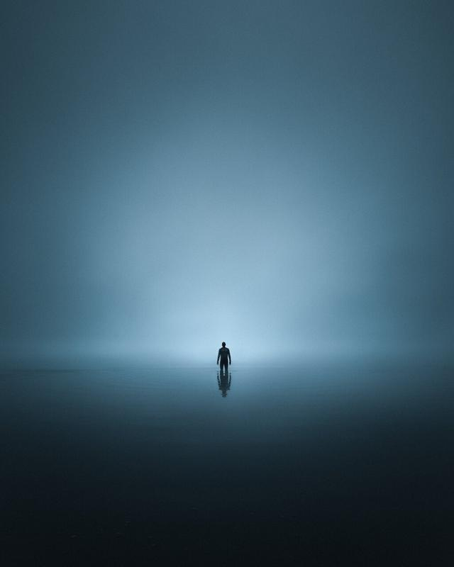](/blog/how-to-photograph-minimalist-landscapes)

[Mikko Lagerstedt](/blog?author=515aaa6be4b063d29d1c71e9#show-archive)

[How to photograph minimalist landscapes?](/blog/how-to-photograph-minimalist-landscapes)

[Mikko Lagerstedt](/blog?author=515aaa6be4b063d29d1c71e9#show-archive)

[Read More →](/blog/how-to-photograph-minimalist-landscapes)

[Mikko Lagerstedt](/blog?author=515aaa6be4b063d29d1c71e9#show-archive)

[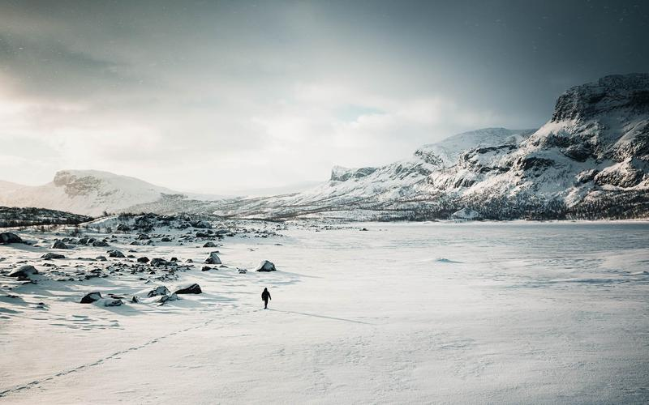](/blog/find-your-style-in-photography)

[Mikko Lagerstedt](/blog?author=515aaa6be4b063d29d1c71e9#show-archive)

[Find your style in photography](/blog/find-your-style-in-photography)

[Mikko Lagerstedt](/blog?author=515aaa6be4b063d29d1c71e9#show-archive)

[Read More →](/blog/find-your-style-in-photography)

[Mikko Lagerstedt](/blog?author=515aaa6be4b063d29d1c71e9#show-archive)

[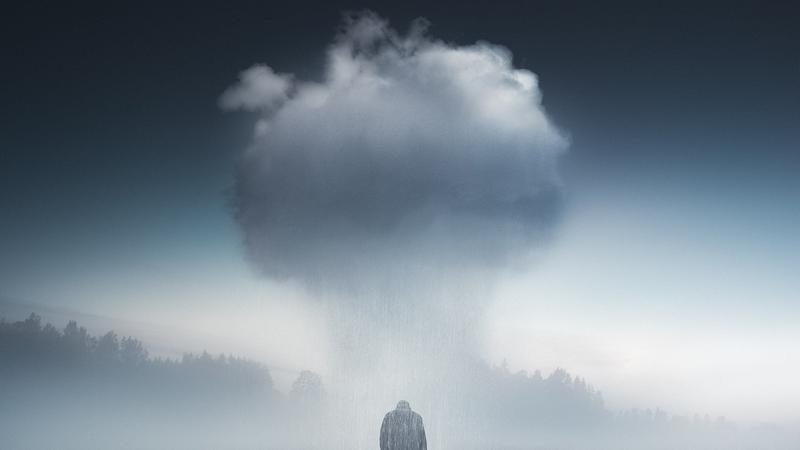](/blog/how-to-create-a-photo-manipulation)

[Mikko Lagerstedt](/blog?author=515aaa6be4b063d29d1c71e9#show-archive)

[How to Create a Moody Photo Manipulation](/blog/how-to-create-a-photo-manipulation)

[Mikko Lagerstedt](/blog?author=515aaa6be4b063d29d1c71e9#show-archive)

[Read More →](/blog/how-to-create-a-photo-manipulation)

[Mikko Lagerstedt](/blog?author=515aaa6be4b063d29d1c71e9#show-archive)

### Free Tutorials

Featured

[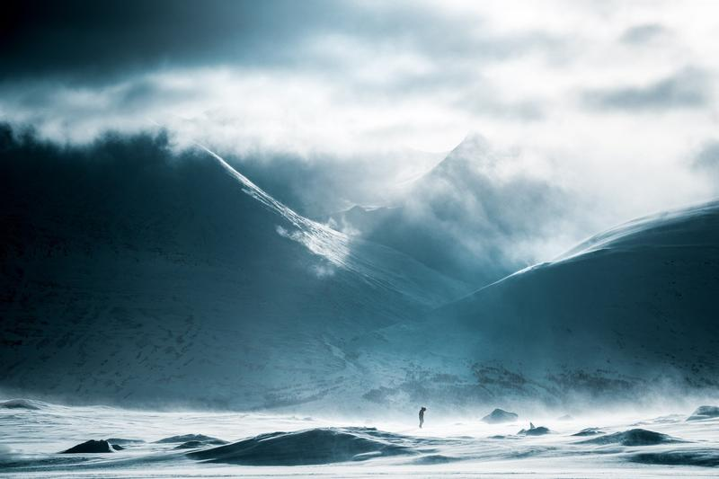](/blog/creative-photography-editing)

23 Mar 2020

[Intuitive Editing Workflow for Photographers](/blog/creative-photography-editing)

23 Mar 2020

[Read More →](/blog/creative-photography-editing)

23 Mar 2020

16 Mar 2020

[Six Common Mistakes Most Photographers Make](/blog/six-common-mistakes-most-photographers-make)

16 Mar 2020

[Read More →](/blog/six-common-mistakes-most-photographers-make)

16 Mar 2020

[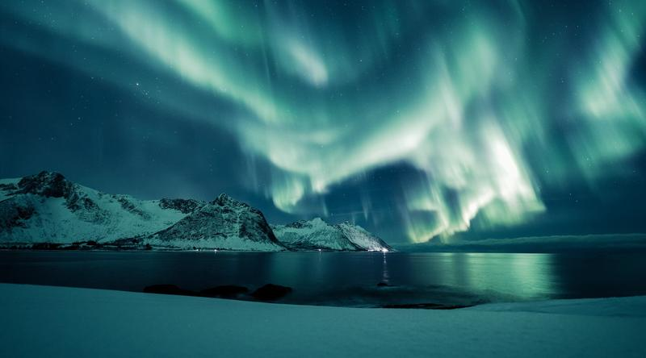](/blog//how-to-photograph-the-northern-lights-aurora-borealis)

6 Mar 2020

[How to Photograph the Northern Lights (Aurora Borealis)?](/blog//how-to-photograph-the-northern-lights-aurora-borealis)

6 Mar 2020

[Read More →](/blog//how-to-photograph-the-northern-lights-aurora-borealis)

6 Mar 2020

19 Feb 2020

[10 Creativity Boosting Habits for Photographers](/blog/10-creativity-boosting-habits-for-photographer)

19 Feb 2020

[Read More →](/blog/10-creativity-boosting-habits-for-photographer)

19 Feb 2020

12 Feb 2020

[Nikon Z7 mirrorless camera for landscape photography? One year Later.](/blog/nikon-z7-mirrorless-camera-for-landscape-photography)

12 Feb 2020

[Read More →](/blog/nikon-z7-mirrorless-camera-for-landscape-photography)

12 Feb 2020

[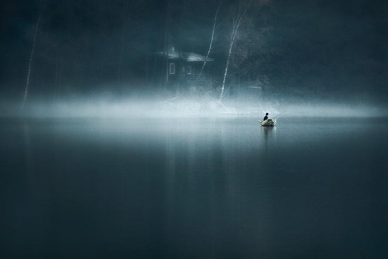](/blog/2018/9/24/atmosphere-ebook-preset-collection)

24 Sept 2018

[ATMOSPHERE eBook](/blog/2018/9/24/atmosphere-ebook-preset-collection)

24 Sept 2018

[Read More →](/blog/2018/9/24/atmosphere-ebook-preset-collection)

24 Sept 2018

[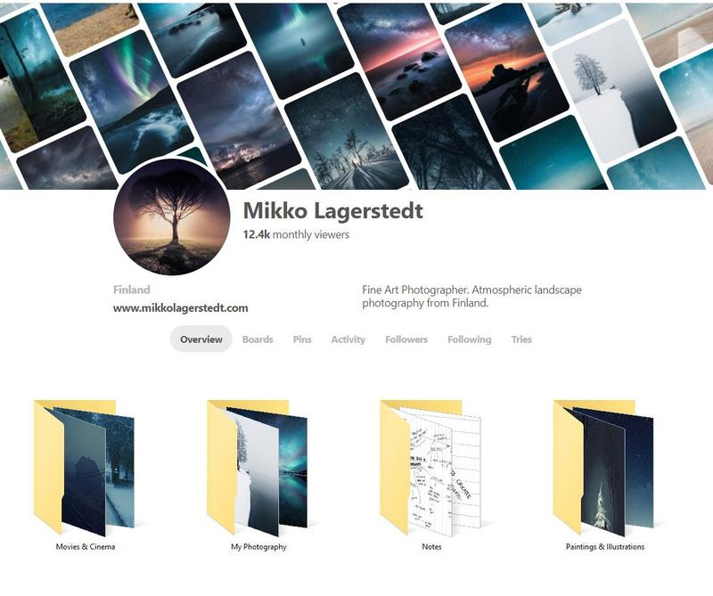](/blog/2018/6/9/stay-inspired-create-a-catalog-of-inspiration)

9 Jun 2018

[Stay Inspired – Create a Catalog of Inspiration](/blog/2018/6/9/stay-inspired-create-a-catalog-of-inspiration)

9 Jun 2018

[Read More →](/blog/2018/6/9/stay-inspired-create-a-catalog-of-inspiration)

9 Jun 2018

3 Jun 2018

[How to find inspiration for your photography?](/blog/2018/6/3/how-to-find-inspiration-for-your-photography)

3 Jun 2018

[Read More →](/blog/2018/6/3/how-to-find-inspiration-for-your-photography)

3 Jun 2018

[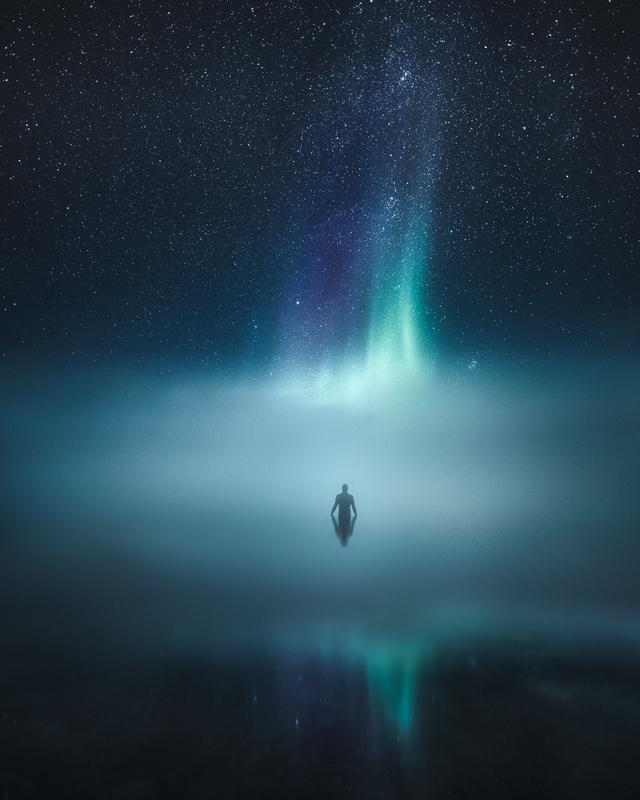](/blog/2018/5/27/set-goals-for-your-photography-the-first-step-on-becoming-a-full-time-creative)

27 May 2018

[Set goals for your photography – The first step on becoming a full-time creative](/blog/2018/5/27/set-goals-for-your-photography-the-first-step-on-becoming-a-full-time-creative)

27 May 2018

[Read More →](/blog/2018/5/27/set-goals-for-your-photography-the-first-step-on-becoming-a-full-time-creative)

27 May 2018

[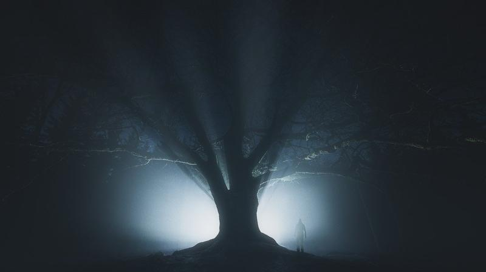](/blog/2018/5/18/how-to-add-glow-to-photographs-in-photoshop)

18 May 2018

[How to add a glow to photographs in Photoshop](/blog/2018/5/18/how-to-add-glow-to-photographs-in-photoshop)

18 May 2018

[Read More →](/blog/2018/5/18/how-to-add-glow-to-photographs-in-photoshop)

18 May 2018

[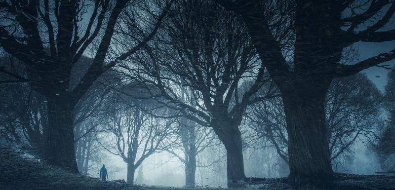](/blog/2018/5/13/how-to-create-atmospheric-photographs-ii)

13 May 2018

[How to create atmospheric photographs part II](/blog/2018/5/13/how-to-create-atmospheric-photographs-ii)

13 May 2018

[Read More →](/blog/2018/5/13/how-to-create-atmospheric-photographs-ii)

13 May 2018

[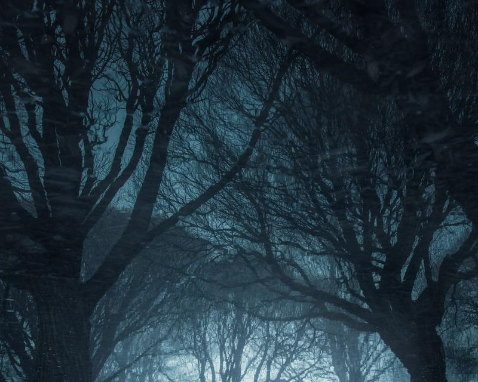](/blog/2018/5/6/how-to-create-atmospheric-photographs)

6 May 2018

[How to create atmospheric photographs part I](/blog/2018/5/6/how-to-create-atmospheric-photographs)

6 May 2018

[Read More →](/blog/2018/5/6/how-to-create-atmospheric-photographs)

6 May 2018

[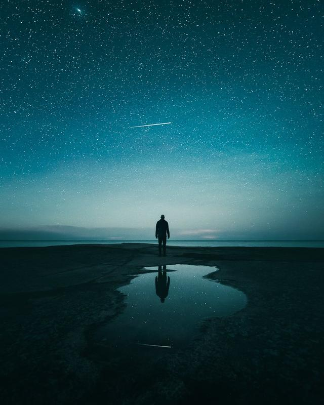](/blog/2018/4/25/how-to-keep-yourself-motivated)

25 Apr 2018

[How to keep yourself motivated and take better photos?](/blog/2018/4/25/how-to-keep-yourself-motivated)

25 Apr 2018

[Read More →](/blog/2018/4/25/how-to-keep-yourself-motivated)

25 Apr 2018

[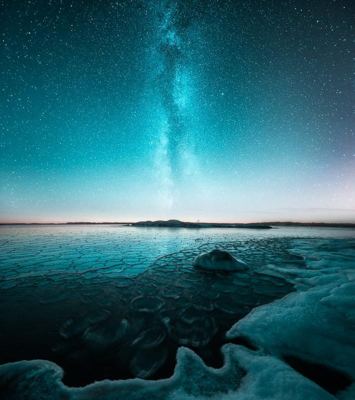](/blog/2017/4/18/match-colors-in-lightroom)

20 Apr 2017

[How to Match Colors in Lightroom](/blog/2017/4/18/match-colors-in-lightroom)

20 Apr 2017

[Read More →](/blog/2017/4/18/match-colors-in-lightroom)

20 Apr 2017

3 Jun 2016

[How to find your vision in Photography](/blog/2016/6/3/how-to-find-your-vision-in-photography)

3 Jun 2016

[Read More →](/blog/2016/6/3/how-to-find-your-vision-in-photography)

3 Jun 2016

[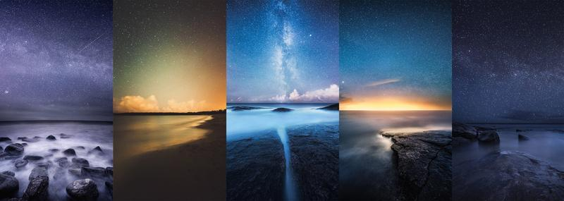](/blog/2016/5/16/how-to-stand-out-on-social-media)

16 May 2016

[Eight key things that make you stand out on Social Media – Major PING Alert!](/blog/2016/5/16/how-to-stand-out-on-social-media)

16 May 2016

[Read More →](/blog/2016/5/16/how-to-stand-out-on-social-media)

16 May 2016

7 Apr 2016

[My Favorite Equipment Part I - Everyday Gear for Star and Landscape Photography](/blog/2016/4/7/my-favorite-everyday-gear-star-landscape-photography)

7 Apr 2016

[Read More →](/blog/2016/4/7/my-favorite-everyday-gear-star-landscape-photography)

7 Apr 2016

1 Dec 2015

[Winter Night Photography Checklist](/blog/2015/11/24/winter-photography-checklist)

1 Dec 2015

[Read More →](/blog/2015/11/24/winter-photography-checklist)

1 Dec 2015

10 Nov 2015

[How to capture sharp star photographs](/blog/2015/11/10/how-to-capture-sharp-star-photographs)

10 Nov 2015

[Read More →](/blog/2015/11/10/how-to-capture-sharp-star-photographs)

10 Nov 2015

3 Nov 2015

[5 Steps to Work Like a Pro in Lightroom](/blog/2015/11/3/5-steps-to-work-like-a-pro-in-lightroom)

3 Nov 2015

[Read More →](/blog/2015/11/3/5-steps-to-work-like-a-pro-in-lightroom)

3 Nov 2015

26 Oct 2015

[5 Steps to Boost Milky Way in Lightroom](/blog/2015/10/26/5-steps-how-to-boost-milky-way-in-lightroom)

26 Oct 2015

[Read More →](/blog/2015/10/26/5-steps-how-to-boost-milky-way-in-lightroom)

26 Oct 2015

7 May 2015

[How to Create A Night Panorama With Lightroom CC](/blog/2015/5/7/how-to-create-night-panorama-lightroom-cc)

7 May 2015

[Read More →](/blog/2015/5/7/how-to-create-night-panorama-lightroom-cc)

7 May 2015

14 May 2014

[How To Use Graduated Filters & Radial Filters in Lightroom 5](/blog/2014/5/11/how-to-use-lightroom-graduated-filters-radial-filters)

14 May 2014

[Read More →](/blog/2014/5/11/how-to-use-lightroom-graduated-filters-radial-filters)

14 May 2014

13 Feb 2014

[How to Fix Light Leak in Lightroom](/blog/2014/2/13/how-to-fix-light-leaks-in-lightroom)

13 Feb 2014

[Read More →](/blog/2014/2/13/how-to-fix-light-leaks-in-lightroom)

13 Feb 2014

27 Jan 2014

[Essential Photoshop Keyboard Shortcuts for Photographers](/blog/2014/1/27/photoshop-keyboard-shortcuts-for-photographers)

27 Jan 2014

[Read More →](/blog/2014/1/27/photoshop-keyboard-shortcuts-for-photographers)

27 Jan 2014

8 Jan 2014

[How To Organize Photos in Lightroom Using Smart Collections](/blog/2014/1/8/lightroom-tutorial-organizing-photos-using-smart-collections)

8 Jan 2014

[Read More →](/blog/2014/1/8/lightroom-tutorial-organizing-photos-using-smart-collections)

8 Jan 2014

3 Jan 2014

[How To Process Fog & Mist Pictures in Lightroom](/blog/2014/1/3/basic-lightroom-adjustments-fog-mist)

3 Jan 2014

[Read More →](/blog/2014/1/3/basic-lightroom-adjustments-fog-mist)

3 Jan 2014

8 Nov 2013

[How To Process Star & Night Sky Pictures in Lightroom 5 & Photoshop](/blog/2013/11/8/night-photography-tutorial-lightroom-5-photoshop)

8 Nov 2013

[Read More →](/blog/2013/11/8/night-photography-tutorial-lightroom-5-photoshop)

8 Nov 2013

5 Nov 2013

[How To Photograph Stars & Night Sky, Top 5 Tips](/blog/2013/11/5/top-5-tips-to-photograph-stars-night-sky)

5 Nov 2013

[Read More →](/blog/2013/11/5/top-5-tips-to-photograph-stars-night-sky)

5 Nov 2013