## Underneath the Surface

Go beyond the visible

As a creative, I try to push myself to develop new ideas and visions. Back in September 2023, something clicked in me. I had this strong pull to do something different, to push the boundaries of what I could capture with my camera and convey the ever-changing beauty of our planet.

I wanted to push myself out of my comfort zone and express the emotions of transformation. I wanted to connect this piece to my roots, guiding the visuals with Finnish literature, Kalevala, the theme of the mythic transformation of nature, light, and darkness. This was the start of the birth of my new photography piece, **Underneath The Surface**.

I packed my gear and headed to the stunning landscapes of northern Finland, unsure how I would bring this dream to life. It sure wasn't easy. The project turned into this intense journey of battling sleeplessness and the brutal cold of Finnish Lapland. Imagine spending hours in freezing water, trying, failing, and then trying again the next day.

But then, there was this moment. After all those attempts, I finally got the shot I was after. Sitting there in the icy water, watching the Northern Lights, I felt this overwhelming sense of connection and change. Time stood still, and I was there, soaking in every second.

It's funny how we often scratch the surface of things, isn't it? But we must keep pushing and trying, no matter how often we stumble. And that's what makes us succeed.

This piece blends the natural world and the mystical stories from the Kalevala. It invites you to step into a scene where these two worlds collide, showing the ever-changing nature of our planet alongside those age-old stories. Through this process, I learned so much about myself and how pushing your limits can lead to some amazing discoveries. Below, you can find a behind-the-scenes video and a chapter on how this photograph was captured.

Join me in this story. We're making history with the first split-view shot of the Northern Lights.

> “Vision is the art of seeing what is invisible to others. ”

— Jonathan Swift

*Kalevala is Finland's national epic, compiled in the 19th century by Elias Lönnrot from ancient oral folklore and mythological poems. It is a cultural work that delves into Finnish history, mythology, and values, telling stories of heroes, gods, and the creation of the world, intertwined with themes of nature, love, and the struggle between good and evil.*

[Underneath the Surface – SuperRare](https://superrare.com/artwork/eth/0x5d6a3585d581a438a3fdad23796ab97692297a22/16)

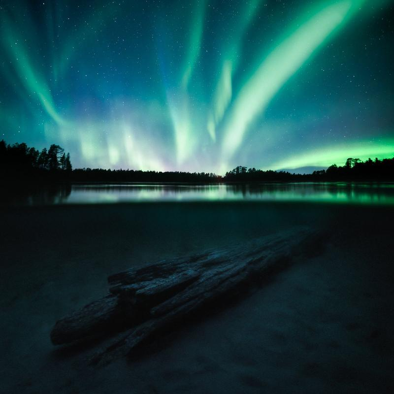

#### See the behind the scenes video of Capturing “Underneath the Surface”

I was invited to photograph for the new Nikon campaign, The Human Prompt. Our task was to capture the prompt from darkness to light and light to darkness. In this video, we go behind the scenes of how I captured this photograph and the other two I captured on the same trip.

####

## What did it take to capture Underneath the Surface?

The idea was clear in my head when I heard it could be possible to try underwater housing in Finnish Lapland. When we started the trip, I was both nervous and excited. Wishing that the stars and lights would align to make this dream a reality. Below, I have told a bit of the story behind what it took to capture the photography piece **Underneath The Surface**.

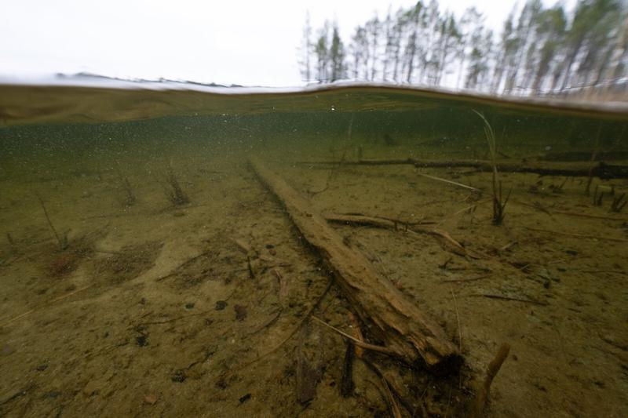

### Testing and scouting

This was my first time using underwater housing, so the first step was to test it out and see if I could find something interesting with the northern lights.

When I went to test the setup, it became evident that this would not be a walk in the park. When it was windy, the sediment and sand moved quite a bit in the lake, so only on a calm night was there a chance I could pull the shot off.

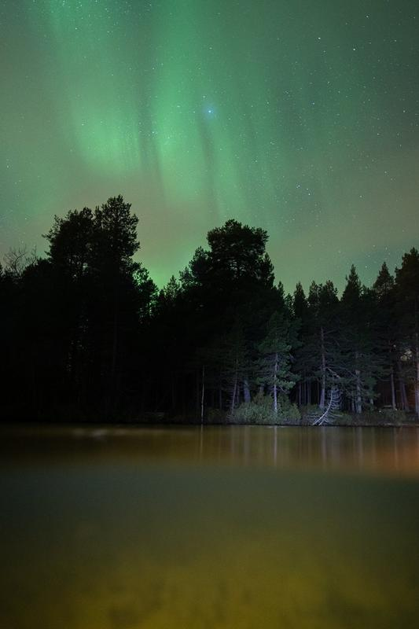

### The first try

When there was a chance we could see northern lights, we headed to this small lake we had been scouting in the daylight. It was a bit windy, so the water was hazy, and I couldn’t capture the night sky without clouds. As I stood there trying and trying, the clouds covered the whole night sky, and I was left bitter by the outcome, even if the process was exciting.

After three hours in the cold water, I decided to call it a night and headed back to the shore. The next day, after we left the scenery, we heard that the sky exploded with a spectacular light show.

## How Did I capture the Photograph?

#### EQUIPMENT

*Nikon Z8, Nikkor Z 14-24 mm f/2.8 S, RRS Tripod, Nauticam UW Housing.*

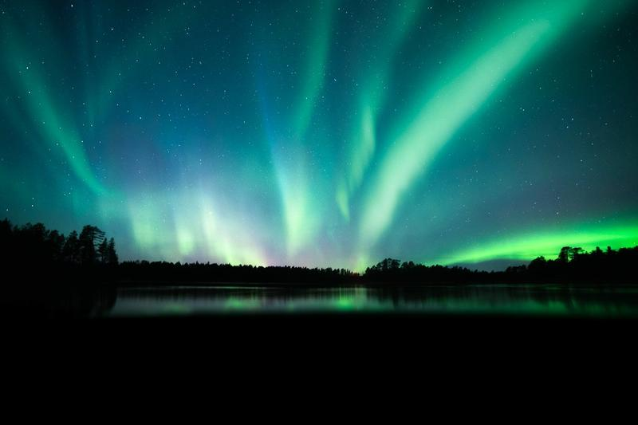

### Above

Going through the emotions from my earlier failures, I went to the water and in about thirty minutes the sky was lit for a brief moment with these streaks of Aurora Borealis—a magical and unforgettable moment.

I knew I didn’t have a lot of time so I quickly pulled the camera upwards and captured the elusive Northern Lights above the surface of the lake, leaving one third of the frame underwater - knowing I needed to capture it with a longer exposure.

**SETTINGS**

ISO 4000, 14 mm, 10 sec, f/2.8

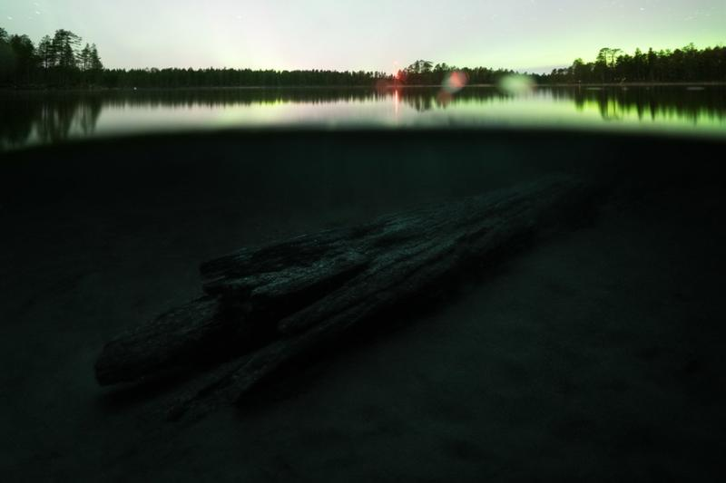

### Below

I captured the log below by tilting the camera downward carefully so as not to disturb the bottom layer of sand. I used a flash to figure out where the log was and then used it to focus in the foreground to give the final piece more depth. Then, I left the camera to expose the underwater part for a few minutes to get enough light to work with the final photography piece.

**SETTINGS**

ISO 8000, 14 mm, f/2.8, 250 sec.

I spent the next three hours, on and off from the water, trying to capture more of those elusive lights. But it wasn’t meant to be, and the lights were covered by a layer of clouds coming from the horizon.

## How Did I EDIT the Photograph?

#### Software

*Adobe Lightroom Classic CC & Adobe Photoshop CC*

When I returned to my computer, I was happy to see I had gotten the shots I wanted to capture. The editing process was straightforward because I knew I had the shots I needed to blend those two exposures.

* First, I edited the images separately, trying to match the colors. After being satisfied, I opened and merged the two images in Photoshop. I had to use the warp tool to make the transition perfect. The masking was easy because of how I had shot the photos.
* Once satisfied with the blend, I opened the image in Lightroom and adjusted the Transform section to narrow it. And cleaned the
* Finally, I applied [**EPIC Preset**](/epic-preset) (Night - Space-X) to create the image's final look.

Above Capture

Below Capture

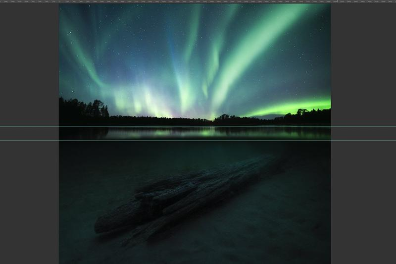

Blending Exposures in Photoshop

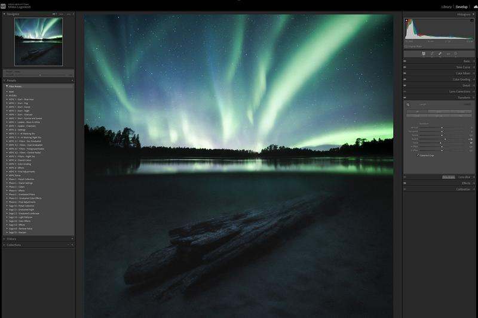

Final Adjustments in Lightroom

> “The greater danger for most of us lies not in setting our aim too high and falling short; but in setting our aim too low, and achieving our mark.”

— Michelangelo

### BTS Photos from the shoot

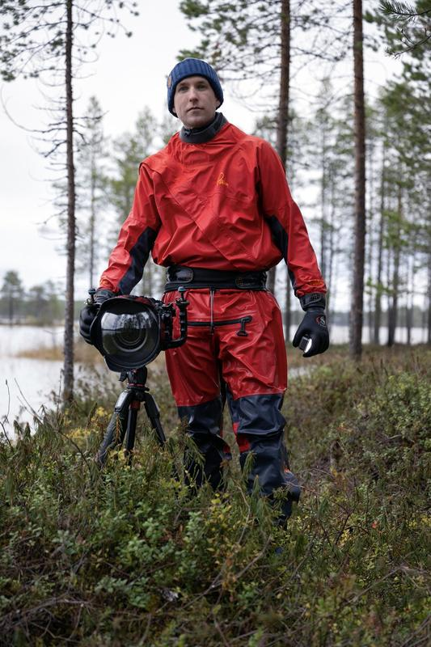

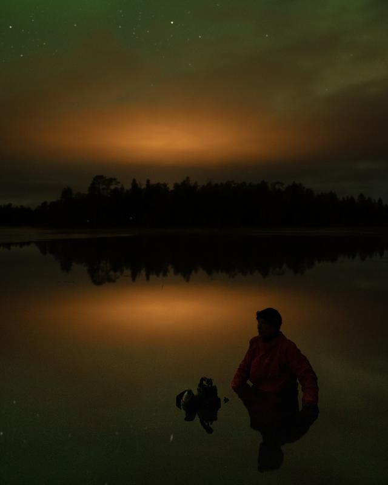

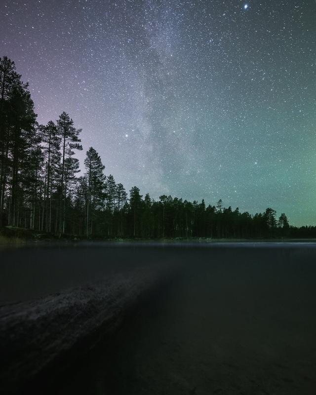

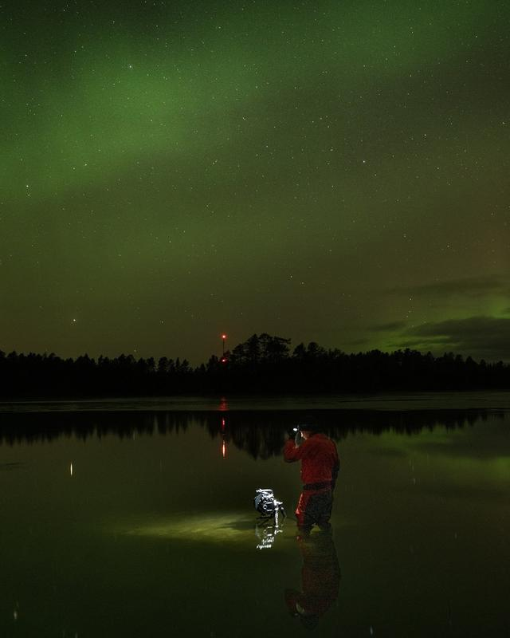

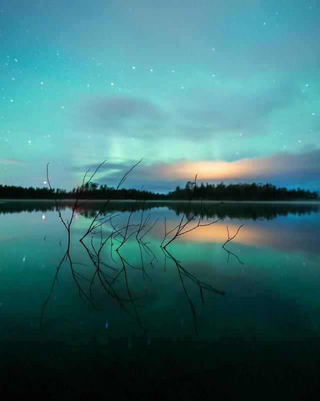

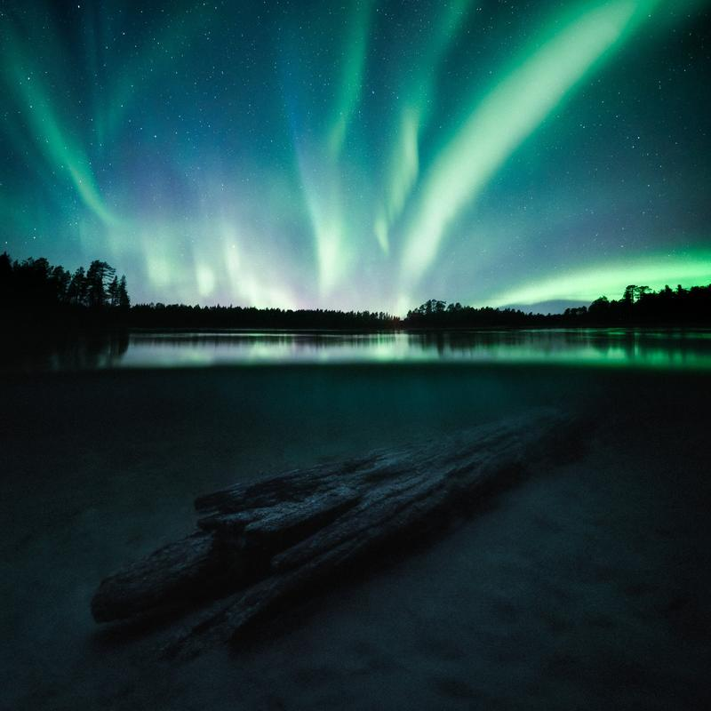

# Underneath the Surface

Join the Story of Underneath The Surface.

[Underneath the Surface - SuperRare](https://superrare.com/artwork/eth/0x5d6a3585d581a438a3fdad23796ab97692297a22/16)