## valokuvataulut

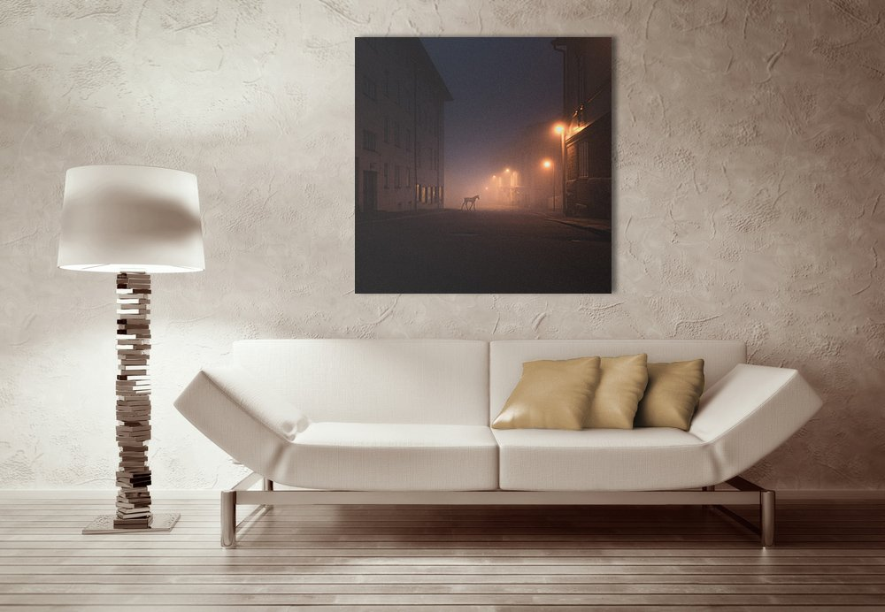

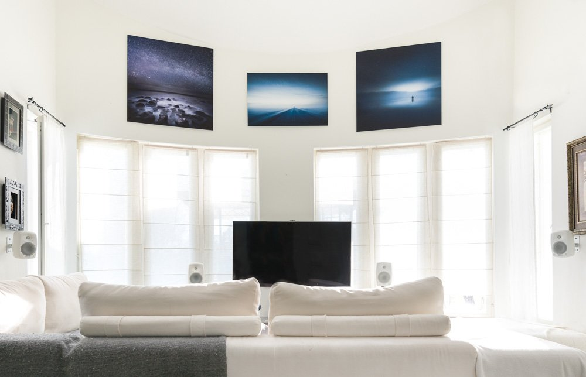

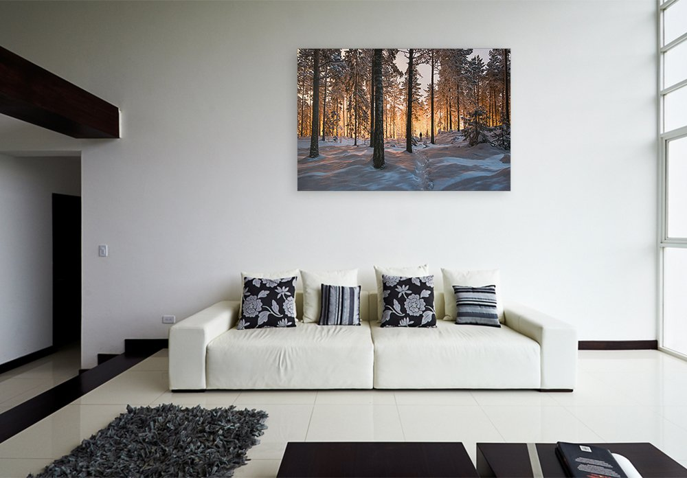

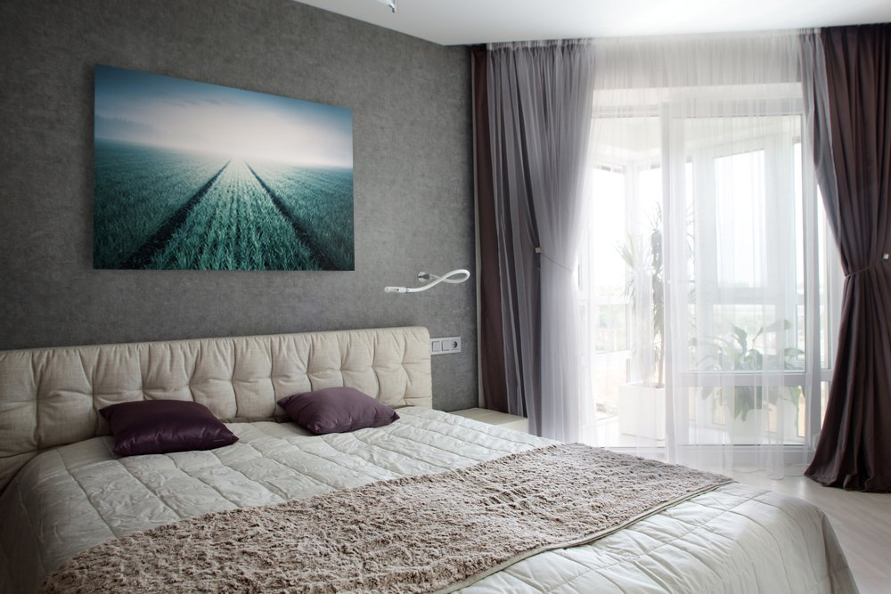

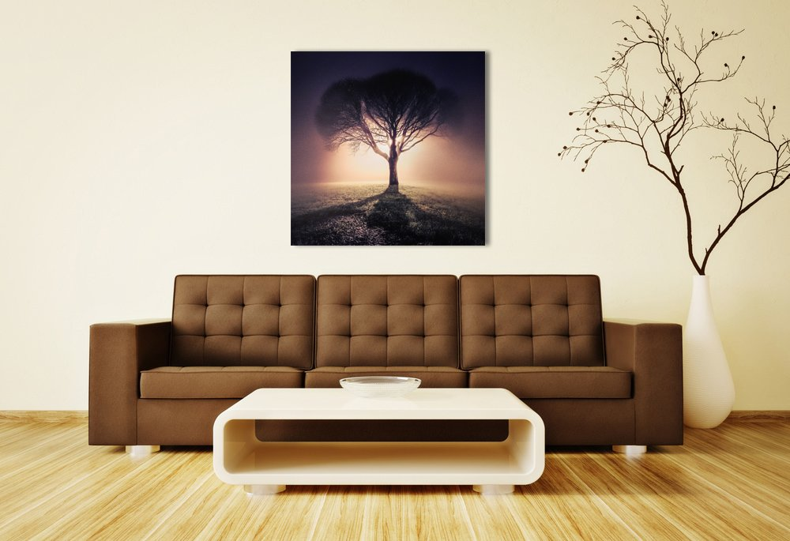

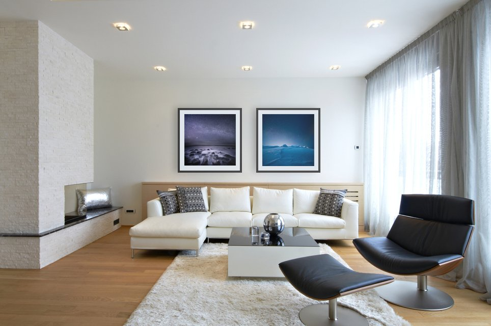

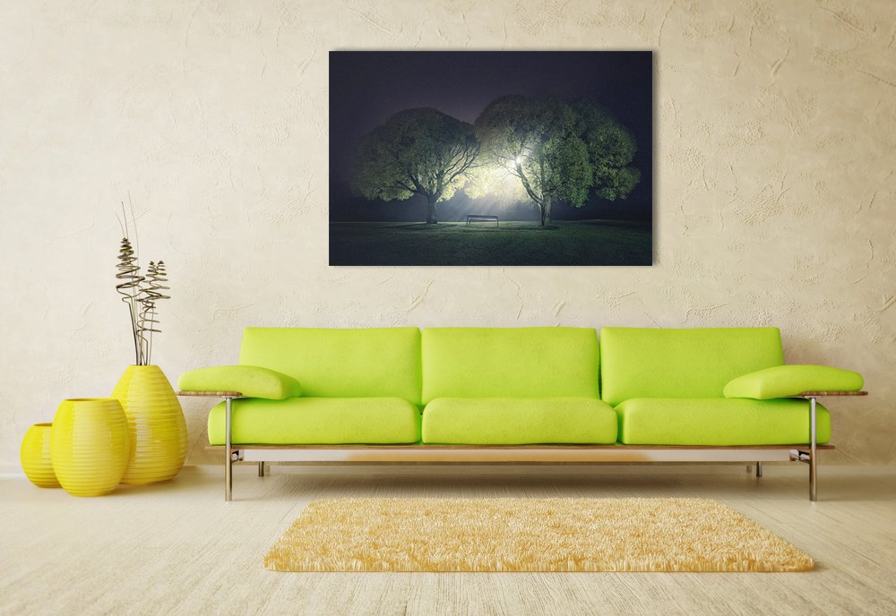

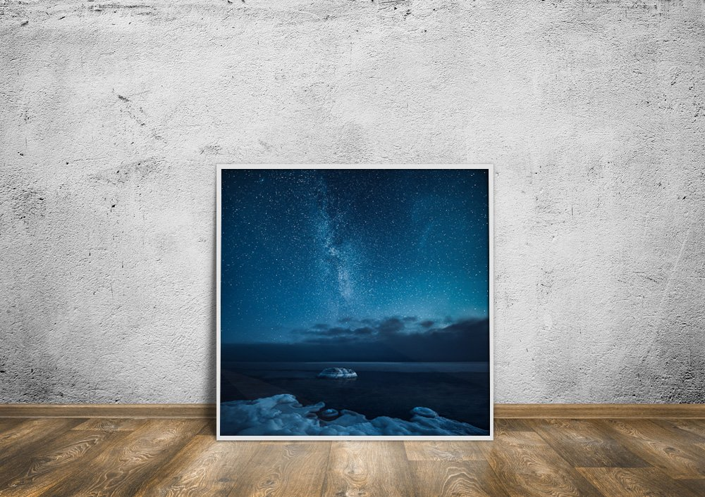

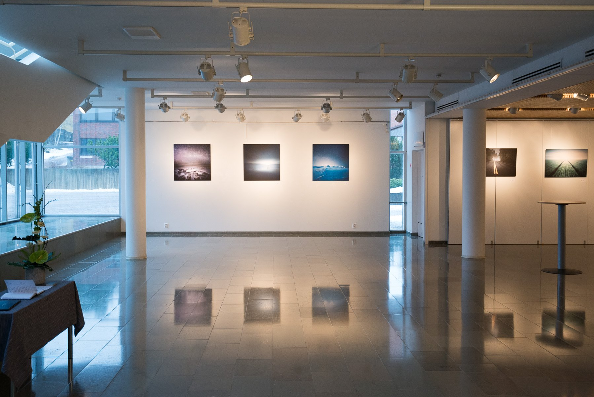

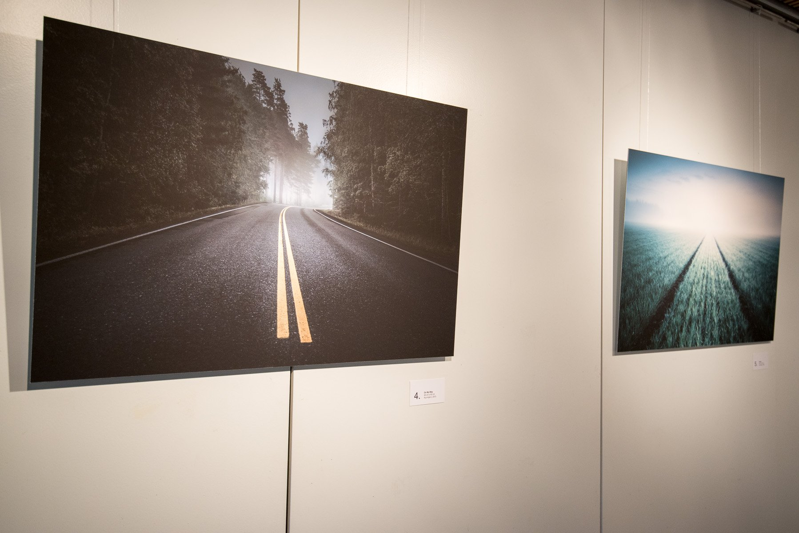

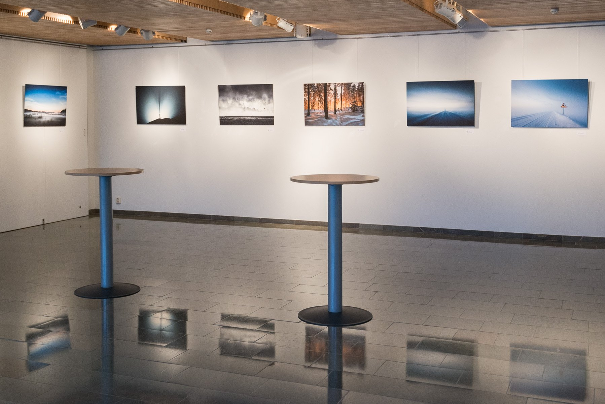

Tulostevaihtoehdot ovat tarkkaan valittuja, jotta tuote on viimeistelyltään huippuluokkaa. Teemme yhteistyötä suomalaisen taidetulostuksen ammattilaisen [Dialabin](http://www.dialab.com) kanssa. Taulujen hinta määräytyy valokuvasta, kuvakoosta sekä tulostusmenetelmästä.

### Tulostusvaihtoehdot

* Hahnemühle Fine Art paperi (Matta-, helmiäis- ja eko-paperi)
* Silisec - Akryylitaulu
* Alumiinitaulu 2 mm
* Hahnemühle Canvas-taulut
* Kehystetty valokuvataulu (Hahnemühle Fine Art paperilla)

[*Lisätietoja käyttämistämme taulu- ja tulostusvaihtoehdoista löydät Dialabin kotisivuilta*](http://www.dialab.com/)

Tavallisesti tulosteen teko ja lähetys vievät n. viikon verran. Mikäli tarvitsette tulosteen tiettyyn päivämäärään mennessä, muistakaa ilmoittaa se lisätiedoissa.

Nimi
\*

Sähköpostiosoite
\*

Kuvan nimi
\*

Kuvakoko
\*

Valitse kuvakoko

Neliö - 20 cm x 20 cm
Neliö - 40 cm x 40 cm
Neliö - 60 cm x 60 cm
Neliö - 90 cm x 90 cm
Neliö - 120 cm x 120 cm

Vaaka tai pystykuva - 30 cm x 20 cm
Vaaka tai pystykuva - 40 cm x 27 cm
Vaaka tai pystykuva - 60 cm x 40 cm
Vaaka tai pystykuva - 90 cm x 60 cm
Vaaka tai pystykuva - 150 cm x 100 cm

Tulostevaihtoehdot
\*

Valitse haluamasi tulostevaihtoehto

Hahnemühle Photo Rag - Mattapaperi
Hahnemühle Baryta - Helmiäispaperi
Hahnemühle Bamboo - Eko-mattapaperi
Silisec - Akryylitaulu
Alumiinitaulu
Kehystetty valokuvataulu (Hahnemühle Fine Art paperilla)

Kommentteja tai lisätietoja

Kiitos! Palaamme asiaan mahdollisimman pian.